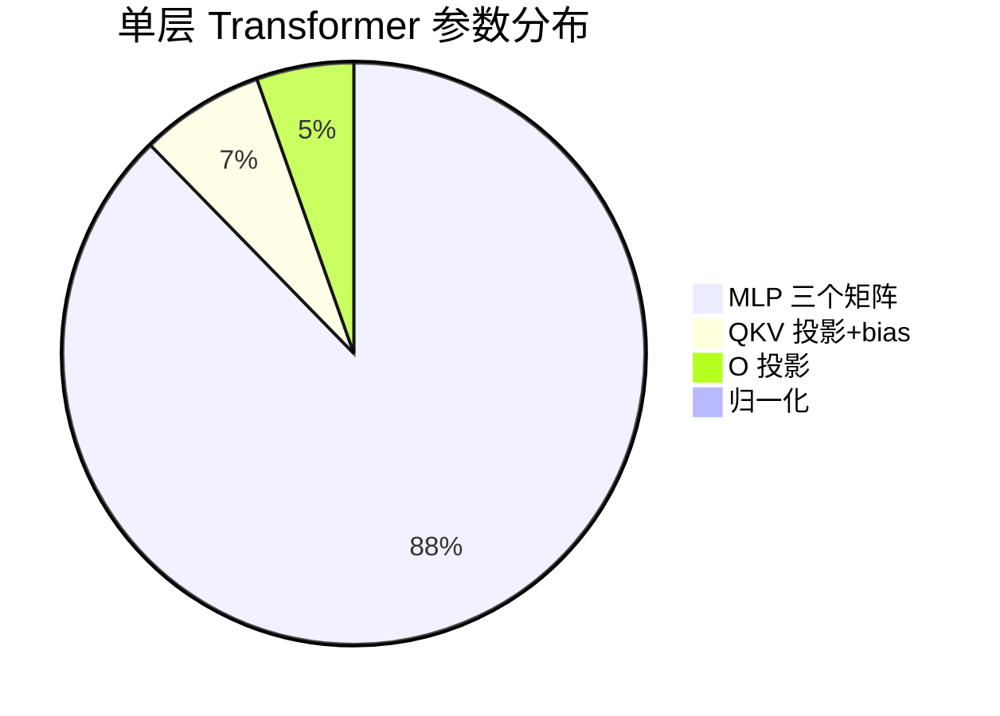
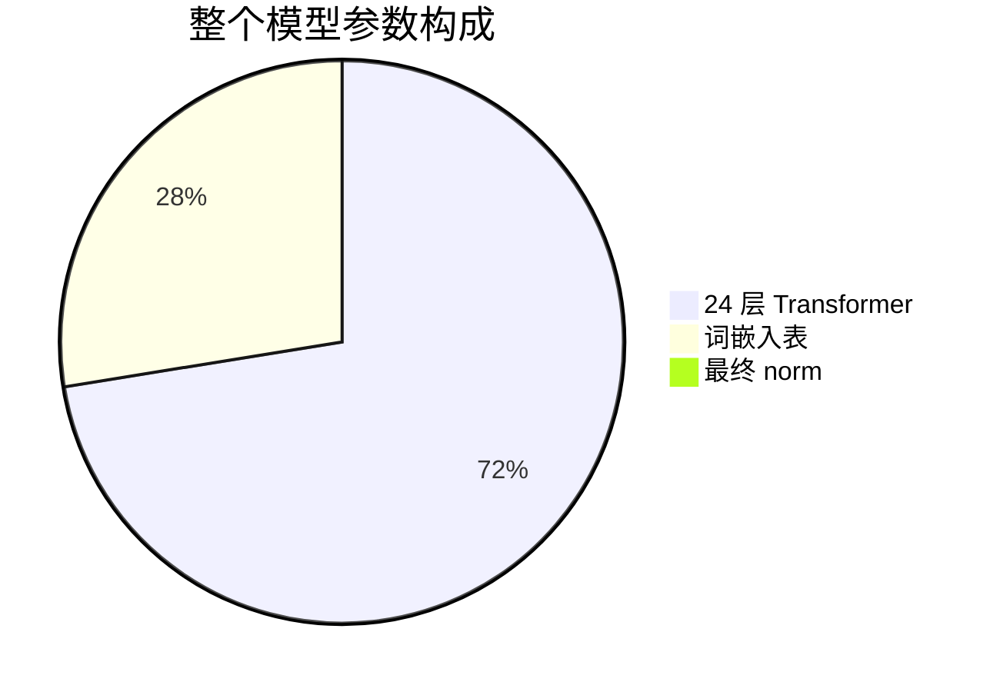

# 第一章 基础概念

> 第 1 章 | 配合源码：全局（重点是 `net.h` / `net.c`） | [目录](./README.md) | [下一章：权重的存储与加载](./02-weights.md)

本章不涉及具体源码文件，先把推理引擎的「是什么、为什么、有哪些零件」讲清楚。读完本章你不会写代码，但会知道每一行代码在整体里扮演什么角色。

---

## 前言：这本书会教会你什么

这是一个用纯 C 写的 Transformer 推理引擎，加载的是 Qwen2.5-0.5B 模型。目标不是做最快的引擎，而是让初学者**看懂推理引擎的原理**。

读完这本「书」，你会理解：

1. 一个 0.5B 参数的大模型，**权重的每个字节**是怎么组织的
2. 输入一句话后，模型**内部一步步**发生了什么计算
3. 为什么用 **RMSNorm** 而不是 LayerNorm、为什么用 **RoPE** 而不是绝对位置编码
4. **GQA** 怎么省内存、**KV Cache** 怎么把生成复杂度从 O(N²) 降到 O(N)
5. **BPE 分词**怎么把文字切成 token、**采样**怎么从概率分布里选词
6. 你的手写引擎和 **vLLM** 这样的工业引擎差在哪、差多少、为什么

**不会**教你的（超出范围）：训练（反向传播/梯度下降）、GPU 编程（CUDA）、分布式部署。

### 本书的约定

每个概念都配三样东西：

- 一句话说清是什么
- 解决什么问题
- 对应源码的哪个文件哪一行

---

## 什么是推理引擎

**推理 (Inference)** = 用训练好的模型算出结果。和训练不同——推理**不需要更新权重**，只做「前向计算」。

**推理引擎** = 给定权重 + 输入文本，算出下一个 token 的程序。核心就是一个函数：

```
next_token_id = forward(weights, tokens_so_far)
```

就这么简单。整个项目 2000 多行 C 代码，都是围绕这个函数展开的：怎么把 `weights` 从磁盘读进来、怎么把文本变成 `tokens_so_far`、怎么把 `next_token_id` 变回文本打印出来。

## Transformer 的一句话原理

Transformer 是一种神经网络，核心机制是注意力（Attention）：让每个词「看」其他词，决定关注谁、忽略谁。

```
"猫 咬 人" → 每个词看其他词 → 理解"谁咬谁" → 预测下一个词
```

现代大模型（GPT / Llama / Qwen）都是 Decoder-only Transformer：只用解码器部分，从左往右逐词生成。本项目加载的 Qwen2.5-0.5B 就是这种结构。

## Tensor（张量）和维度

这是整本书里最容易踩坑的一节，请仔细读。

最重要的一句话先说：`dim=896` 表示 每个 token 的特征向量有 896 个数，这 896 是特征维（列），不是行数。行数由"输入了几个 token"（seq_len）决定，和 896 完全无关。

| 概念 | 是什么 | 由谁决定 |
|------|--------|---------|
| **dim=896** | 每个特征向量有几个数（896 个） | 模型结构**固定** |
| **行数（seq_len）** | 一批数据里有几个 token | 输入**可变** |

> 举例：输入 "Hello world"（2 个 token）→ 数据张量形状是 `[2, 896]`：**2 行 × 896 列**。
> 行数=2（token 数），列数=896（特征维）。换 128 个 token 输入就是 `[128, 896]`，列数还是 896。

---

再区分两个容易混淆的"维"：

| 说法 | 含义 | 例子 |
|------|------|------|
| "**896 维**向量" | 向量里有 896 个数 | `[0.1, -0.2, 0.5, ... 共896个]` |
| "**1 维**数组" | 数据只排成一排（只有一行，没有行列结构） | 同上 |
| "**2 维**数组" | 数据排成行列网格（有行和列两个方向） | 权重矩阵如 `(896, 896)` 或 `(4864, 896)` |

> ⚠️ "896维向量"和"1维数组"说的是同一个东西——**896 个数排成一排**。
> "维"在前者指数的个数，在后者指数组的嵌套层数。

**张量**就是多维数组，按嵌套层数（"几个方向"）分类：

| 嵌套层数 | 叫法 | 形状 | 元素个数 | 例子 |
|---------|------|------|---------|------|
| 0 层 | 标量 | `()` | **1 个数** | `3.14` |
| 1 层 | 向量 | `(896,)` | **896 个数** | 一个 token 的表示 |
| 2 层 | 矩阵 | `(896, 896)` | **80 万个数** | Q 投影权重矩阵 |
| 3 层 | 张量 | `(24, 896, 896)` | **1900 万个数** | 24 层叠在一起 |

```
0层:  3.14                              ← 1 个数 (标量)

1层:  [0.1, -0.2, 0.5, ...]             ← 一排, 有多少个看具体张量
                                         (token 向量是 896 个)

2层:  [ [0.1, -0.2, ...],               ← 很多排, 每排若干个
       [0.3,  0.1, ...],                  排数×每排个数 = 总数
       ... ]                             具体形状取决于这是哪个张量:
                                           Q 权重   [896, 896] = 80 万
                                           MLP 权重 [4864, 896] = 435 万
                                           输入数据 [seq_len, 896]
```

**所以：Qwen2.5-0.5B 的 `dim=896` 意味着每个 token 用一个 **896 个数的向量（1层张量）**表示。把一个 token 从一个向量变换成另一个向量，需要用权重矩阵做投影——**Q/O 投影矩阵是 896×896 的方阵（80 万个数），但不是所有矩阵都是方的：

| 权重矩阵 | 形状 | 方阵? | 说明 |
|---------|------|-------|------|
| Q 投影 (wq) | `(896, 896)` | ✅ 方阵 | 输入输出都是 896 维 |
| O 投影 (wo) | `(896, 896)` | ✅ 方阵 | 输入输出都是 896 维 |
| K/V 投影 (wk/wv) | `(128, 896)` | ❌ 长方形 | GQA 让输出只有 128 维 |
| MLP (gate/up/down) | `(4864, 896)` | ❌ 长方形 | 扩张到 4864 维 |
| Embedding | `(151936, 896)` | ❌ 长方形 | 词表 × 特征维 |

> ⚠️ 常见误区：`hidden_size=896` 不代表模型里所有矩阵都是 896×896 的方阵。
> 它只表示"每个 token 的特征向量有 896 个数"。至于矩阵长什么样，取决于这个矩阵做什么。
> 另外，**输入数据的张量形状是 `[seq_len, 896]`**——行数是 token 数量（可变），
> 列数是 896（固定）。输入 128 个 token 就是 128 行，和"896"无关。

### 维度和"知识量"的关系

一个常见问题：**维度越多，存储的知识越多吗？** 方向上对，但要完整理解。

**dim = 一个词的"理解精度"**。用拍照类比：

```
dim = 896   →  100 万像素照片, 能认出是只猫
dim = 4096  →  1600 万像素照片, 能看清猫的品种
dim = 8192  →  6000 万像素照片, 连毛发纹理都清楚
```

不同模型的 dim 对比：

```
模型               dim    层数    参数量
─────────────────────────────────────────────
GPT-2 Small        768     12     0.12B    ###
Qwen2.5-0.5B       896     24     0.49B    ####       ← 本项目
Qwen2.5-1.5B      1536     28      1.5B    #######
Llama-3.1-8B      4096     32      8.0B    ####################
Qwen2.5-72B       8192     80     72.0B    ########################################
```

但光有 dim 不够——**知识量 ≈ dim × 层数 × 训练数据量**，三个因素缺一不可：

| 因素 | 作用 | 类比 |
|------|------|------|
| **dim** | 每个词能描述多精细 | 词汇量 |
| **层数** | 能把关系推理多深 | 思考深度 |
| **训练数据** | 真正注入的知识 | 读过的书 |

```
dim=896, 1层:  认识词, 但不会推理 → "猫和狗都是动物"
dim=896, 24层: 同样认识词, 还能层层推理
  → "猫 → 动物 → 哺乳类 → 会得狂犬病 → 要打疫苗"
    (每层推一步, 24 层推 24 步)
```

**为什么不能无限增大 dim？** 三个限制：

1. 数据要配得上：dim=8192 但只喂 1GB 数据 → 大部分维度是空的，浪费（大房子没家具）
2. 内存和速度暴涨：0.5B 要 2GB 内存，72B 要 150GB+，普通电脑跑不动
3. 训练更难：参数越多需要的数据量和算力指数级增长

Qwen2.5-0.5B 选 dim=896 是**精心选择的平衡**——够学到基本语言能力，又小到能在普通电脑上跑。

## "0.5B" 是怎么算出来的

B = Billion = 十亿。0.5B 指模型有约 **5 亿个参数（可训练的权重数字）**。精确数字是 **494,032,768 ≈ 0.49B**，四舍五入叫 "0.5B"。

参数量 = 所有权重矩阵的元素总数。手算过程：

```
┌──────────────────────────────────────────────────────────────┐
│ 第 1 块: 词嵌入表                                            │
│   151936 行 × 896 列         = 136,134,656  (1.36 亿)       │
├──────────────────────────────────────────────────────────────┤
│ 第 2 块: 24 层 Transformer (每层 14,912,384 个参数)          │
│                                                              │
│  每一层内部:                                                  │
│    归一化        896 + 896                     =      1,792 │
│    Q 投影权重    896 × 896                    =    802,816  │
│    K 投影权重    128 × 896  (GQA, 小)         =    114,688  │
│    V 投影权重    128 × 896  (GQA, 小)         =    114,688  │
│    Q/K/V 偏置    896 + 128 + 128 (Qwen独有)   =      1,152  │
│    O 投影权重    896 × 896                    =    802,816  │
│    MLP 门控      4864 × 896                   =  4,358,144  │  ← 大头
│    MLP 上投      4864 × 896                   =  4,358,144  │  ← 大头
│    MLP 下投      896 × 4864                   =  4,358,144  │  ← 大头
│                              单层小计          = 14,912,384 │
│                                                              │
│  × 24 层                                       = 357,897,216 │
├──────────────────────────────────────────────────────────────┤
│ 第 3 块: 最终 norm                                           │
│   896                                                        │
├──────────────────────────────────────────────────────────────┤
│ 总计: 136,134,656 + 357,897,216 + 896 = 494,032,768         │
│                                        = 0.49 B ≈ "0.5 B"   │
└──────────────────────────────────────────────────────────────┘
```

两个观察：

1. MLP 占了大头：每层 1490 万参数里，MLP 三个矩阵就占 1307 万（88%）。因为 `4864 × 896 × 3` 太大了。增大 `hidden_dim` 对参数量影响最大。
2. GQA 省了参数：K/V 用 2 个头（128 维）而非 14 个头（896 维），每层少 ~138 万参数。更大的收益在 KV Cache 内存上（省 7 倍）。

## 每个参数是干嘛的（用"解决什么问题"讲）

上面那张表列了每层有哪些参数，但没说每个参数解决什么问题。逐一解释。这些名字后面在 `net.h` 的 `TransformerWeights` 结构体里都会再见到。

### ① 归一化权重（896 + 896 = 1,792）

每一层有两个 RMSNorm，各 896 个缩放系数。

- 防止向量经过 24 层矩阵乘法后数值爆炸（不归一化，22 层就涨到 228 亿，模型崩溃）
- 这 1792 个参数做什么：
  - 第一组 896 个（attention 前）：每层开头把向量"拉回标准大小"防爆炸，再用这 896 个系数逐维微调（重要的维度放大，不重要的缩小）
  - 第二组 896 个（MLP 前）：MLP 前再做一次同样的操作，用另一组系数
- 为什么是两组：attention 和 MLP 需要不同的数值配置，所以各自一组系数独立训练

> 📍 在哪：
> - 模型数据：`rms_att_weight` ← safetensors 的 `input_layernorm.weight`；`rms_ffn_weight` ← `post_attention_layernorm.weight`
> - 代码：`net.c` 的 `rmsnorm()` 函数 + `forward()` 里 attention 前、MLP 前各一次调用

### ② Q/K/V 投影权重（802,816 + 114,688 + 114,688）

把同一个输入向量投影成三种不同角色，供注意力计算用。

- 让每个词能根据内容自动决定"该关注其他哪些词"
- 三个矩阵各做什么：
  - Q 投影（896×896）：算出"我想找什么样的词"（Query），输出 896 维（14 个头）
  - K 投影（128×896）：算出"我是什么标签"（Key），输出只有 128 维——因为 **GQA**，14 个 Q 头共享 2 个 KV 头，所以 K/V 比 Q 小 7 倍
  - V 投影（128×896）：算出"我携带什么内容"（Value），同样 128 维
- 为什么 K/V 比 Q 小：省内存。KV Cache 要存所有历史 token 的 K/V，小 7 倍意味着缓存内存也省 7 倍

> 📍 在哪：
> - 模型数据：`wq/wk/wv` ← safetensors 的 `self_attn.q_proj/k_proj/v_proj.weight`
> - 代码：`net.c` 里三次 `matmul` 调用，`matmul()` 函数也在 `net.c`

### ③ Q/K/V 偏置（896 + 128 + 128 = 1,152，Qwen 独有）

投影矩阵乘法后额外加的平移向量（`Q = x @ Wq + bq`）。

- 矩阵乘法只能"旋转+缩放"，加 bias 后多了"平移"能力，让投影更灵活
- 为什么标注 Qwen 独有：Llama 系列所有投影都没有 bias；Qwen 在 Q/K/V 上加了 bias（但 O 投影没有），这是两个架构的关键区别
- 为什么维度不同：bias 维度 = 输出维度。Q 输出 896 维所以 bias 是 896，K/V 输出 128 维所以 bias 是 128

> 📍 在哪：
> - 模型数据：`bq/bk/bv` ← safetensors 的 `self_attn.q_proj/k_proj/v_proj.bias`
> - 代码：`net.c` 里声明，作为 `matmul` 第 4 个参数传入
> - 注意：O 投影传的是 `NULL`（无 bias）

### ④ O 投影权重（896 × 896 = 802,816，无 bias）

把 14 个 attention 头的结果整合回一个向量。

- attention 算完后，14 个头各自输出了 64 维，拼起来是 896 维，但这是"14 个头的杂乱拼接"，需要 Wo 重新整合
- 为什么没有 bias：Qwen 的设计选择，O 投影不需要平移

> 📍 在哪：
> - 模型数据：`wo` ← safetensors 的 `self_attn.o_proj.weight`（注意：没有 `o_proj.bias`）
> - 代码：`matmul(..., wo, ..., NULL, dim, dim)`，第 4 参数 `NULL` 表示无 bias

### ⑤ MLP 三个矩阵（4864×896 × 3 = 13,074,432，占 88%）

每一层的前馈网络，三个矩阵完成"扩张→门控→压缩"。

- attention 负责"词之间交换信息"，MLP 负责"每个词独立加工信息"——需要更大的"思考空间"
- 三个矩阵各做什么：
  - 门控 w_gate（4864×896）：扩张到 4864 维，算出"哪些通道该激活"（门控信号）
  - 上投 w_up（4864×896）：扩张到 4864 维，算出"候选值"
  - 两个相乘：`silu(gate) × up`——门控决定放行多少候选值（SwiGLU 激活）
  - 下投 w_down（896×4864）：压缩回 896 维
- 为什么这么占参数：扩张到 4864 维（896 的 5.4 倍），每个矩阵都是 435 万参数，三个加起来 1307 万。如果想压缩模型，MLP 是首要目标

> 📍 在哪：
> - 模型数据：`w_gate/w_up/w_down` ← safetensors 的 `mlp.gate_proj/up_proj/down_proj.weight`
> - 代码：`net.c` 里三次 `matmul` + 中间的 `silu×up` 循环

### 一张图总结每一层各参数的关系

```
输入 x (896维)
  │
  ├─ ① 归一化 896 ──→ 调好数值大小 (防爆炸)
  │        ↓
  │  ②③ Q/K/V 投影 ──→ 算出三种角色 (偏置帮平移)
  │        ↓
  │     Attention 计算 (14头注意 2头KV)
  │        ↓
  │  ④ O 投影 ──→ 整合 14 个头
  │        ↓
  ├─ 残差连接
  │        ↓
  ├─ ① 归一化 896 ──→ 再调一次数值
  │        ↓
  │  ⑤ MLP 门控+上投 ──→ 扩张到 4864 维思考
  │     silu(gate)×up
  │     下投 ──→ 压回 896 维
  │        ↓
  └─ 残差连接
       ↓
     输出给下一层
```

## 为什么每个矩阵是这个大小

每个矩阵的形状都由**输入维度 × 输出维度**决定，不是随便选的：

```
[Q 投影 896×896]
  输入 x 是 896 维 → 输出 Q 是 896 维 (14头 × 64维/头)
  → 896 行 × 896 列

[K 投影 128×896]  ← 比 Q 小很多!
  输入 896 维 → 输出只有 128 维 (2头 × 64维)  ← 这是 GQA!
  14 个 Q 头共享 2 个 KV 头, 所以 K/V 比 Q 小 7 倍

[V 投影 128×896]  ← 同 K, GQA

[Q/K/V 偏置]
  维度 = 各自的输出维度: Q 偏置 896, K/V 偏置 128

[O 投影 896×896]
  输入: 14 个头拼起来 = 896 维 → 输出整合回 896 维

[MLP 门控/上投 4864×896]  ← 大头!
  输入 896 维 → 扩张到 4864 维 (hidden_dim, 给"思考空间")

[MLP 下投 896×4864]
  输入 4864 维 → 压回 896 维 (思考完回到主干道)
```

## 单层参数分布：MLP 占了近 88%

```
归一化:           1,792     (0.01%)  ▏
QKV投影+bias:   1,033,344    ( 6.9%)  ███
O投影:            802,816    ( 5.4%)  ██
MLP三个矩阵:   13,074,432    (87.7%)  ████████████████████████████████
─────────────────────────
单层合计:      14,912,384
```

MLP 占了绝大部分——三个 `4864×896` 矩阵就占了 1307 万参数。因为 MLP 要把 896 维扩张到 4864 维（5.4 倍），给"思考空间"。如果想压缩模型，MLP 是首要目标（这也是 MoE 架构改革 MLP 的原因）。

下面这个图直观展示单层参数的分布比例——MLP 一家独大：



再看整个模型 0.5B 参数的构成：



### 为什么是 24 层

```
单层 1490 万 × 24 层 = 3.58 亿 (占模型 72%)
```

层数决定"思考深度"——每层做一轮"看上下文 + 加工信息"，24 层 = 24 轮思考。层数越多能学到的关系越深，但参数量和计算量也线性增加。

## 参数量 ≠ 文件大小

容易混淆的两个数字：

| | 参数量 | 文件大小 |
|---|---|---|
| 含义 | 模型有多少个权重数字 | 存在磁盘上占多大 |
| 数值 | 4.94 亿 | 988 MB |
| 公式 | — | 参数量 × 每个参数的字节数 |

```
safetensors 文件用 bf16 存储:
  988 MB = 4.94 亿 × 2 字节/参数 (bf16)

引擎加载后转成 fp32 放进内存:
  内存占用 = 4.94 亿 × 4 字节 = 1.97 GB  ← 这就是运行时要 ~2GB 的原因

如果用 int4 量化:
  文件 = 4.94 亿 × 0.5 字节 = 247 MB  (缩到 1/4)
```

> 行业惯例：模型名里的数字是「约数」。0.5B ≈ 5 亿参数量级，7B ≈ 70 亿，72B ≈ 720 亿。不是精确值。

## 前向传播 vs 反向传播

| | 前向传播 | 反向传播 |
|---|---|---|
| 做什么 | 输入→算→输出 | 输出→算梯度→更新权重 |
| 谁用 | **推理引擎**（本项目） | 训练框架（PyTorch 训练模式） |
| 方向 | 从第 1 层算到第 N 层 | 从第 N 层算回第 1 层 |

推理引擎**只做前向**，比训练简单很多——这就是为什么我们能用 2000 行 C 实现它。

---

## 本章小结

本章建立了几个关键直觉，后面所有章节都建立在它们之上：

1. **推理引擎 = 一个 `forward(weights, tokens)` 函数**，核心是前向计算，不更新权重。
2. **`dim=896` 是特征维（每 token 896 个数），不是行数**；行数由输入的 token 数决定。这是全书最容易混淆的一点，务必记牢。
3. 三种"矩阵"不能混：权重矩阵（固定参数）、输入数据张量（行数可变）、注意力分数矩阵（seq_len × seq_len）。
4. **0.5B ≈ 5 亿参数，MLP 占了 88%**，所以压缩模型时 MLP 是首要目标。
5. **参数量（4.94 亿）≠ 文件大小（988 MB）**，差距来自每个参数用几个字节存（bf16=2 字节，fp32=4 字节）。

下一章我们看这些权重数字在磁盘上到底是怎么排列的，引擎又是怎么把它们读进内存的。

> 继续阅读：[第二章 权重的存储与加载](02-weights.md)
