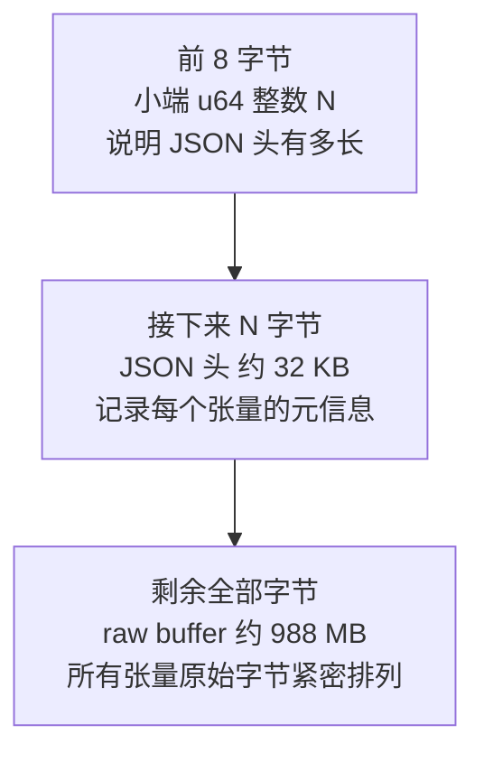
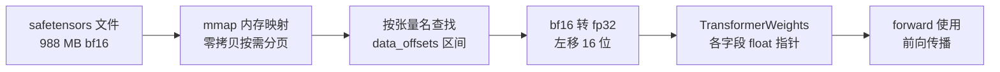

# 第二章 权重的存储与加载

> 第 2 章 | 配合源码：`safetensors.h` / `safetensors.c`（约 300 行） | [上一章：基础概念](01-basics.md) | [下一章：JSON 解析器](03-json.md)

本章解决一个问题：**模型权重在磁盘上长什么样，引擎怎么把它读进内存**。

第一章我们算出模型有 4.94 亿个参数，但它们不会凭空出现在内存里。这些数字在磁盘上排成一个 `model.safetensors` 文件（988 MB），引擎启动时要把它读进来、转成 float、交给前向传播使用。这整个过程都在 `safetensors.c` 里完成。

---

## safetensors 文件格式

HuggingFace 的 safetensors 格式极简，设计目标是「安全（不能执行代码）+ 快（mmap 友好）」。它的二进制布局是这样的：

```
 字节偏移
 0        ┌───────────────────────────────────┐
          │ u64 header_len (小端, 8 字节)      │  告诉你 JSON 头有多长
 8        ├───────────────────────────────────┤
          │ header JSON (header_len 字节)      │  张量元信息表
          │ { "tensor_name": {                │
          │     "dtype": "BF16",              │
          │     "shape": [151936, 896],       │
          │     "data_offsets": [0, 272269312]│  在下面 buffer 的位置
          │   }, ...                          │
          │ }                                 │
 8+N      ├───────────────────────────────────┤
          │ raw tensor data (连续二进制)       │  所有张量的字节紧密排列
 EOF      └───────────────────────────────────┘
```

整个文件就三段：

1. **前 8 字节**：一个小端序的 64 位整数，告诉你第二段（JSON 头）有多少字节。
2. **JSON 头**：一张"元信息表"，记录每个张量的名字、数据类型、形状、以及它的原始字节在第三段里的起止位置。
3. **原始数据**：所有张量的字节紧密排列在一起，没有任何分隔符或对齐填充。

这个图展示 safetensors 文件的三段式二进制布局，以及每段在真实模型文件里大约占多大：



**关键洞察**：JSON 头记录了每个张量在 raw buffer 中的 `[start, end)` 区间。加载时只要按 offset 取指针——**零拷贝**，不用把数据搬来搬去。

> 📍 **在哪**：`safetensors.h` 顶部的注释把这套布局又复述了一遍。`safetensors_open()` 函数（`safetensors.c`）按这三段依次解析。

## 核心术语

在进入代码之前，先讲清楚两个底层概念，它们决定了为什么代码这么写。

### mmap（内存映射文件）

- 大白话**：把磁盘文件「映射」到内存地址空间，访问内存等于读文件，不用 `fread`。
- 为什么用**：读 1GB 权重时，`fread` 要多次系统调用 + 额外 buffer；`mmap` 让操作系统按需把文件页加载进内存，近乎瞬时，内存占用按需。

```c
void *map = mmap(NULL, file_size, PROT_READ, MAP_PRIVATE, fd, 0);
// 之后访问 map[offset] 直接命中内存
```

几个参数的含义：

- `PROT_READ`：只读权限（权重不需要写）
- `MAP_PRIVATE`：私有映射（写时复制，不影响原文件）
- `MAP_FAILED`：映射失败的返回值（代码里用来检查错误）

> 📍 **在哪**：`safetensors.c` 的 `safetensors_open()` 函数里那行 `mmap(NULL, file_size, PROT_READ, MAP_PRIVATE, fd, 0)`。映射完拿到指针，后续所有读操作都基于这个指针算偏移。

### little-endian（小端序）

- 大白话**：多字节数据在内存里的排列顺序。「小端」= 低位字节存在低地址。

```
数字 0x12345678 (4字节) 的小端存储:
地址:  [0]   [1]   [2]   [3]
内容:  0x78  0x56  0x34  0x12   ← 低位在前
```

几乎所有现代 CPU（x86、ARM）都是小端。safetensors 也用小端，所以可以直接 `memcpy`，不用做字节序转换。代码里有个专门的函数读小端 u64：

```c
static unsigned long read_u64_le(const unsigned char *b) {
    unsigned long v = 0;
    for (int i = 0; i < 8; i++) {
        v |= ((unsigned long)b[i]) << (8 * i);
    }
    return v;
}
```

> 📍 **在哪**：`safetensors.c` 的 `read_u64_le()`，用来读文件最开头那 8 字节的 header 长度。

## 数据类型：bf16 / fp16 / fp32

权重用 **bfloat16** 存储（省一半空间），但引擎用 **float32** 计算（精度高）。所以加载时要做一次 `bf16 → fp32` 的转换。

三种浮点格式的位结构：

```
fp32 (32位): [符号 1] [指数 8] [尾数 23]
bf16 (16位): [符号 1] [指数 8] [尾数  7]   ← 就是 fp32 砍掉低 16 位尾数
fp16 (16位): [符号 1] [指数 5] [尾数 10]   ← 指数位少, 动态范围小
```

**为什么用 bf16 不用 fp16**：bf16 保留了 fp32 的 8 位指数（动态范围一样），只牺牲尾数精度。训练时不容易溢出，所以成了现代 GPU/TPU 默认格式。

### bf16 → fp32 转换

bf16 就是 fp32 的高 16 位，左移即可：

这个图展示 bf16 的 16 位如何对齐放进 fp32 的 32 位——bf16 整体放在高 16 位，低 16 位补零：


```c
uint16_t b = ...;                    // 读 bf16
uint32_t bits = ((uint32_t)b) << 16; // 放到 fp32 高 16 位
memcpy(&out[i], &bits, 4);           // 位重新解释成 float
```

> 📍 **在哪**：`safetensors.c` 的 `safetensors_load_float()` 函数里 `BF16` 分支。逐元素把 2 字节扩成 4 字节。`F16` 分支也实现了（处理非正规数、inf/nan），但 Qwen2.5 用不到，只是顺手支持。

### strict aliasing（严格别名规则）

- 大白话**：C 编译器认为 `float*` 和 `uint32_t*` 指向同一块内存是「未定义行为」。所以不能用 `*(float*)&bits` 做类型转换，要用 `memcpy`（编译器会优化成零开销）。

`safetensors.c` 文件顶部的注释专门强调了这条规则——为什么必须用 `memcpy(&f, &fp32_bits, 4)` 而不是直接解引用。这是 C 语言里一个经典的坑，开了 `-O2` 优化后违反严格别名可能导致诡异 bug。

## 权重的张量命名规则

Qwen2.5 在 safetensors 里的张量命名遵循 transformers 惯例：

```
model.embed_tokens.weight                      ← 词嵌入表
model.layers.0.input_layernorm.weight          ← 第0层 attention 前的 RMSNorm
model.layers.0.self_attn.q_proj.weight         ← 第0层 Query 投影权重
model.layers.0.self_attn.q_proj.bias           ← 第0层 Query 投影偏置 (Qwen 独有!)
model.layers.0.self_attn.k_proj.weight         ← Key 投影
model.layers.0.self_attn.v_proj.weight         ← Value 投影
model.layers.0.self_attn.o_proj.weight         ← Output 投影 (无 bias)
model.layers.0.post_attention_layernorm.weight ← MLP 前的 RMSNorm
model.layers.0.mlp.gate_proj.weight            ← SwiGLU 的门控矩阵
model.layers.0.mlp.up_proj.weight              ← 上投矩阵
model.layers.0.mlp.down_proj.weight            ← 下投矩阵
model.norm.weight                              ← 最终 RMSNorm
...                                            (每层重复, layers.0 到 layers.23)
```

命名规律：

- `model.embed_tokens` / `model.norm`：全局唯一的张量（词嵌入表、最终归一化）。
- `model.layers.{N}.xxx`：第 N 层的权重，N 从 0 到 23。
- `self_attn` / `mlp`：注意力子模块和前馈子模块。
- `input_layernorm` / `post_attention_layernorm`：两个 RMSNorm，对应第一章说的"每层两次归一化"。

**关键**：`tie_word_embeddings=true` 时，**没有 `lm_head.weight`**——输出头复用 `embed_tokens`。所以引擎最后算 logits 时，用的是同一张 embedding 表转置过来用（见 `net.c` 的最终输出代码）。

> 📍 **在哪**：`safetensors.c` 的 `safetensors_load_weights()` 把这些名字一一映射到 `TransformerWeights` 结构体的字段，并用注释列出了完整的命名对照表。

### 逐层拼装的技巧

safetensors 把每一层单独存（`layers.0.xxx`, `layers.1.xxx`, ...），但引擎希望 24 层叠成一个连续数组（`[24, dim]` 这种形状），方便用 `layer * stride + offset` 索引。所以有个 `load_layered()` 辅助函数：

```c
static int load_layered(SafetensorsFile *st, float *dst,
                        const char *suffix, int n_layers, size_t each_floats) {
    char name[256];
    for (int l = 0; l < n_layers; l++) {
        LAYER_NAME(name, sizeof(name), l, suffix);   // 拼出 "model.layers.{l}.{suffix}"
        float *tmp = safetensors_load_float(st, name);
        memcpy(dst + (size_t)l * each_floats, tmp, each_floats * sizeof(float));
        free(tmp);
    }
    return 0;
}
```

每一层读出来临时存放，再 `memcpy` 拼到目标大数组的对应位置。24 层循环完，就得到一个连续的 `(n_layers, ...)` 张量。

> 📍 **在哪**：`safetensors.c` 的 `load_layered()` 和宏 `LAYER_NAME`，被 `safetensors_load_weights()` 反复调用。

## 实例：embedding 表在文件里的精确位置

光讲布局还是抽象。用 `./run info` 看真实数据：

```
model.embed_tokens.weight   dtype=BF16  shape=[151936,896]
                            data[0, 272269312]   (272269312 bytes)
```

这几个数字的含义：

```
model.safetensors 文件 (988 MB 总大小)
┌──────────────────────────────────────────────────────────┐
│ 第 0-7 字节:      u64 header 长度                        │
├──────────────────────────────────────────────────────────┤
│ 第 8-32287 字节:  JSON header (32280 字节)               │
├──────────────────────────────────────────────────────────┤
│                                                          │
│  ★ 第 32288 ~ 272301599 字节 ★  ← embedding 表就在这!    │
│                                                          │
│  151936 行 × 896 列 × 2字节(bf16) = 272269312 字节 ≈ 260MB │
│  这就是全部词向量的原始数据                                │
│                                                          │
├──────────────────────────────────────────────────────────┤
│  其他权重 (q_proj, k_proj, mlp_gate ...)                  │
└──────────────────────────────────────────────────────────┘
```

**embedding 表占了整个模型文件的 260/988 ≈ 26%**——超过四分之一。这也是为什么小模型的 embedding 表占比特别高：词表（151936）相对特征维（896）很大，而层数（24）又少。

### 从磁盘到内存的完整旅程

这个图展示权重从磁盘上的 safetensors 文件，到内存里 float 数组、再到 forward 调用的完整流转：



把 `data_offsets=[0, 272269312]` 这两个数字连起来，能看到一个 token 的向量是怎么从磁盘走到内存的：

```
训练阶段 (Qwen 团队做的)
  在 GPU 集群上训练, 学到了 151936 × 896 个最优数字
  → 存进 model.safetensors
        │
        │  你用 ./download.sh 下载 (988 MB)
        ▼
磁盘上
  model.safetensors 的 raw buffer 开头 (偏移 0)
  存了 260 MB 的 bf16 数据
        │
        │  ./run 启动时, safetensors.c 做了这一行:
        │  w->token_embedding_table = safetensors_load_float(
        │      st, "model.embed_tokens.weight");
        ▼
内存里
  malloc 一块 151936 × 896 × 4 = 544 MB 的 float 数组
  (bf16 每个 2 字节 → 转成 fp32 每个 4 字节, 所以翻倍)
        │
        │  forward(token=4616) 时
        ▼
使用
  token_embedding_table + 4616 × 896  ← 跳过前 4616 个词, 定位到 "cat"
  memcpy 拷贝 896 个 float → s->x → 进入 Transformer
```

注意 `data_offsets=[0, 272269312]` 是相对于 raw buffer 起点的偏移，不是相对于整个文件。引擎在 `safetensors_open()` 里记下了 raw buffer 的起点（`st->data = bytes + 8 + header_len`），之后所有读取都基于这个起点算偏移。

### 内存中的布局

```
w->token_embedding_table (544 MB, 1亿3573万个 float):

         [0]     [1]     [2]    ...    [895]
       ┌────────────────────────────────────┐
  行 0 │ -0.003  0.015  -0.021  ...  0.008  │ ← token 0 的 896 个数
  行 1 │  0.012 -0.004   0.033  ... -0.011  │ ← token 1
       │  ...                               │
行 4616 │ -0.016  0.003  -0.002  ...  0.005  │ ← "cat" (id=4616) 的向量
       │  ...                               │
行 9707│ -0.025  0.006  -0.010  ... -0.002  │ ← "Hello" (id=9707)
       │  ...                               │
行151935│ 0.025  -0.006  0.010  ... -0.002  │
       └────────────────────────────────────┘
```

**查表过程就一步**：`table[token_id]`，取出那一行的 896 个数字。这就是"词嵌入"（embedding）的全部操作——没有计算，只是按行号取数据。

> **这 896 个数字怎么来的？** 是训练出来的。训练时模型不断调整这 1.35 亿个数字，让意思相近的词向量也相近。加载的 safetensors 里存的，就是训练完的最优值。

## SafetensorsFile 结构体

整个加载过程围绕一个结构体 `SafetensorsFile`，它在 `safetensors.h` 里定义：

```c
typedef struct {
    char *path;            // 文件路径 (调试用)
    char *header_json;     // header JSON 文本 (以 \0 结尾)
    unsigned long header_len; // header JSON 的字节长度
    JsonValue *header;     // 解析后的 header 树 (open 时建好，close 时释放)
    unsigned char *data;   // 指向 raw buffer 起点的指针
    unsigned long data_size; // raw buffer 字节数
    /* 整个文件 mmap 的起点 (用来最后 munmap) */
    unsigned char *mapped;
    unsigned long mapped_size;
} SafetensorsFile;
```

几个指针的关系（重要，别混淆）：

```
mapped ──► 文件最开头 (字节 0)
             │
             │  +8                +8+header_len
             ▼                     ▼
           [u64 header_len]   [raw buffer 起点]
                                   ▲
data ─────────────────────────────-┘  (st->data = mapped + 8 + header_len)
```

- `mapped`：mmap 返回的起点，对应文件字节 0。`close` 时用它来 `munmap`。
- `data`：raw buffer 的起点，对应文件字节 `8 + header_len`。所有张量的 `data_offsets` 都是相对于这个点。
- `header_json`：JSON 头的文本（拷贝了一份，加了 `\0` 结尾）。
- `header`：用 JSON 解析器（下一章）把 `header_json` 解析成的树，之后查张量元信息都走这棵树。

> 📍 **在哪**：`safetensors.h` 的结构体定义；`safetensors.c` 的 `safetensors_open()` 负责填好所有字段，`safetensors_close()` 负责 `munmap` + `free` + 释放 JSON 树。

### 四个对外函数

| 函数 | 做什么 | 大白话 |
|------|--------|--------|
| `safetensors_open(path, st)` | 打开文件、mmap、解析 header | 把书翻开、查目录 |
| `safetensors_close(st)` | munmap + free + 释放 JSON | 合上书 |
| `safetensors_find(st, name, ...)` | 查一个张量的偏移/长度/形状/dtype | 翻目录找到某一章的页码 |
| `safetensors_load_float(st, name)` | 读出张量并转成 float 数组 | 翻到那一页、把内容抄成 float |
| `safetensors_load_weights(st, cfg, w)` | 把整套权重加载进 `TransformerWeights` | 一次性把整本书抄进内存 |

`safetensors_load_weights()` 是引擎启动时调用的总入口，它先分配所有字段的内存，然后对每个字段调 `load_layered()`（逐层拼）或 `safetensors_load_float()`（全局张量直接读）。

---

## 本章小结

1. **safetensors = 8 字节头长度 + JSON 头 + 连续 raw buffer**。三段式，极简，没法藏代码所以安全。
2. **mmap 让读文件像访问内存**，不用 `fread`，按需分页，适合读大权重。
3. **小端序是默认**，所以 x86/ARM 上可以直接 `memcpy`，不用转字节序。
4. **bf16 是 fp32 的高 16 位**，转换只要左移 16 位；`memcpy` 是为了遵守严格别名规则，不是为了拷贝（编译器会优化掉）。
5. **embedding 表占文件 26%**（260MB），是 raw buffer 的开头那一段；加载后翻倍成 544MB（bf16→fp32）。
6. **权重命名遵循 `model.layers.{N}.xxx` 规律**，`tie_word_embeddings=true` 时输出头复用 embedding 表。

下一章我们看那个 JSON 头是怎么被解析的——因为 safetensors 的 header 就是 JSON，而我们的引擎不依赖任何外部库，所以得手写一个 JSON 解析器。

> 继续阅读：[第三章 JSON 解析器](03-json.md)
