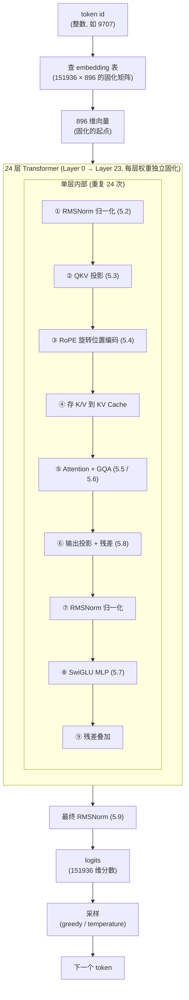
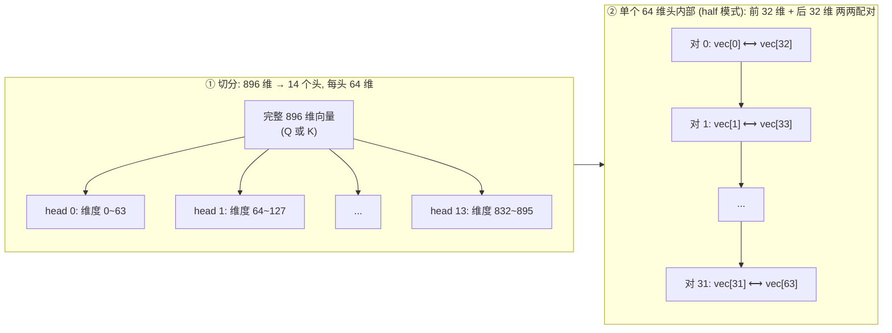
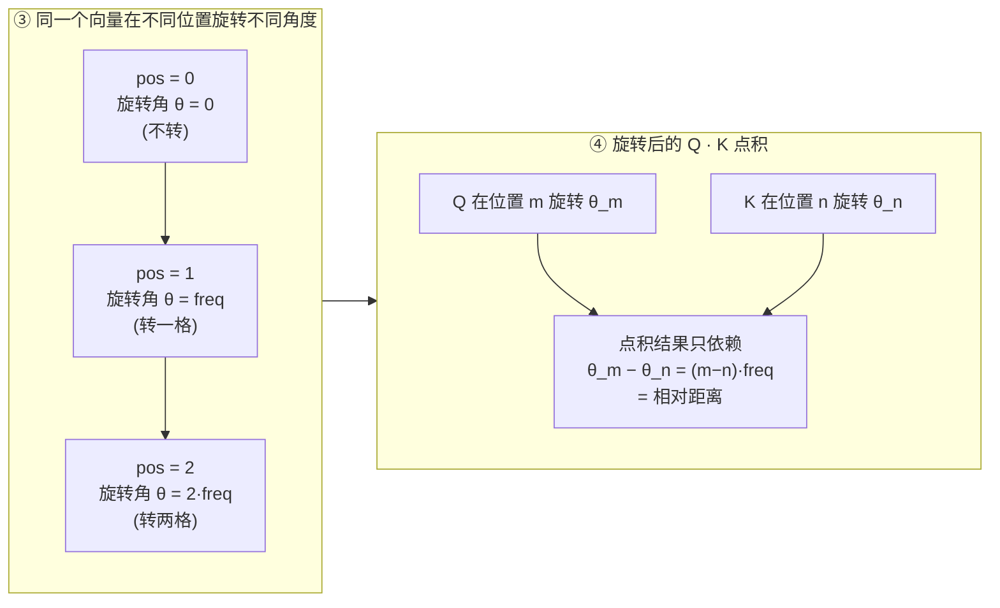
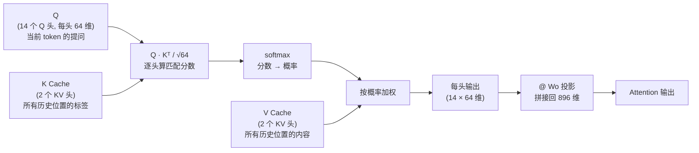
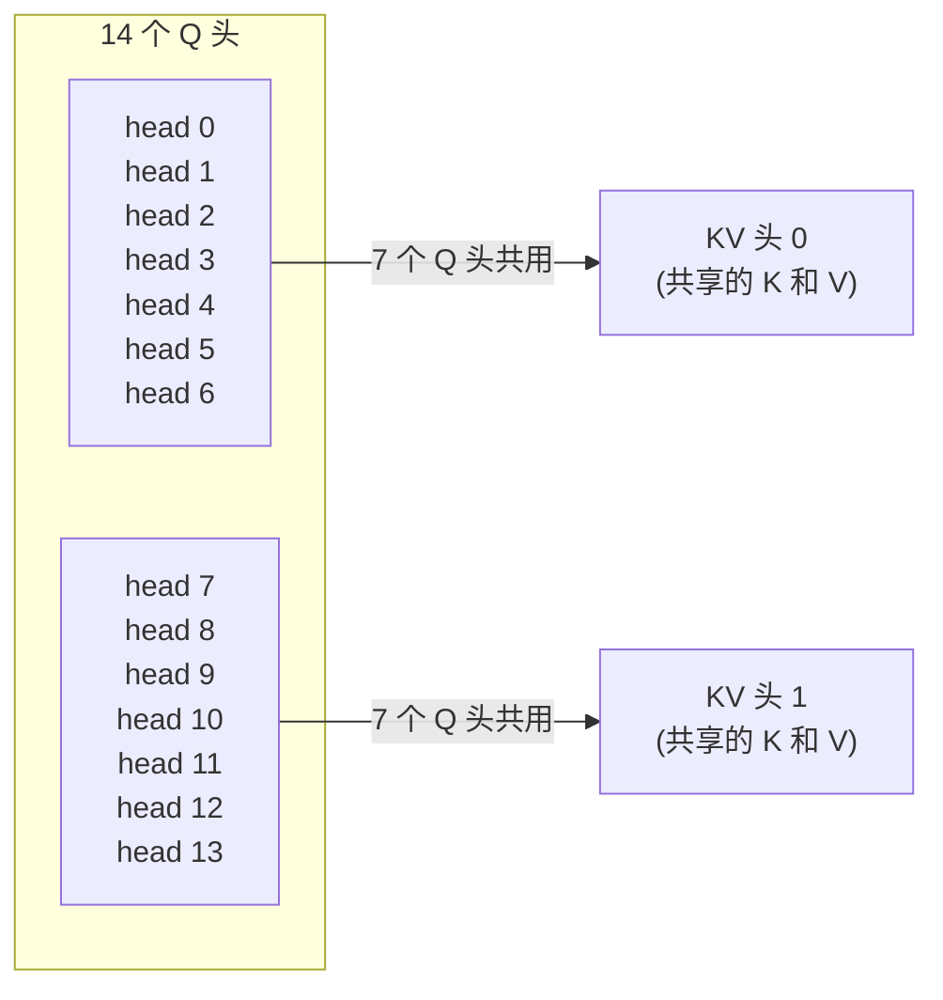
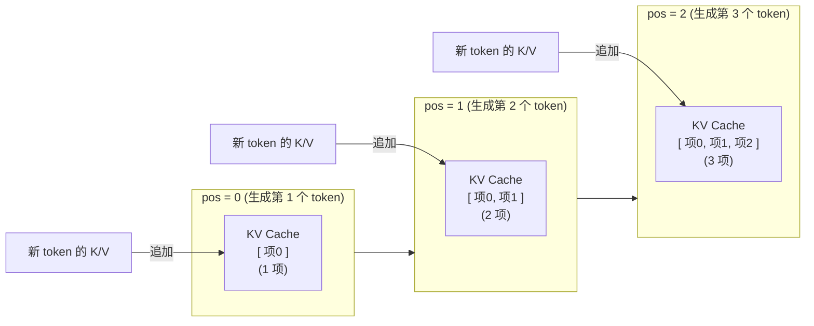

# 第五章 前向传播（net.c）

> 第 5 章 | 配合源码 `net.c`（约 400 行） | [上一章：模型结构](./04-model.md) | [下一章：分词器](./06-tokenizer.md)

---

## 这章讲什么

`net.c` 是整个推理引擎的核心。所有算子（RMSNorm、matmul、RoPE、Attention、SwiGLU）都在这里。

**这是最重要的一章，建议反复读。**

本章的展开方式：

- 先用真实数据看清「一个 token 进来后，到底发生了什么」
- 给出单层 Transformer 的完整流程图
- 5.2～5.9 逐个拆解每个算子，配原理 + 代码 + 真实数字

---

## 一个 token 的旅程：从 embedding 到 logits

在看具体算子之前，先用真实数据看清楚「一个 token 进来后，到底发生了什么」。

### 关键区分：什么是固化的，什么是变化的

```
固化的 (训练时就定死, 存在 safetensors 里):
  ① embedding 表       — "Hello" 永远查到同样的 896 个数
  ② 每层的权重矩阵     — Wq/Wk/Wv/Wo/MLP, 推理时不改变
  ③ 每层的归一化权重   — rms_att_weight, rms_ffn_weight

变化的 (每次推理都重新算):
  ④ 每层的中间向量 x   — 896 个数, 每过一层就被改写一次
  ⑤ 注意力分数         — 取决于输入了哪些 token
  ⑥ 最终 logits        — 每次输入不同, 输出就不同
```

### 真实数据：同一个 token 经过 24 层的变化

用 token "Hello" (id=9707) 跑一遍，看它前 4 个数怎么变：

```
Embedding 后(起点):  [-0.025,  0.006, -0.010,  0.013]   ← 固化起点(查表)
第 0 层后:           [ 0.096,  0.091,  0.253, -0.066]   ← 变了
第 1 层后:           [ 0.028,  0.213,  0.177, -0.204]   ← 又变了
第 2 层后:           [-0.669, -6.341, -2.660,  4.762]   ← 又变了
   ...
第 23 层后:          [ 3.011,  2.389,  0.339,  2.611]   ← 最终的向量
```

**起点是固化的（embedding 查表），但每经过一层，896 个数都被改写成新的值**。最终第 23 层的向量用来算 logits，预测下一个词。

### 每一层对向量做了什么（做菜类比）

把 24 层想象成流水线的 24 道工序：

```
菜谱(权重)是固化的, 食材(向量)每经过一道工序都在变化
```

每一道工序（每一层）做两件事：

**第一件：注意力（Attention）— "看看周围的词"**

```
"Hello" 进入第 0 层时:
  它拿着自己的 Q (问题), 去和所有已出现词的 K (标签) 匹配
  → 发现自己和某些词更相关
  → 把相关词的 V (内容) 混进自己的向量里

结果: "Hello" 的向量不再是孤立的, 它"知道"了上下文
```

**第二件：前馈网络（MLP）— "独立思考一下"**

```
"Hello" 吸收了上下文后:
  经过 MLP, 把 896 维扩张到 4864 维(更多思考空间)
  SwiGLU 门控决定哪些信息该强化、哪些该抑制
  再压缩回 896 维

结果: "Hello" 的向量变得更"抽象", 更接近语义
```

两件事都通过残差连接叠加到原向量上：

```
x_新 = x_旧 + 注意力(x_旧)      ← 加上"从别人那里学到的"
x_新 = x_新 + MLP(x_新)         ← 加上"自己思考的结果"
```

### 24 层的累积效应

每一层都让向量变得更"高级"：

```
第 0-3 层 (浅层):   学到词性、语法关系
                   "Hello" → 知道这是个问候语
第 4-15 层 (中层):  学到短语、搭配
                   "Hello" → 知道后面常跟 "world" / "how are you"
第 16-23 层 (深层): 学到语义、推理
                   "Hello" → 结合上下文, 决定下一个最合理的词
```

### 完整流程图

```
  "Hello" (文字)
     │
     │  分词器
     ▼
  token id = 9707                          [固化的词表]
     │
     │  查 embedding 表 (固化)              ← 起点固化的
     ▼
  896 维向量 [-0.025, 0.006, ...]
     │
     │  ┌─────────────────────────────┐
     │  │ 第 0 层 (权重固化):          │
     │  │   ① 注意力: 看周围的词       │  ← 向量变化
     │  │   ② MLP: 独立加工            │  ← 向量再变化
     │  └─────────────────────────────┘
     ▼
  新的 896 维向量 [0.096, 0.091, ...]
     │
     │  第 1 层 ... (同样的两件事, 不同权重)
     ▼
  ... 重复 24 次, 每次向量都在变 ...
     │
     │  最终 RMSNorm + 投影回词表
     ▼
  logits (151936 个分数)
     │
     │  采样 (greedy / temperature)
     ▼
  下一个 token
```

> 核心洞察：embedding 是固定的起点，权重是固定的"加工规则"，但向量本身每过一层都在变。
> 经过 24 层后，"Hello" 的向量已经融合了上下文、语法、语义：变成能用来预测下一个词的"高级表示"。
> 这就是为什么同一个词在不同句子里，最终表示会不一样（上下文通过每层的 attention 注入）。

---

## 单层 Transformer 的完整流程

下面这张图是本章的「地图」，5.2～5.9 节分别对应图里的每一步：

```
        x (896维)
        │
   ┌────┴────────────────────────────────────────┐
   │  ① RMSNorm(x, rms_att_w) → xb              │  归一化 (5.2)
   │  ② Q=xb@Wq+bq  K=xb@Wk+bk  V=xb@Wv+bv     │  QKV 投影 (5.3)
   │  ③ RoPE(Q, pos), RoPE(K, pos)              │  旋转位置编码 (5.4)
   │  ④ 存 K,V 到 KV Cache 第 pos 列             │  缓存
   │  ⑤ Attention (GQA: 14个Q头共享2个KV头)      │  注意力 (5.5 + 5.6)
   │  ⑥ xb2 = out@Wo, x += xb2                  │  输出投影 + 残差 (5.3 / 5.8)
   │  ⑦ RMSNorm(x, rms_ffn_w) → xb              │  归一化 (5.2)
   │  ⑧ SwiGLU: silu(xb@Wgate) * (xb@Wup) @Wdown│  前馈网络 (5.7)
   │  ⑨ x += mlp_out                            │  残差 (5.8)
   └─────────────────────────────────────────────┘
        │ (重复 24 次)
        ▼
   最终 RMSNorm + 投影回词表 → logits (5.9)
```

这个图展示一个 token 从输入到输出的完整旅程：经过 embedding 查表得到 896 维起点向量，再依次穿过 24 层 Transformer（每层做 Attention + MLP 两件事），最终归一化并投影回 151936 维词表，采样得到下一个 token。



对应源码：`net.c` 的 `forward()` 函数（第 182 行起），主循环 `for (int l = 0; l < L; l++)` 在第 210 行。

---

## 算子 1：RMSNorm（归一化）

### 先看不做归一化会怎样

每一层都做矩阵乘法（QKV 投影），本质是 896 个数累加：

```c
for (int j = 0; j < 896; j++) {
    val += wrow[j] * x[j];   // 896 个乘积累加
}
```

896 个数相加，如果每个都稍微大一点，总和就会大很多。**每层放大一点，24 层指数级爆炸**。

用同一个输入走两条路做实验：唯一区别是「有没有在每层开头归一化」：

```
同一个 896 维输入, 走两条路对比:

  层数      不归一化 (只做矩阵乘法)     每层开头归一化 (拉回标准再做乘法)
  ────────────────────────────────────────────────────────────────
  第 0 层    |x| = 0.86                 |x| = 85.6
  第 1 层    |x| = 2.61                 |x| = 90.4
  第 2 层    |x| = 7.65                 |x| = 87.9
  第 3 层    |x| = 22.36                |x| = 87.5
  第 5 层    |x| = 195                  |x| = 90.0
  第 10 层   |x| = 43,925               |x| = 87.8
  第 15 层   |x| = 11,134,814           |x| = 91.2
  第 20 层   |x| = 2,527,791,360   ← 爆炸  |x| = 85.3
  第 22 层   |x| = 22,842,894,336 ← 爆炸  |x| = 91.1
  第 23 层   |x| = 69,113,749,504 ← 爆炸  |x| = 90.6
```

左边不归一化：数值像滚雪球，每一层只做矩阵乘法把上一层的输出原样放大，没人拦，指数增长到 690 亿：浮点数装不下，模型废掉。

右边每层归一化：每一层开头先把上一层的输出拉回标准大小，再做矩阵乘法。所以不管上一层输出 85 还是 91，进入这层时都从同样起点开始：数值始终稳定。

为什么会爆炸：每层矩阵乘法让向量稍微变大一点，连续 24 次就指数增长：

```
每层放大 2 倍的话:
  第 1 层: ×2
  第 2 层: ×4
  第 10 层: ×1024
  第 24 层: ×16,777,216   ← 原来的 1600 万倍

归一化做的事 = 每层门口按一下"重置键", 把数值拉回标准大小
  → 上一层的"雪球"大小清零
  → 这层从标准大小重新开始, 不会累积
```

### 归一化的目的：防止数值在多层传递中爆炸或消失

**在每一层开头，把向量"拉回"标准大小，防止累积爆炸**。就像每层门口装了一个"音量调节器"：不管上一层输出多响，进门先调回标准音量，这样就不会一层层累积爆炸。

### 具体怎么处理的（三步）

```c
// net.c: rmsnorm()  (第 98 行)
static void rmsnorm(float *out, const float *x, const float *weight, int size, float eps) {
    // 第 1 步: 算这 896 个数的"平均个头"(均方根 RMS)
    double ss = 0.0;
    for (int i = 0; i < size; i++) ss += x[i] * x[i];
    ss = ss / size + eps;                 // ← eps 防止除以 0
    float inv = 1.0f / sqrtf((float)ss);  // ← RMS 的倒数

    // 第 2+3 步: 每个数除以 RMS(统一缩放), 再乘 weight(逐维微调)
    for (int i = 0; i < size; i++)
        out[i] = (x[i] * inv) * weight[i];
}
```

用一个具体例子走一遍。假设输入向量只有 4 维（简化）：

```
输入 x:       [0.6,  1.2,  0.3,  0.9]     ← 当前层的输入

第 1 步: 算"平均个头"
  平方:        [0.36, 1.44, 0.09, 0.81]
  求和:        0.36 + 1.44 + 0.09 + 0.81 = 2.7
  除以 4:      2.7 / 4 = 0.675
  加 eps:      0.675 + 0.000001 ≈ 0.675
  开方(RMS):   √0.675 ≈ 0.822
  倒数:        1 / 0.822 ≈ 1.217

第 2 步: 每个数除以 RMS (统一缩放, 比例不变)
  0.6 × 1.217 = 0.730
  1.2 × 1.217 = 1.460
  0.3 × 1.217 = 0.365
  0.9 × 1.217 = 1.095
  → 整体放大了, 但大的还是大, 小的还是小 (比例保留)

第 3 步: 乘 weight (每维独立微调, 训练学的)
  假设 weight = [1.5, 0.3, 2.0, 0.9]:
  0.730 × 1.5 = 1.095   ← 这维重要, 放大
  1.460 × 0.3 = 0.438   ← 这维不重要, 缩小
  0.365 × 2.0 = 0.730   ← 放大
  1.095 × 0.9 = 0.986   ← 微调

输出: [1.095, 0.438, 0.730, 0.986]
```

三步分别的作用：

| 步骤 | 做什么 | 为什么 |
|------|--------|--------|
| ① 算 RMS | 统计当前向量的"平均大小" | 知道该缩放多少 |
| ② 除以 RMS | 统一缩放到标准大小 | **防止多层累积爆炸**（核心目的） |
| ③ 乘 weight | 每维独立微调 | 让模型学到"哪些维度重要" |

### eps 是干嘛的

```c
ss = ss / size + eps;   // ← eps = 1e-6
```

**防止除以零**。万一向量全是 0，RMS = 0，`1/0` 会得到无穷大。加一个极小的数兜底。

### 每层有两个 RMSNorm（不是只在最开始做一次）

常见误区：以为归一化只在整个网络最开始做一次。
实际：每一层内部做两次：attention 前一次，MLP 前一次。

为什么两次？因为一层里有两个独立的子模块（Attention + MLP），各自都会改变数值大小。**每次做矩阵乘法之前都要归一化**，一层有两处矩阵乘法，所以两次：

```
x 进入一层
  │
  ├─ 归一化 ① (rms_att_weight)   ← Attention 前
  │   把 x 拉回标准大小 → 做 Attention
  │                      Attention 算完, 数值又变了
  ├─ 残差: x = x + attention输出
  │
  ├─ 归一化 ② (rms_ffn_weight)   ← MLP 前
  │   再次把 x 拉回标准大小 → 做 MLP  ← 不归一化的话, MLP 输入就是乱的
  │
  ├─ 残差: x = x + mlp输出
  └─ 给下一层 (下一层又会归一化两次)
```

核心原则：每进一个"加工车间"（Attention / MLP），门口都要归一化一次。类比工厂流水线，一道工序里有两个车间，每个车间门口都要安检：不是全程只安检一次。

代码里对应两次调用（`net.c:221` 和 `net.c:374`）：

```c
rmsnorm(..., w->rms_att_weight, ...)   // 第 1 次: attention 前 (net.c:221)
rmsnorm(..., w->rms_ffn_weight, ...)   // 第 2 次: MLP 前    (net.c:374)
```

两组权重各自训练（`rms_att_weight` 和 `rms_ffn_weight`），因为 attention 和 MLP 对数值分布的要求不同。所以每层归一化参数是 `896 + 896 = 1792` 个：两个车间，各 896 个旋钮。

### 为什么用 RMSNorm 而不是 LayerNorm

```
LayerNorm:  减均值 → 除标准差 → 乘 weight    (三步)
RMSNorm:              除 RMS → 乘 weight      (两步, 省掉了减均值)
```

RMSNorm 少算一步（不用算均值），计算量更小，效果几乎一样。现代 LLM（Llama/Qwen）基本都用 RMSNorm。

### 一句话总结

**归一化 = 每层门口的音量调节器**。不管上一层输出多大多小，进门先调回标准大小，防止 24 层累积爆炸。这是深层网络能稳定工作的前提条件：没有它，22 层就数值溢出了。

---

## 算子 2：matmul（矩阵向量乘）

**最耗时的部分**（占 95%+ 计算量）。

```c
// net.c: matmul()  (第 114 行)
// out[d] = W[d,n] @ x[n] + bias[d]
// W 以 row-major 存储: W[i*n+j] 是第 i 行第 j 列
static void matmul(float *out, const float *W, const float *x,
                   const float *bias, int n, int d) {
    for (int i = 0; i < d; i++) {
        float val = (bias ? bias[i] : 0.0f);
        const float *wrow = W + (size_t)i * n;
        for (int j = 0; j < n; j++) val += wrow[j] * x[j];
        out[i] = val;
    }
}
```

术语：

- row-major（行主序）：矩阵按行存储，`W[i*n+j]` 是第 i 行第 j 列。C 语言数组默认就是 row-major。
- 投影 (projection)：`y = Wx + b` 这个操作叫「线性投影」：把向量乘以矩阵变换到另一个空间。

> ⚠️ 开发时的坑：`matmul(out, W, x, bias, n, d)` 的参数 `n` 是输入维度、`d` 是输出维度。
> 调用时传反会导致写越界。本项目开发时 k_proj 的参数传反过，ASan 抓到了。

### 重要辨析：三种"矩阵"不要混淆

讨论 Transformer 维度时，必须区分三类完全不同的"矩阵"：

| 类别 | 是什么 | 大小由谁决定 | 会变吗 |
|------|--------|-------------|--------|
| **① 权重矩阵** | 训练学出的参数（wq/wk/wv 等） | **模型结构固定** | 不会（训练完就不变） |
| **② 输入数据张量** | embedding 后的中间结果 | **seq_len 决定行数** | 会（不同输入不同） |
| **③ 注意力分数矩阵** | Q·Kᵀ 算出的分数 | **seq_len × seq_len** | 会（不同输入不同） |

用 `./run info` 看真实的权重矩阵形状（类别①）：

```
q_proj.weight  shape=[896, 896]   ← 权重方阵, 不管输入几个 token 都是 896×896
k_proj.weight  shape=[128, 896]   ← 长方形 (GQA)
o_proj.weight  shape=[896, 896]   ← 权重方阵
mlp.gate_proj  shape=[4864, 896]  ← 长方形 (MLP 扩张)
embed_tokens   shape=[151936, 896] ← 长方形 (词表×特征)
```

输入数据的张量（类别②）：

```
输入 2 个 token:    张量形状 = [2, 896]     ← 2 行(行=token数), 896 列(特征)
输入 128 个 token:  张量形状 = [128, 896]   ← 128 行, 896 列
                    行数 = seq_len, 和 896 无关
```

注意力分数矩阵（类别③）：

```
输入 2 个 token:    score 形状 = [2, 2]      ← 2×2, 和 896 完全无关
输入 128 个 token:  score 形状 = [128, 128]
                    永远是 [seq_len, seq_len]
```

> ⚠️ 常见误区："`hidden_size=896` 是不是意味着内部矩阵都是 896×896？"
> **不是**。896 是特征维（每个 token 有 896 个数）。
> - 权重矩阵：有的是 896×896 方阵（Q/O），有的是长方形（K/V/MLP/embedding）
> - 数据张量：行数 = token 数（seq_len），列数 = 896
> - 注意力矩阵：seq_len × seq_len，和 896 无关

---

## 算子 3：RoPE（旋转位置编码）

问题：注意力本身是顺序无关的：打乱 token 顺序，Q/K/V 不变。但语言顺序重要。
解决：用「旋转」编码位置。不同位置的向量旋转不同角度。

```c
// net.c: rope()  (第 139 行)
static void rope(float *vec, int head_dim, int pos, float base) {
    for (int i = 0; i < head_dim / 2; i++) {
        float freq = powf(base, (float)(-2*i) / head_dim);
        float angle = pos * freq;
        float c = cosf(angle), s = sinf(angle);
        // HF "half" 模式: vec[i] 和 vec[i + head_dim/2] 配对
        float a = vec[i], b = vec[i + head_dim / 2];
        vec[i]             = a * c - b * s;
        vec[i + head_dim/2] = a * s + b * c;
    }
}
```

这个图展示 RoPE 的两个关键概念：左图：896 维向量怎么切成 14 个头（每个头 64 维），64 维内部按 HF "half" 模式把前 32 维和后 32 维配对成 32 个复数对；右图：同一个向量在不同位置 pos=0/1/2 被旋转不同角度（每对的频率 freq 不同，位置越大旋转角越大），最终 Q 和 K 旋转后做点积，结果只依赖相对位置 (m−n)。



配对之后，每对 (a, b) 被当作一个复数 a + bi，乘以 e^{iθ} 做旋转。**位置越大，旋转角越大；低频对（高维索引 i 大）转得慢，编码长距离；高频对转得快，编码短距离**。



核心直觉：把相邻两个维度看作复数，乘以 e^{iθ} 做旋转。
位置 m 和位置 n 的注意力分数只依赖 (m-n) 即相对距离。

rope_theta 的作用：基频。越大，能编码的位置越远。

- GPT-2: theta=10000（上下文 1024）
- Qwen2.5: theta=1000000（上下文 32768）

**只作用于 Q 和 K**，不作用于 V：位置信息只在算相关性（Q·K）时需要。

代码里的调用（`net.c:263-268`）：

```c
for (int h = 0; h < nhead; h++) {
    rope(s->q + h * d, d, pos, theta);   // 对每个 Q 头旋转
}
for (int h = 0; h < nkvhead; h++) {
    rope(s->k + h * d, d, pos, theta);   // 对每个 K 头旋转
}
```

---

## 算子 4：Attention（注意力）

核心公式：`Attention(Q,K,V) = softmax(Q·Kᵀ / √d) · V`

直觉：对于当前 token，决定前面哪些 token 跟它相关，加权平均它们的信息。

```
Q (Query): 当前 token "在找什么"    — 提问向量
K (Key):   每个 token "是什么"       — 标签向量
V (Value): 每个 token "的内容"       — 信息向量

score = Q·K: 相关程度 (点积越大越相关)
att = softmax(score): 归一化成概率
out = Σ att × V: 按相关性加权取内容
```

为什么除 √d：维度 d 大时，点积 Q·K 数值变大，softmax 进入饱和区（梯度趋零）。
除 √d 把方差控制回 1。

因果性：代码里循环只到 `pos`（当前位置），不会看到未来 token：这就是「因果」(causal)。

### 实例：用 "cat dog" 走一遍完整 Attention

光看公式还是抽象。用真实数字走一遍，每一步都看得到具体数值。

> 完整脚本：`attention_visual.py`，改输入就能看任意词的注意力。

输入：`"cat dog"` → 分词成 2 个 token：`cat`(id=4616) 和 ` dog`(id=5562)

---

**第 1 步：Embedding — token id 变成 896 维向量**

```
'cat' → [-0.0162, 0.0031, -0.0019, -0.0077, -0.0239, ...共896个数]
'dog' → [-0.0045, -0.0111, 0.0140, -0.0110, 0.0069, ...共896个数]
```

就是查 `token_embedding_table[id]`，取出那一行。

---

**第 2 步：QKV 投影 — 同一个向量投影出 3 个视角**

cat 的 896 维向量，经过**三个不同的权重矩阵**，得到三个不同的向量：

```
cat 的输入向量
  ├── @ Wq 矩阵 → Q(cat) = [-0.047, -0.018, -0.243, ...]  "cat 想找什么"
  ├── @ Wk 矩阵 → K(cat) = [-8.114, -3.306, -6.474, ...]  "cat 是什么标签"
  └── @ Wv 矩阵 → V(cat) = [-0.015, 0.004, -0.017, ...]   "cat 的内容"
```

**为什么同一个输入要投影出三个向量？** 因为它们扮演不同角色：

- Q（Query） = 「我想找什么样的词」：拿着它去和别人匹配
- K（Key） = 「我是什么样的词」：别人拿 Q 来和它匹配
- V（Value） = 「如果选中我，你能拿到什么信息」

生活类比：相亲：

| | 相亲类比 | Attention |
|---|---|---|
| Q | 你的择偶要求（"想找喜欢运动的"） | 当前词想找什么样的上下文 |
| K | 你的个人标签（"我喜欢运动"） | 每个词的"身份标签" |
| V | 你的实际条件（身高/收入/性格） | 每个词携带的实际信息 |

cat 拿自己的 Q（择偶要求）去和所有人的 K（个人标签）匹配，匹配度高的，就多拿对方的 V（实际条件）。

---

**第 3 步：Q·K 算分数（匹配度）**

```
dog 拿自己的 Q 去和每个位置的 K 做点积:
  Q(dog) · K(cat) = +164.352   ← dog 觉得 cat 跟自己有 164 分相关
  Q(dog) · K(dog) = +164.390   ← dog 觉得自己跟自己有 164 分相关
```

**点积 = 匹配度**。两个向量方向越一致，点积越大，越"相关"。

注意 cat 看不到 dog（因果性：只能看左边已出现的词），所以 cat 只和自己算分数。

---

**第 4 步：softmax 变成百分比**

```
dog 的分数:   [+164.352, +164.390]
softmax 后:   [0.490,    0.510]

→ dog 把 49% 注意力放在 cat 上, 51% 放在自己身上
```

---

**第 5 步：用百分比加权 V（拿到最终信息）**

```
dog 的输出 = 49% × V(cat) + 51% × V(dog)
          = 49% 的 cat 内容 + 51% 的 dog 内容
```

这就是注意力的本质：dog 的输出不再只是 dog 自己的信息，而是混入了 49% 的 cat 信息。cat 和 dog 越相关（分数越高），混入的比例越大。

---

完整流程回顾：

```
  cat(pos0)                          dog(pos1)
     |                                  |
  embed → 896维向量                 embed → 896维向量
     |                                  |
  投影出 Q,K,V                      投影出 Q,K,V
     |                                  |
  Q(cat)·K(cat) 算分数              Q(dog)·K(cat), Q(dog)·K(dog) 算分数
  只能看自己(因果)                  能看 cat 和自己
     |                                  |
  softmax → 100% 看自己             softmax → 49%看cat + 51%看自己
     |                                  |
  加权 V → 输出                    加权 V → 输出(混入了cat的信息)
     |                                  |
  ... 经过 24 层同样的处理 ...       ... 经过 24 层同样的处理 ...
     |                                  |
  最终向量 → logits → 预测下一个词
```

这个图展示 Attention 的计算流程：14 个 Q 头逐个拿当前 token 的 Query 去和 KV Cache 里所有历史位置的 Key 做点积算分数，softmax 归一化成权重，再用权重对 Value 加权求和，得到每个头的输出。



这个图展示 GQA（分组查询注意力）的核心：Qwen2.5-0.5B 有 14 个 Q 头但只有 2 个 KV 头。每 7 个 Q 头共享同一组 K/V（head 0~6 共享 KV 头 0，head 7~13 共享 KV 头 1），KV Cache 内存因此从 14 份降到 2 份，省 7 倍。



这个图展示 KV Cache 随生成步骤累积的过程：pos=0 时 Cache 里只有 1 项（第 1 个 token 的 K/V），pos=1 时追加到 2 项，pos=2 时 3 项……每个新 token 算出的 K/V 都追加进 Cache，下次 forward 时之前的所有 K/V 都能被读到。



> 关键洞察：经过一层 attention，dog 的表示里已经混入了 cat 的信息。
> 经过 24 层，每个 token 的表示都融合了整个上下文。这就是模型"理解语境"的方式。

### 多个 token 怎么协同：顺序算 + KV Cache 共享上下文

前面讲了单个 token 的 attention。但真实输入是多个 token（比如"你好"是 2 个 token）。
一个常见疑问：**两个 token 是同时算还是分开算？分开算含义不就不一样了吗？**

答案：**先顺序算，再用 KV Cache 让后面的 token 看到前面的**。

"你好" = `[56568, 52801]`，处理过程：

```
═══ 第 1 次 forward (pos=0): 处理 "你" ═══

  KV Cache: 空

  Layer 0:
    "你" → embed → 896维
    "你" → QKV投影 → Q, K, V
    把 K, V 存进 Cache 位置 0        ← ★ 存进"记忆"
    "你" 的 Q × Cache 里的 K (只有位置0="你"自己)
    → attention 只看到自己 (此时 Cache 里只有自己)

  ... 经过 24 层 ...

  KV Cache 现在:  位置0="你"的K/V


═══ 第 2 次 forward (pos=1): 处理 "好" ═══

  KV Cache:  位置0="你"的K/V         ← ★ 上一步存的!

  Layer 0:
    "好" → embed → 896维
    "好" → QKV投影 → Q, K, V
    把 K, V 存进 Cache 位置 1
    "好" 的 Q × Cache 里的 K:
      × 位置0 "你" 的 K → 分数 0.7   ← ★ "好"看到"你"了!
      × 位置1 "好" 的 K → 分数 0.3
    softmax → "你"占70%, "好"占30%
    "好" 的输出 = 70%×"你"的V + 30%×"好"的V
    → "好" 的向量里混入了 70% 的 "你" 的信息!

  ... 经过 24 层, 每层都这样混合 ...
  → 最终 "好" 的向量包含了整个 "你好" 的语义
```

**关键代码**：attention 的循环范围 `t <= pos`（`net.c:302`）：

```c
for (int t = 0; t <= pos; t++) {   // 只看到当前及之前的位置
    // pos=0("你"): t只到0, "你"只能看自己
    // pos=1("好"): t到1, "好"能看"你"(位置0)和自己(位置1)
}
```

### 为什么这样不会"含义不一样"

```
没有 KV Cache (你担心的情况):
  "你" 单独算 → 只知道 "你"
  "好" 单独算 → 只知道 "好"
  → 两个孤立的字, 上下文丢了

有 KV Cache (实际情况):
  "你" 算完 → K/V 存进 Cache (记忆!)
  "好" 算的时候 → 读 Cache 里 "你" 的 K/V
  → "好" 通过注意力 "看到" "你"
  → 上下文完整保留
```

**KV Cache 就是 token 之间的「通信渠道」**。虽然每次 forward 只处理一个 token，
但通过 Cache，后面的 token 能看到前面所有 token 的 K/V，用 attention 混合它们的 V。
这就是为什么「分开算但含义不会丢」。

### 因果性：前面的 token 看不到后面的

`for (int t = 0; t <= pos; t++)` 里的 `<= pos` 保证：

```
pos=0 ("你"): 只能看到位置 0 → "你"看不到"好"
pos=1 ("好"): 能看到位置 0,1 → "好"能看到"你"

→ 后面的词能看到前面的词, 前面的词看不到后面的词
→ 就像读句子: 读到"好"时知道前面有"你", 但读到"你"时不知道后面是"好"
```

这就是「因果注意力」（causal attention），也是为什么模型只能「预测下一个词」而不是「填中间词」。

### 为什么需要 24 层

单层 attention 只做一次「看到」。完整语义需要多层累积：

```
第 0 层:  "好" 看到 "你" → 知道这两个字相邻
第 5 层:  → 理解 "你好" 是个问候语
第 10 层: → "你好" 后面可能接 "世界" 或 "吗"
第 23 层: → 最终预测下一个词

每层在前一层基础上加深理解, 24 层累积出完整语义
```

---

## 算子 5：GQA（分组查询注意力）

问题：标准注意力每个 Q 头配一套 KV，KV Cache 太大。
解决：多个 Q 头共享一套 KV。

```
Qwen2.5-0.5B: 14 个 Q 头, 2 个 KV 头 (每 7 个 Q 共享 1 组 KV)

head 0-6   → 共用 KV 头 0
head 7-13  → 共用 KV 头 1
```

收益：KV Cache 内存从 14 份降到 2 份（省 7 倍），质量损失很小。

代码里的 GQA 映射（`net.c:296-297`）：

```c
int group = nhead / nkvhead;        // = 14/2 = 7
for (int h = 0; h < nhead; h++) {
    int kvh = h / group;           // head 0-6 → kvh=0, head 7-13 → kvh=1
    float *qh = s->q + h * d;
    // 取 KV 头 kvh 的 K/V 来算这个 Q 头的注意力
}
```

三种注意力方案对比：

| 方案 | Q 头数 | KV 头数 | KV Cache 大小 | 质量 |
|------|--------|---------|---------------|------|
| MHA（标准） | 14 | 14 | 14 份 | 最好 |
| MQA | 14 | 1 | 1 份 | 降 |
| **GQA** ★ Qwen2.5 | 14 | 2 | 2 份（省 7 倍） | 接近 MHA |

---

## 算子 6：SwiGLU MLP

结构：扩张 → 门控 → 压缩

```
x (896维)
 ├── @ W_gate → gate → silu() ──┐
 │                               × → (4864维) → @ W_down → (896维)
 └── @ W_up   → up   ───────────┘
```

```c
// net.c:385-401
float *wg = w->w_gate + (size_t)l * hd * dim;   // 门控权重 (4864,896)
float *wu = w->w_up   + (size_t)l * hd * dim;   // 上投权重 (4864,896)
float *wd = w->w_down + (size_t)l * dim * hd;   // 下投权重 (896,4864)

matmul(s->hb,  wg, s->xb, NULL, dim, hd);   // gate = xb @ W_gate  → 4864维
matmul(s->hb2, wu, s->xb, NULL, dim, hd);   // up   = xb @ W_up    → 4864维
// SwiGLU: 逐元素 silu(gate) × up, 门控决定放行多少候选值
for (int i = 0; i < hd; i++) s->hb[i] = silu(s->hb[i]) * s->hb2[i];
matmul(s->xb2, wd, s->hb, NULL, hd, dim);   // 压回 896 维
```

silu(x) = x / (1+e^{-x})：比 ReLU 平滑，负数不是直接归零而是缓慢趋近零。

```c
// net.c:174
static float silu(float x) {
    return x / (1.0f + expf(-x));
}
```

门控直觉：gate 是「软门」（0 到 1），动态决定哪些维度该激活。
ReLU 是硬门（要么 0 要么原值），SwiGLU 更灵活。

| 激活函数 | 行为 | 用在哪 |
|---------|------|--------|
| ReLU | 负数直接归零（硬门） | 早期 CNN |
| silu/Swish | 负数平滑趋近零（处处可导） | SwiGLU 内部 |
| SwiGLU | silu(gate) × up（动态软门控） | Qwen/Llama 的 MLP |

> MLP 占了每层 88% 的参数（三个 `4864×896` 矩阵）。这是因为「思考」需要大空间，
> 所以先扩张到 4864 维，加工完再压回 896 维。详见第 1 章 / 第 4 章参数分布。

---

## 残差连接

每层有两个残差（attention 后和 MLP 后）：

```c
// net.c:364 (attention 后)
for (int i = 0; i < dim; i++) s->x[i] += s->xb2[i];  // x = x + Wo(attn_out)

// net.c (MLP 后)
for (int i = 0; i < dim; i++) s->x[i] += s->xb2[i];  // x = x + mlp_out
```

为什么需要：深层网络（24 层）没有残差会梯度消失。残差让信息能直接跳过某些层。

```
x ──→ [Attention] ──┐
│                   └──(+ )──→ x'   ← x' = x + Attention(x)
└──────────────────┘
```

每一层都「在原输入基础上叠加一点修正」，而不是替换。像批改作业：不是重写，是在原文上加批注。这样即使某一层学不到东西（输出近 0），信息也能原样流过去，不会丢。

---

## 最终输出

经过 24 层后，向量 `s->x` 还需要最后两步才能变成 logits：

```c
// net.c 最终输出
// 1. 最终 RMSNorm (用 rms_final_weight)
rmsnorm(s->x, s->x, w->rms_final_weight, dim, eps);

// 2. logits = x @ embedding^T  (tie_word_embeddings 复用 embedding)
for (int v = 0; v < vocab_size; v++) {
    float val = 0.0f;
    for (int i = 0; i < dim; i++) val += s->x[i] * token_embedding[v*dim+i];
    s->logits[v] = val;
}
```

为什么复用 embedding：因为 `tie_word_embeddings=true`，没有单独的 `lm_head` 矩阵。
入口「token → 向量」和出口「向量 → token 分数」用同一本字典。

```
最终向量 x (896维)
   │
   │  和 embedding 表的每一行做点积 (151936 次)
   ▼
logits (151936 个分数)
   │
   │  采样 (greedy / temperature / top-k)  ← 见第 7 章
   ▼
下一个 token id
```

> logits 不是概率（可以是负数、总和不为 1）。采样时再用 softmax 变成概率分布。
> 采样策略（greedy / temperature / top-k）在第 7 章详述。

---

## 把整章串起来：一个 token 走完一遍 forward

把 5.1～5.9 串起来，下面是一个 token（假设 pos=5）从输入到 logits 的完整路径：

```
forward(token, pos=5)
│
├─ ① embed: x = token_embedding_table[token]            (net.c:203)
│
├─ for l in 0..23:                                       (net.c:210)
│   │
│   ├─ ② RMSNorm ①: xb = rmsnorm(x, rms_att_weight[l])  (net.c:221)
│   ├─ ③ QKV 投影: q,k,v = matmul(xb, Wq/Wk/Wv + bq/bk/bv) (net.c:246-248)
│   ├─ ④ RoPE: rope(q, pos), rope(k, pos)               (net.c:263-268)
│   ├─ ⑤ 存 KV Cache: key_cache[l][pos]=k, value_cache[l][pos]=v (net.c:281-284)
│   ├─ ⑥ Attention (GQA): 14 个 Q 头 × 2 个 KV 头        (net.c:296-350)
│   │     for h in 0..13:
│   │       kvh = h / 7
│   │       for t in 0..pos: att[t] = q[h] · k_cache[l][t][kvh] / √64
│   │       softmax(att)
│   │       out[h] = Σ att[t] · v_cache[l][t][kvh]
│   ├─ ⑦ O 投影 + 残差: x += matmul(out, Wo)            (net.c:363-364)
│   ├─ ⑧ RMSNorm ②: xb = rmsnorm(x, rms_ffn_weight[l])  (net.c:374)
│   ├─ ⑨ SwiGLU MLP:                                   (net.c:389-401)
│   │     hb  = silu(matmul(xb, W_gate)) × matmul(xb, W_up)
│   │     mlp_out = matmul(hb, W_down)
│   └─ ⑩ 残差: x += mlp_out
│
├─ ⑪ 最终 RMSNorm: x = rmsnorm(x, rms_final_weight)
└─ ⑫ 投影回词表: logits = x @ embedding^T              (151936 个分数)
```

每一步都对应 `net.c` 里一段确定的代码。建议打开 `net.c` 对照这张图读一遍，
再用 `./run fwd model.safetensors 198 0 -v` 跑一次，对照日志里的中间值，逐行验证你的理解。

---

## 核心洞察小结

1. 只有前向，没有反向：推理引擎只算前向传播，不需要梯度：这是为什么 2000 行 C 就能实现它。

2. 固化 vs 变化：权重和 embedding 是固化的（训练完不变），向量每过一层都在变。
   这就是为什么同一个词在不同上下文里最终表示不一样。

3. 归一化是深层网络的命门：没有 RMSNorm，22 层就数值溢出。每层两次，attention 前 + MLP 前。

4. Attention 的本质是"加权混合 V"：Q·K 算相关度，softmax 变权重，加权取 V。
   上下文就是这样融进当前 token 的。

5. KV Cache 是 token 间的通信渠道：让"分开算每个 token"不丢上下文，
   同时把生成复杂度从 O(N²) 降到 O(N)。

6. GQA 用 2 个 KV 头代替 14 个：KV Cache 内存省 7 倍，质量几乎不降。

7. MLP 占 88% 参数：扩张到 4864 维"思考"，SwiGLU 门控决定哪些通道激活，再压回 896 维。
   想压缩模型，MLP 是首要目标。

8. tie_word_embeddings：入口查表和出口投影用同一个 embedding 表，省 544 MB 内存。

---

> 下一章我们离开模型计算，看「文字怎么变成 token id」：分词器。
> [继续阅读第 6 章 →](./06-tokenizer.md)
