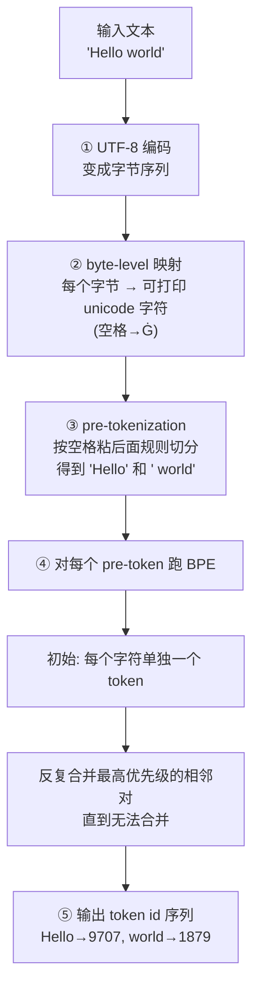

# 第六章 分词器（tokenizer.c）

> 第 6 章 | 配合源码 `tokenizer.c`（约 510 行） | [上一章：前向传播](./05-forward.md) | [下一章：采样与生成](./07-sampling.md)

---

## 这章讲什么

`tokenizer.c` 解决一个问题：**文字怎么变成 token id，反过来怎么变回去**。

模型只懂数字（token id），不懂字符。分词器就是文本和 id 之间的桥梁：

```
"Hello world" ──encode──► [9707, 1879] ──模型──► logits ──decode──► "a"
```

本章展开顺序：

- 为什么需要分词（动机）
- BPE 算法（核心：反复合并最高频对）
- Byte-level 映射（256 个字节 → 可打印 unicode）
- Pre-tokenization（BPE 前先切分）
- 哈希表 FNV-1a（15 万词表怎么快速查）
- BOS / EOS / PAD（特殊 token）
- Tokenizer 结构体 + tokenizer.bin 文件格式

---

## 为什么需要分词

模型只懂数字（token id），不懂字符。分词器是文本和 id 的桥梁：

```
"Hello world" ──encode──► [9707, 1879] ──模型──► logits ──decode──► "a"
```

为什么不直接「一个字符一个 id」？两个原因：

1. **字符太碎**：`"Hello"` = 5 个字符 = 5 个 id，模型要算 5 步；合并成 1 个 token 只要 1 步，效率高得多。
2. **语义更完整**：`"Hello"` 作为一个整体，比 `H-e-l-l-o` 五个孤立字符携带更多语义。

也不直接「一个单词一个 id」？因为词太多了（中英文 + 代码 + 各种变体），词表会爆炸。
**BPE 是介于「字符」和「整词」之间的折中**——常见组合切成一个 token，罕见组合拆成小片段。

| 方案 | token 数 | 例子 | 问题 |
|------|---------|------|------|
| 字符级 | 多 | `Hello` → 5 个 token | 太碎，语义弱 |
| 整词级 | 少 | `Hello` → 1 个 token | 词表爆炸（百万级） |
| **BPE** ★ | 折中 | `Hello` → 1 个 token；`unhappiness` → `un`+`happiness` | 词表适中（15 万） |

---

## BPE（Byte-Pair Encoding，字节对编码）

### 算法：从单字符开始，反复合并出现频率最高的相邻对

**训练时**（我们已经不用做，Qwen 团队做好了）：

```
统计大量文本里所有相邻字节对的出现频率
反复合并频率最高的一对, 直到合并 N 次

  第 1 轮: (l, l) 出现 100 万次 → 合并成 "ll"
  第 2 轮: (e, ll) 出现 80 万次 → 合并成 "ell"
  ...
每次合并都生成一条规则, 顺序就是优先级
```

**推理时（我们做的事）**：用训练好的 merges 规则，把新文本编码成 token。

### "Hello" 的编码过程

```
"Hello" 的编码过程:
  初始: H, e, l, l, o  (每个字符是一个 token)
  查 merges: (l,l) 最常出现 → 合并成 "ll"
  现在: H, e, ll, o
  再查: (e,ll) → 合并
  ...
  最终: "Hello" (一个 token, id=9707)
```

### 核心代码：贪心找最高优先级的 merge

```c
// tokenizer.c: encode_pretoken()  (第 321 行)
// 对一个 pre-token 反复找最优 merge
while (1) {
    int best_rank = INT_MAX;
    int best_idx = -1;
    // 扫一遍相邻对, 找优先级最高(merge_rank 最小)的那个
    for (int i = 0; i + 1 < n; i++) {
        int rank = merge_rank(t, tokens[i], tokens[i+1]);
        if (rank >= 0 && rank < best_rank) {
            best_rank = rank;
            best_idx = i;
        }
    }
    if (best_idx < 0) break;   // 没有能合并的了, 结束
    // 把 tokens[best_idx] 和 tokens[best_idx+1] 合并成一个
    merge_at(tokens, &n, best_idx);
}
```

**关键点**：merge 的顺序就是优先级。`merges[0]` 最优先，`merges[1]` 次之……
`merge_rank()` 查「这对 (a,b) 是第几条规则」——数字越小优先级越高。

### merge_rank：查优先级

```c
// tokenizer.c: merge_rank()  (第 69 行)
static int merge_rank(Tokenizer *t, int a, int b) {
    for (int i = 0; i < t->n_merges; i++) {
        if (t->merges[2*i] == a && t->merges[2*i+1] == b)
            return i;   // 第 i 条规则, 优先级 = i
    }
    return -1;   // 没有这条规则, 不能合并
}
```

`merges` 数组里每两个元素是一对：`merges[2i] = a, merges[2i+1] = b`，表示「token a 和 token b 可以合并」。出现顺序即优先级，越早优先级越高。

---

## Byte-level 映射

### 问题：空格、换行等控制字符不好放进词表

原始字节里有空格、换行、控制字符这些「看不见」的家伙，不好直接当词表的字符串存。
GPT-2 的解法：把 256 个字节映射到可打印的 unicode 字符。

```
原始字节 0x20 (空格) → 'Ġ' (U+0120)  ← 词表里存的是这个字符
原始字节 0x0A (换行) → 'Ċ' (U+010A)
原始字节 0x48 ('H')  → 'H'           ← 可打印, 不变
```

所以你看 HF tokenizer 调试输出里，词表条目里到处是 `Ġ`——它就是空格。

### 映射怎么实现

`tokenizer.h` 里有一个 256 项的映射表：

```c
// tokenizer.h
/* byte_map: 第 i 个字节映射成什么 unicode 字符串(GPT-2 byte-level) */
char  byte_map_chars[256][8];   // 每个字节对应的 unicode 字符串
int   byte_map_len[256];        // 对应字符串的长度
```

**编码时**：每个字节先查 `byte_map_chars`，变成对应的 unicode 字符串，再走 BPE。

**解码时**：反向映射回字节。

### 整套编码流程（结合 byte-level + BPE）

下面这个流程图展示一段文本从「字符串」变成「token id 序列」的完整过程：



逐步看每个阶段的数据变化：

```
"Hello world"  (原始文本)
   │
   │  1. UTF-8 字节
   ▼
[0x48, 0x65, 0x6c, 0x6c, 0x6f, 0x20, 0x77, 0x6f, 0x72, 0x6c, 0x64]
   │
   │  2. byte-level 映射 (每个字节 → unicode 字符)
   ▼
['H', 'e', 'l', 'l', 'o', 'Ġ', 'w', 'o', 'r', 'l', 'd']
   │
   │  3. pre-tokenization 切分 (空格粘后面)
   ▼
["Hello", "Ġworld"]
   │
   │  4. 对每个 pre-token 跑 BPE (反复合并最高频对)
   ▼
["Hello" → id 9707, "Ġworld" → id 1879]
   │
   ▼
输出 token id 序列: [9707, 1879]
```

> 注意 `" world"` 变成了 `"Ġworld"`——空格被字节映射成了 `Ġ`，然后 BPE 把它和后面的字母合并成一个 token。这就是为什么 `" world"` 在词表里是独立条目。

---

## Pre-tokenization

### BPE 不是在整个文本上跑，而是先切成 pre-token

如果对整段文本一次性跑 BPE，会有两个问题：

1. 太长，合并要扫很多对
2. 不同 pre-token 之间的边界不该跨过（比如标点不该和后面的词合并）

所以先切分，再对每个 pre-token 独立跑 BPE。

```
"Hello world" → ["Hello", " world"]   ← 空格粘到后面的词
"don't"       → ["don", "'t"]
```

### 关键规则：空格粘到后面的词

这样 `" world"` 编码后空格变成 `Ġ` 并可能合并成一个 token：

```c
// tokenizer.c: pretokenize()  (第 213 行)
/* 单个空格 + 后面是字母: 空格和字母串一起 (GPT-2 " ?\p{L}+") */
if (c == ' ' && i + 1 < text_len) {
    unsigned char nxt = (unsigned char)text[i+1];
    int is_letter = (nxt >= 'A' && nxt <= 'Z') || (nxt >= 'a' && nxt <= 'z');
    if (is_letter) {
        int start = i;   /* 包含前导空格 */
        i++;             /* 吃掉空格 */
        while (i < text_len) {
            ...           /* 继续吃字母 */
        }
        ...
    }
}
```

### 完整的 GPT-2 风格正则近似

`pretokenize()` 实现的是 GPT-2 pre-tokenizer 的近似规则：

| 模式 | 例子 | 说明 |
|------|------|------|
| `'s 't 're 've 'm 'll 'd` | `"don't"` → `don` + `'t` | 英文缩写 |
| `空格 + 字母串` | `" world"` → 一个 pre-token | 空格粘后面 |
| 连续字母（无前导空格） | `"Hello"` | 单词 |
| 单个数字 | `"123"` → `1` `2` `3` 三个 pre-token | GPT-2 数字单拆 |
| 标点串 | `"!!"` → 一个 pre-token | 连续标点合并 |
| 连续空白 | `"\n\n"` → 一个 pre-token | 多个空白成组 |
| 非 ASCII（UTF-8） | 每个 UTF-8 字符一组 | 中文等 |

> 注意：本项目是 GPT-2 风格的近似实现，不是 100% 等同 HF 的 Qwen tokenizer。
> 对绝大多数自然语言文本，编码结果和 HF 一致；极端边界情况可能差一两个 token。

---

## 哈希表（FNV-1a）

### 问题：vocab 有 15 万条，编码时要频繁查「字符串→id」

BPE 每一步都要查「这对相邻字符合并后的字符串，在词表里是哪个 id？」。
词表 15 万条，线性查找太慢，用哈希表加速到 O(1)。

### FNV-1a 哈希：简单快速的字符串哈希算法

```c
// tokenizer.c: hash_str()  (第 24 行)
static unsigned int hash_str(const char *s, int len) {
    unsigned int h = 2166136261u;       // FNV offset basis
    for (int i = 0; i < len; i++) {
        h ^= (unsigned char)s[i];
        h *= 16777619u;                 // FNV prime
    }
    return h;
}
```

**两个魔法数字**：

| 常数 | 值 | 叫什么 |
|------|-----|--------|
| `2166136261u` | FNV offset basis | 起始值 |
| `16777619u` | FNV prime | 每步乘的素数 |

**算法核心**：对每个字节做「异或 + 乘素数」。简单到几行代码，但分布均匀、冲突少。

### 拉链法处理冲突

哈希冲突时用链表串联：

```c
// tokenizer.h
int    hash_size;     // 桶数 (2 的幂)
int   *hash_buckets;  // 长度 hash_size, 存第一个 token id 或 -1
int   *hash_next;     // 长度 vocab_size, 冲突时链到下一个 token id 或 -1
```

- `hash_buckets[h]`：哈希值为 h 的第一个 token id
- `hash_next[id]`：从 token id 链到下一个同哈希值的 token id

```
hash_buckets[12345] → id=42 → hash_next[42]=7788 → hash_next[7788]=-1
                     (链表: 42 → 7788 → 结束)
```

查找时算哈希，沿链表比较字符串：

```c
// tokenizer.c: vocab_lookup()  (第 55 行)
static int vocab_lookup(Tokenizer *t, const char *s, int len) {
    unsigned int h = hash_str(s, len) & (t->hash_size - 1);   // 取模
    for (int id = t->hash_buckets[h]; id != -1; id = t->hash_next[id]) {
        if (t->vocab_len[id] == len
            && memcmp(t->vocab[id], s, len) == 0)
            return id;   // 找到
    }
    return -1;   // 没找到
}
```

### 建表：把词表所有条目塞进哈希桶

```c
// tokenizer.c: build_vocab_index()  (第 34 行)
static int build_vocab_index(Tokenizer *t) {
    // 对每个 vocab[i], 算哈希, 头插进对应桶的链表
    for (int i = 0; i < t->vocab_size; i++) {
        unsigned int h = hash_str(t->vocab[i], t->vocab_len[i])
                         & (t->hash_size - 1);
        t->hash_next[i] = t->hash_buckets[h];
        t->hash_buckets[h] = i;
    }
    ...
}
```

---

## BOS / EOS / PAD

三个特殊 token，标记序列的结构：

```
BOS = Beginning Of Sequence (序列起始符)
EOS = End Of Sequence (序列结束符)  ← 生成时遇到它就停
PAD = Padding (填充符, batch 对齐用)
```

| token | 含义 | 作用 |
|-------|------|------|
| BOS | 序列开头 | 编码时前置，告诉模型「这是输入的起点」 |
| EOS | 序列结尾 | 生成时遇到它就停止 |
| PAD | 填充 | batch 推理时把不同长度的序列补齐 |

**Qwen 的设置**：BOS 和 EOS 都是 id=151643 = `<|endoftext|>`。

```c
// tokenizer.h
int   bos_id;
int   eos_id;
int   pad_id;
```

编码时可以选择是否前置 BOS：

```c
// tokenizer.c: tokenizer_encode()  (第 399 行)
int tokenizer_encode(Tokenizer *t, const char *text, int bos_id,
                     int *out_tokens, int max_tokens);
// bos_id 传 -1 表示不前置
```

---

## Tokenizer 结构体 + tokenizer.bin 文件格式

### Tokenizer 结构体

```c
// tokenizer.h
typedef struct {
    int   vocab_size;       // 词表大小 (151936)
    char **vocab;           // vocab[i] = token i 的字符串 (byte-level 编码后)
    int  *vocab_len;        // vocab[i] 的字节长度
    int   n_merges;         // BPE 合并规则数
    int  *merges;           // merges[2i]=a, merges[2i+1]=b

    /* string -> id 查找表 (拉链法哈希) */
    int    hash_size;       // 桶数 (2 的幂)
    int   *hash_buckets;    // 桶头
    int   *hash_next;       // 冲突链表

    /* special tokens */
    int   n_special;
    int  *special_ids;
    char **special_strs;
    int  *special_lens;

    /* byte→unicode 映射 (GPT-2 byte-level) */
    char  byte_map_chars[256][8];
    int   byte_map_len[256];

    int   bos_id, eos_id, pad_id;
} Tokenizer;
```

### tokenizer.bin 文件格式

`tokenizer.json`（HF 格式，7 MB，含冗余信息）太大不便直接加载，
所以 `export_tokenizer.py` 把它转成紧凑的 `tokenizer.bin`（3 MB，只有必需数据）：

```
tokenizer.bin 布局 (全部小端):
┌──────────────────────────────────────────────────────────┐
│ uint32  vocab_size           词表条目数 N (151936)        │
│ uint32  n_merges             BPE 合并规则数 M             │
│ uint32  n_special            special token 数            │
├──────────────────────────────────────────────────────────┤
│ N 条 vocab 字符串:                                       │
│   每条 = uint32 len + len 字节 (不含 \0)                 │
│   vocab[0], vocab[1], ..., vocab[N-1]                    │
├──────────────────────────────────────────────────────────┤
│ M 条 merge:                                              │
│   每条 = uint32 a + uint32 b                             │
│   (表示 token[a] + token[b] → 新 token)                  │
├──────────────────────────────────────────────────────────┤
│ n_special 条 special:                                    │
│   每条 = uint32 id + uint32 len + len 字节               │
├──────────────────────────────────────────────────────────┤
│ 256 字节 byte_unicode_map:                               │
│   把 raw byte (0..255) 映射到 unicode char 的索引        │
└──────────────────────────────────────────────────────────┘
```

加载函数 `tokenizer_load()`（`tokenizer.c:85`）按这个布局逐段读取。

---

## 完整 encode + decode 流程

### encode：文本 → token id 序列

```
tokenizer_encode("Hello world", bos=BOS)
│
├─ 1. pretokenize(): 切成 pre-tokens
│      "Hello world" → ["Hello", " world"]
│
├─ 2. 对每个 pre-token:
│      a. UTF-8 字节 → byte_map 映射 → unicode 字符串
│      b. 初始每个字符是一个 token
│      c. 反复 BPE: 找最高优先级 merge, 合并
│      d. 查 vocab_lookup 得到最终 id
│      "Hello" → [9707]
│      "Ġworld" → [1879]  (空格已变 Ġ, 合并后一个 token)
│
├─ 3. 拼接所有 pre-token 的 id
│      [9707, 1879]
│
└─ 4. 前置 BOS (如果要求)
      [BOS, 9707, 1879]
```

### decode：token id → 文本

```c
// tokenizer.c: tokenizer_decode()  (第 452 行)
int tokenizer_decode(Tokenizer *t, int id, char *buf, int buf_cap);
// 把单个 token id 解码成 UTF-8 字节, 追加到 buf
```

decode 是 encode 的反过程：查 `vocab[id]` 拿到 byte-level 字符串，
反向 `byte_map` 把 `Ġ` 还原成空格等，输出原始字节。

```
id=9707 → "Hello"        → 输出 "Hello"
id=1879 → "Ġworld"       → 反映射 Ġ→空格 → 输出 " world"
```

> 注意 decode 是**逐 token** 的——生成时每生成一个 token 就 decode 一个，
> 拼接成最终文本。详见第 7 章的生成循环。

---

## 核心洞察小结

1. **分词器是文本和数字之间的桥梁**：模型只懂数字（token id），分词器把文字切分成 token。

2. **BPE 是「字符」和「整词」的折中**：从字符开始反复合并最高频对，常见组合成一个 token，罕见组合拆成片段。词表控制在 15 万。

3. **Byte-level 映射解决控制字符问题**：256 个字节映射到可打印 unicode（空格→`Ġ`），让任意字节都能进词表。

4. **Pre-tokenization 先切分再 BPE**：空格粘到后面的词（`" world"`），不同片段之间不跨边界合并。

5. **FNV-1a 哈希 + 拉链法**：15 万词表的「字符串→id」查找降到 O(1)，编码才够快。

6. **BOS/EOS/PAD 是序列结构标记**：Qwen 里 BOS=EOS=`<|endoftext|>` (id=151643)，生成遇 EOS 停。

7. **tokenizer.bin 是 tokenizer.json 的紧凑版**：7 MB → 3 MB，只留编码/解码必需的数据。

8. **同一个 token id 在两个文件里存不同东西**：这是个常见混淆点，值得讲清楚。

以 "Hello" 的 id=9707 为例——**两个文件都有 9707，但存的内容完全不同**：

```
┌─────────────────────────────────────────────────────────┐
│  tokenizer.bin (3MB)                                    │
│    vocab[9707] = "Hello"  (字符串)                       │
│    用途: 文字 ↔ id 转换                                 │
│    谁用: tokenizer.c (encode / decode)                  │
│    内容: 151936 个字符串                                 │
└─────────────────────────────────────────────────────────┘
                          ↓
                   token id 9707
                          ↓
┌─────────────────────────────────────────────────────────┐
│  model.safetensors (988MB)                              │
│    embed_tokens[9707] = [-0.025, 0.006, ...]  (向量)     │
│    用途: id → 896维向量 (给神经网络算)                   │
│    谁用: net.c 的 forward()                             │
│    内容: 151936 行 × 896 个浮点数                       │
└─────────────────────────────────────────────────────────┘
```

| 文件 | id=9707 对应什么 | 大小 | 干嘛用 |
|------|-----------------|------|--------|
| `tokenizer.bin` | `"Hello"`（文字） | 几十字节 | 文字↔id 翻译 |
| `model.safetensors` | `[-0.025, 0.006, ...]`（896 个数） | 3.5 KB | 模型计算用 |

完整流程——从文字到向量要过两道关：

```
"Hello world" (用户输入)
    │
    │  tokenizer.c 查 tokenizer.bin
    │  "Hello" → 找到 id=9707
    │  " world" → 找到 id=1879
    ▼
[9707, 1879] (token id 序列)
    │
    │  net.c 查 safetensors 的 embedding 表
    │  id=9707 → 取出第 9707 行的 896 个数
    │  id=1879 → 取出第 1879 行的 896 个数
    ▼
[[896个数], [896个数]] (向量, 进入 Transformer)
```

**这就是为什么推理引擎需要加载两个文件**——`tokenizer.bin` 负责文字↔id 转换，`model.safetensors` 负责 id→向量→计算。缺了任何一个都不行。

---

> 下一章我们看「怎么从 logits 选出下一个 token」——采样与生成。
> [继续阅读第 7 章 →](./07-sampling.md)
