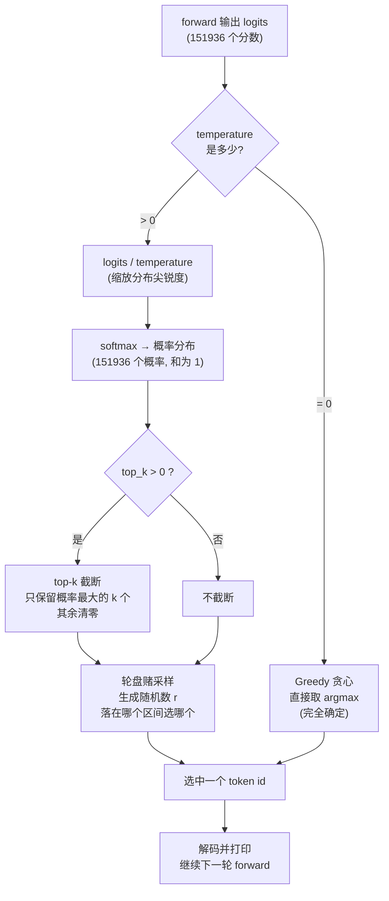

# 第 7 章 采样与生成（run.c）

> 第 7 章 | [上一章：第 6 章 分词器](./06-tokenizer.md) | [下一章：第 8 章 日志与可视化](./08-logging.md)

> 对应源码：`run.c`（~500 行）
> 前置知识：第 5 章（前向传播产出 logits）、第 6 章（分词器把文本变 token id）
> 这章回答一个问题：**拿到 logits 之后，怎么选出一个 token，怎么循环把整句生成出来。**

---

## 目录

- [7.1 生成循环：prefill + decode 两阶段](#71-生成循环prefill--decode-两阶段)
- [7.2 为什么必须分两阶段](#72-为什么必须分两阶段)
- [7.3 采样策略全景](#73-采样策略全景)
- [7.4 PRNG：xorshift128](#74-prngxorshift128)
- [7.5 命令行参数](#75-命令行参数)
- [7.6 一句话总结](#76-一句话总结)

---

## 7.1 生成循环：prefill + decode 两阶段

一次完整生成分两步走：先把 prompt 全部「读」进去（prefill），再一格一格「写」出新 token（decode）。

```
1. prompt → BPE encode → token ids [t0, t1, ..., t(n-1)]
2. prefill: 逐个喂 prompt token (teacher forcing)
     每步用 prompt 里下一个 token 当答案, 不采样
     目的是把 prompt 的 KV Cache 全部填满
3. decode: 用最后一步的 logits 采样 → 新 token → 解码打印 → 继续
4. 遇到 EOS 或达到上限 → 停止
```

主循环的骨架（`run.c` 里 `main()` 的生成部分）：

```c
int token = prompt_tokens[0];
for (int pos = 0; pos < total_len; pos++) {
    forward(&cfg, &w, &s, token, pos);        /* 算出 logits */

    int next;
    if (pos < n_prompt - 1) {
        next = prompt_tokens[pos + 1];        /* prefill: 直接取 prompt 下一格 */
    } else {
        next = sample(s.logits, ...);         /* decode: 采样 */
    }

    if (next == tk.eos_id && pos >= n_prompt - 1) break;   /* 遇到 EOS 停 */

    if (pos >= n_prompt - 1) {
        /* decode 阶段才打印, prefill 不打印 (prompt 已经 echo 过) */
        fwrite(buf, 1, blen, stdout);
    }
    token = next;
}
```

### prefill 阶段：teacher forcing

prefill 不采样，而是「按标准答案走」——这叫 **teacher forcing**（教师强制）。

```
prompt = "你好世界"  →  tokens = [你, 好, 世, 界]
                                0    1    2    3

prefill 一轮轮走:
  pos=0: forward(你)  → logits → 但不采样, 直接用 tokens[1]=好
  pos=1: forward(好)  → logits → 直接用 tokens[2]=世
  pos=2: forward(世)  → logits → 直接用 tokens[3]=界
  pos=3: forward(界)  → logits → ★ 这一步才采样, 开始 decode
```

为什么要这样？因为 prompt 是用户给的，模型不该自作主张改写。prefill 唯一的作用是**把 prompt 每个 token 的 K/V 都填进 KV Cache**，让 decode 阶段生成的新 token 能看到完整上下文。

### decode 阶段：自回归

从 `pos == n_prompt - 1` 开始进入 decode。每一步：

```
forward(当前 token)
  → logits (151936 个分数)
  → sample() 选一个
  → 解码成文字, 打印
  → 当作下一步的输入 token
```

这就是「自回归」(autoregressive)——输出又变成输入，循环往复。

### 两阶段的日志分界

代码里用一个阶段切换日志来标识：

```c
LOGI_L(CAT_KEY, 0, "═══ 阶段 1: Prefill (处理 %d 个 prompt token) ═══", n_prompt);
...
if (pos == n_prompt) {
    LOGI_L(CAT_KEY, 0, "═══ 阶段 2: Decode (自回归生成) ═══");
}
```

加 `-v` 跑一次就能看到这两个红色加粗的分界线。

---

## 7.2 为什么必须分两阶段

一个常见疑问：**prompt 有 n 个 token，能不能一次性并行算完，而不是一格一格走？**

理论上 prefill 可以并行（prompt 里每个 token 都是已知的，不依赖前面的采样）。但本项目的 `forward()` 一次只处理一个 token，所以 prefill 也是顺序循环。

工业引擎（vLLM / SGLang）的 prefill 是真正的并行：把 prompt 的所有 token 拼成 `[seq_len, dim]` 矩阵，一次 matmul 全算完。本项目为了代码简单保持顺序处理，速度慢但逻辑清晰。

> 这就是为什么 prefill 通常是一次性的「大头」开销，decode 是「细水长流」。
> 工业术语里 prefill 叫 **time-to-first-token (TTFT)**，decode 叫 **inter-token latency**。

### KV Cache 在两阶段的作用

回顾第 5 章的因果注意力：每个 token 只看自己和之前的 token。这意味着：

```
prefill 阶段:
  每步把当前 token 的 K/V 存进 cache 第 pos 格
  → prefill 结束时, cache 里已经有 prompt 全部 n 个 token 的 K/V

decode 阶段:
  新 token 的 Q 去 × cache 里所有 K (包括 prompt 的 + 已生成的)
  → 新 token 能看到整个上下文
  → 把自己的 K/V 也存进 cache 第 pos 格
```

如果没有 KV Cache，decode 每一步都要重算一遍 prompt 所有 token 的 K/V——`n` 步就 `O(n²)`。有了 cache 复杂度降到 `O(n)`。这是为什么生成能跑得动的根本原因。

---

## 7.3 采样策略全景

`sample()` 函数（`run.c:84`）支持四种策略，由 `temperature` 和 `top_k` 两个参数组合控制。

下面这个流程图展示完整的采样决策过程——从 logits 到最终选出一个 token：



### 策略 1：Greedy（贪心，temperature=0）

```c
if (temperature == 0.0f) {
    int best = 0;
    float bestv = logits[0];
    for (int i = 1; i < vocab_size; i++) {
        if (logits[i] > bestv) { bestv = logits[i]; best = i; }
    }
    return best;   /* 直接选分数最高的 */
}
```

**特点**：

- 完全确定——同一个 prompt + 同一个模型，永远生成同样的输出
- 不需要随机数
- 适合**数值验证**（和 PyTorch 对答案时用）

**缺点**：容易生成重复、呆板的文本（总选最稳妥的词）。

### 策略 2：Temperature（温度缩放）

```c
float inv_t = 1.0f / temperature;
float sum = 0.0f;
for (int i = 0; i < vocab_size; i++) {
    probs[i] = expf((logits[i] - maxl) * inv_t);   /* 缩放后 softmax */
    sum += probs[i];
}
```

温度 `T` 在 softmax **之前**对 logits 做缩放（除以 T）：

| T 值 | 效果 | 分布形状 | 应用 |
|------|------|---------|------|
| `T < 1`（如 0.5） | 更确定（保守） | 更尖 | 事实问答、代码生成 |
| `T = 1` | 原始分布 | 不变 | — |
| `T > 1`（如 1.5） | 更随机（激进） | 更平 | 创意写作、brainstorm |
| `T = 0` | 完全确定 | 退化为 argmax | 数值验证 |

**直观图示**：

```
原始 logits → softmax (T=1):
  词A: 0.60 ████████████████████
  词B: 0.30 ██████████
  词C: 0.08 ███
  词D: 0.02 ▏

T=0.5 (更尖, 集中):
  词A: 0.85 ████████████████████████████
  词B: 0.13 ████
  词C: 0.02 ▏
  词D: 0.00

T=2.0 (更平, 分散):
  词A: 0.40 █████████████
  词B: 0.30 ██████████
  词C: 0.20 ██████
  词D: 0.10 ███
```

**为什么减去 maxl**：`expf` 容易数值溢出。先找最大值减掉，最大那个变成 `exp(0)=1`，其余都小于 1，永远不会溢出（这叫 **numerically stable softmax**）。

### 策略 3：Top-k 截断

```c
if (top_k > 0 && top_k < vocab_size) {
    char *keep = calloc(vocab_size, 1);
    for (int s = 0; s < top_k; s++) {
        /* 迭代找当前最大值, 标记已选 */
        int best = -1; float bestv = -1e30f;
        for (int i = 0; i < vocab_size; i++) {
            if (!keep[i] && probs[i] > bestv) { bestv = probs[i]; best = i; }
        }
        keep[best] = 1;
    }
    /* 把没标记的清零, 重算 sum */
    for (int i = 0; i < vocab_size; i++) {
        if (!keep[i]) probs[i] = 0.0f;
        else sum += probs[i];
    }
}
```

**目的**：只在概率最大的 k 个 token 里采样，其余全部清零——截断长尾，避免选到概率极低的乱码。

```
softmax 后 151936 个 token 的概率分布:
  绝大多数概率 < 0.001 (长尾, 几乎不可能选)
  top 40 个就占了 95%+ 概率

不截断: 有微小概率选到完全不相关的词 (类似笔误)
top_k=40: 只在这 40 个里挑, 长尾直接清零
```

工业引擎还有 **top-p（nucleus sampling）**：动态选概率累计达到 p 的最小集合（如 p=0.9）。本项目没实现，但思路一样——截掉小概率尾部。

### 策略 4：轮盘赌采样（Roulette Wheel）

```c
float r = rng_uniform(rng) * sum;     /* [0, sum) 的随机数 */
float cum = 0.0f;
int chosen = vocab_size - 1;          /* 兜底 */
for (int i = 0; i < vocab_size; i++) {
    cum += probs[i];
    if (r < cum) { chosen = i; break; }   /* 落到哪个区间 */
}
```

把概率分布想象成一个轮盘，每个 token 占一块扇区（面积 = 概率），随机转一次：

```
probs = [0.5, 0.3, 0.15, 0.05]
轮盘:
  ┌──────────────────────────┐
  │       词 A (50%)         │
  │──────────────────────────│
  │     词 B (30%)           │
  │──────────────────────────│
  │  词 C (15%) │ 词 D (5%)  │
  └──────────────────────────┘
   ↑ r=0.62 落在词 B 区间 → 选词 B
```

**为什么 `r * sum` 而不是 `r`**：top-k 截断后 sum 已经不是 1.0（被清零的部分不算）。乘以 sum 把随机数缩放到 `[0, sum)`，再累积比较，保证落到正确区间。

### 四种策略的关系

```
                    temperature=0?
                         │
                    ┌────┴────┐
                   是         否
                    │         │
                argmax    softmax(logits/T)
                              │
                         top_k > 0?
                              │
                         ┌────┴────┐
                        是         否
                         │         │
                  截断长尾      直接用
                         │         │
                         └────┬────┘
                              │
                       轮盘赌采样 → 选一个 token
```

---

## 7.4 PRNG：xorshift128

采样需要随机数。本项目不依赖系统的 `/dev/random`，而是用一个**确定性**的伪随机数生成器（PRNG）——这样**同一个 seed 永远生成同一个序列**，方便复现 bug。

### xorshift128 算法

```c
typedef struct { unsigned int x,y,z,w; } RNG;

static void rng_seed(RNG *r, unsigned int s) {
    r->x = s ? s : 1;                          /* seed=0 会被替换成 1 */
    r->y = r->x * 1812433253u + 1;
    r->z = r->y * 1812433253u + 1;
    r->w = r->z * 1812433253u + 1;
}

static unsigned int rng_next(RNG *r) {
    unsigned int t = r->x ^ (r->x << 11);
    r->x = r->y; r->y = r->z; r->z = r->w;
    r->w = r->w ^ (r->w >> 19) ^ (t ^ (t >> 8));
    return r->w;
}

static float rng_uniform(RNG *r) {
    return (rng_next(r) >> 8) * (1.0f / 16777216.0f);   /* [0, 1) */
}
```

**算法核心**：用 4 个 32 位状态字（共 128 位），每步做**异或（xor）+ 移位（shift）**产生下一个数。故名 xorshift。

```
状态: [x, y, z, w]  (128 位)
        │
        │  ① t = x ^ (x << 11)        ← 用 x 做一次左移异或
        │  ② 状态整体左移: x←y, y←z, z←w
        │  ③ w = w ^ (w>>19) ^ (t ^ (t>>8))  ← 把 t 和 w 混合
        ▼
       新的 w = 输出的 32 位随机数
```

**关键术语**：

| 术语 | 全称 | 含义 |
|------|------|------|
| **PRNG** | Pseudo Random Number Generator | 用确定性算法生成「看起来随机」的数。给定种子，序列完全可复现 |
| **xorshift** | XOR + shift | 一类用异或和移位操作的 PRNG，极简快速 |
| **seed** | 种子 | 初始状态。同一种子永远产生同一序列——这就是为什么 `-s 42` 能复现 |

### `rng_uniform` 怎么把 32 位整数变成 [0,1) 的 float

```c
return (rng_next(r) >> 8) * (1.0f / 16777216.0f);
```

- `rng_next(r)` 是 32 位 unsigned int（0 到 ~43 亿）
- `>> 8` 丢掉低 8 位，保留高 24 位（0 到 16777215，即 `2^24 - 1`）
- 乘以 `1 / 16777216`（`2^-24`），结果在 `[0, 1)`

为什么要丢掉低 8 位？因为 float 的尾数只有 23 位，保留高 24 位刚好够精度。直接用全 32 位会有低位精度损失。

### 为什么不用 `rand()`

C 标准库的 `rand()` 有几个问题：

- 不同平台实现不同（Windows 和 Linux 结果不一样）
- 周期短、统计性质差
- 多线程不安全（全局状态）

手写 xorshift128 解决了所有这些问题：跨平台一致、周期 `2^128 - 1`、状态封装在结构体里。

---

## 7.5 命令行参数

`run.c` 的 `main()` 解析这些参数：

```bash
./run model.safetensors tokenizer.bin "prompt" \
      -t 0.8    \   # temperature (0=贪心, 默认 0)
      -k 40     \   # top_k (默认 40)
      -s 42     \   # seed (默认 12345)
      -v        \   # debug 级日志 (每层摘要)
      -vv       \   # trace 级日志 (所有中间张量)
      --report      # 生成 trace_report.html
```

| 参数 | 默认值 | 含义 |
|------|--------|------|
| `-t` | `0.0` | temperature。0 表示贪心（不采样），>0 启用采样 |
| `-k` | `40` | top_k。`<=0` 表示不截断，全词表采样 |
| `-s` | `12345` | PRNG 种子。同一种子永远生成同样输出 |
| `-v` | 关 | 开启 debug 日志 |
| `-vv` | 关 | 开启 trace 日志（最详细） |
| `--report` | 关 | 运行后生成 HTML 报告 |

参数解析代码：

```c
float temperature = 0.0f;
int   top_k       = 40;
int   seed        = 12345;

for (int i = 4; i < argc; i++) {
    if (strcmp(argv[i], "-t") == 0 && i+1 < argc) {
        temperature = (float)atof(argv[++i]);
    } else if (strcmp(argv[i], "-k") == 0 && i+1 < argc) {
        top_k = atoi(argv[++i]);
    } else if (strcmp(argv[i], "-s") == 0 && i+1 < argc) {
        seed = atoi(argv[++i]);
    }
}
```

### 调参速查

**想稳定输出做对比**：

```bash
./run model.safetensors tokenizer.bin "你好" -t 0
```

`-t 0` 永远选最高分，输出完全确定。

**想生成有变化的创意文本**：

```bash
./run model.safetensors tokenizer.bin "从前有座山" -t 0.8 -k 40 -s 42
```

`-t 0.8` 略保守，`-k 40` 截断长尾，`-s 42` 固定种子（出问题能复现）。

**想每次结果都不一样**：换不同的 `-s` 值即可。

### 其他子命令

除了生成模式，`run.c` 还有三个调试子命令：

```bash
./run info  model.safetensors          # 打印所有张量列表 + 关键校验
./run encode tokenizer.bin "Hello"     # BPE 编码, 打印 token id 列表
./run fwd  model.safetensors 198 0     # 单 token 前向, 打印 top-5 logits
```

`fwd` 子命令是第 9 章调试方法论的基石——拿单个 token 的输出和 PyTorch 对答案。

---

## 7.6 一句话总结

**生成 = prefill（把 prompt 灌进 KV Cache）+ decode（自回归一格一格采样）**。
采样 = `softmax(logits/T)` → top-k 截断长尾 → 轮盘赌选一个。
随机数用 xorshift128 是为了**同 seed 可复现**——这是工程上调试和验证的必要前提。
