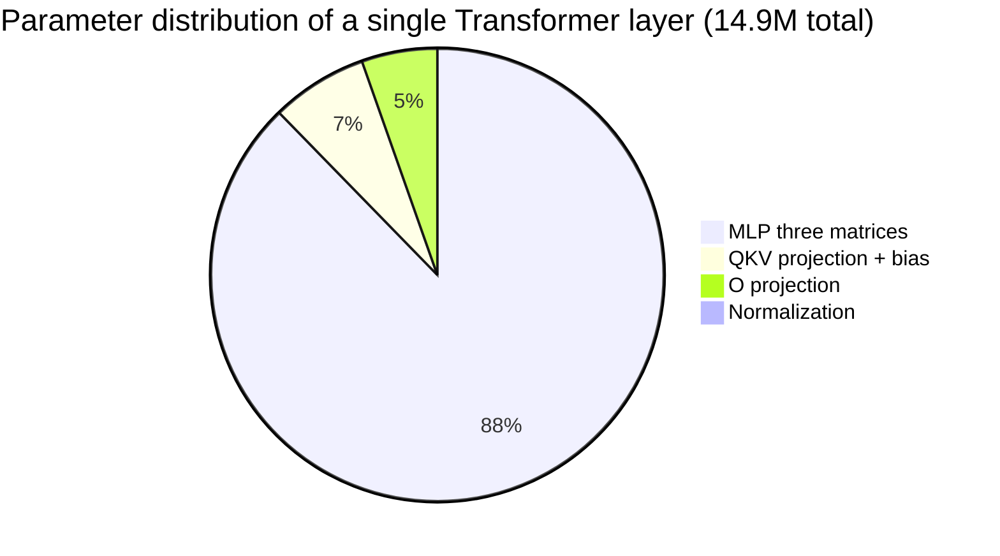
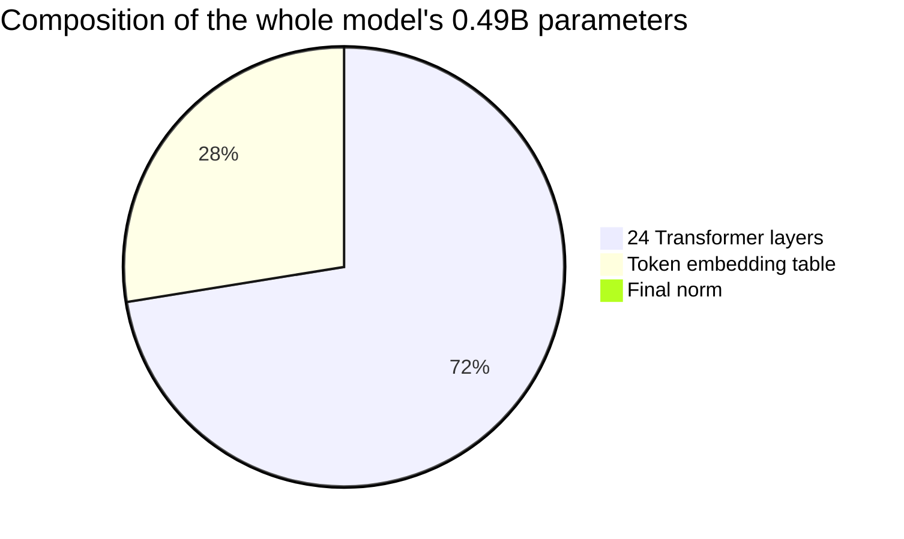

> 🌐 [中文版](../01-basics) | English

# Chapter 1 · Basics

> Chapter 1 | Companion source: the whole codebase (focus on `net.h` / `net.c`) | [Table of Contents](./README.md) | [Next: Weight Storage & Loading](./02-weights.md)

This chapter doesn't touch any specific source file. Instead, it first lays out *what an inference engine is, why it exists, and what parts it has*. After reading it you won't have written any code, but you'll know what role every line of code plays in the bigger picture.

---

## Preface: What This Book Will Teach You

This is a Transformer inference engine written in pure C that loads the Qwen2.5-0.5B model. The goal isn't to be the fastest engine, but to help beginners **understand the principles behind an inference engine**.

After finishing this "book," you will understand:

1. How **every byte of the weights** of a 0.5B-parameter large model is organized
2. What computations happen **step by step inside** the model after you feed it a sentence
3. Why we use **RMSNorm** instead of LayerNorm, and why **RoPE** instead of absolute positional encoding
4. How **GQA** saves memory, and how **KV Cache** reduces the generation complexity from O(N²) to O(N)
5. How **BPE tokenization** slices text into tokens, and how **sampling** picks a word from a probability distribution
6. Where — and by how much, and why — your hand-written engine differs from an industrial engine like **vLLM**

What it will **not** teach you (out of scope): training (backpropagation / gradient descent), GPU programming (CUDA), distributed deployment.

### Conventions in This Book

Every concept comes with three things:

- **Plain English**: one sentence saying what it is
- **Why**: what problem it solves
- **Where**: which file and which line of the source code it corresponds to

---

## What Is an Inference Engine

**Inference** = using a trained model to compute a result. Unlike training, inference **does not need to update weights**; it only does a "forward computation."

An **inference engine** = a program that, given weights and input text, computes the next token. At its core it's a single function:

```
next_token_id = forward(weights, tokens_so_far)
```

It really is that simple. The entire project — more than 2000 lines of C — is built around this one function: how to read `weights` from disk, how to turn text into `tokens_so_far`, and how to turn `next_token_id` back into text to print out.

## Transformer in One Sentence

A Transformer is a kind of neural network whose core mechanism is **attention**: it lets each word "look at" the other words and decide whom to attend to and whom to ignore.

```
"cat bites person" → each word looks at the others → understands "who bites whom" → predicts the next word
```

Modern large models (GPT / Llama / Qwen) are all **Decoder-only Transformers**: they use only the decoder part and generate word by word from left to right. The Qwen2.5-0.5B loaded by this project is exactly this kind of architecture.

## Tensors and Dimensions

This is the section where readers most easily get tripped up in the whole book, so please read it carefully.

**The single most important sentence first**: `dim=896` means **each token's feature vector has 896 numbers**; those 896 are the **feature dimension (columns)**, **not the number of rows**. The number of rows is decided by "how many tokens were input" (seq_len) and has nothing to do with 896.

| Concept | What it is | Decided by |
|------|--------|---------|
| **dim=896** | How many numbers each feature vector has (896) | **Fixed** by the model architecture |
| **Number of rows (seq_len)** | How many tokens are in a batch | **Variable**, by input |

> Example: input "Hello world" (2 tokens) → the data tensor shape is `[2, 896]`: **2 rows × 896 columns**.
> Number of rows = 2 (the token count), number of columns = 896 (the feature dimension). Switch to a 128-token input and it becomes `[128, 896]` — the column count is still 896.

---

**Now let's distinguish two easily confused senses of "dimension"**:

| Phrase | Meaning | Example |
|------|------|------|
| "an **896-dim** vector" | The vector has 896 numbers in it | `[0.1, -0.2, 0.5, ... 896 total]` |
| "a **1-dim** array" | The data is laid out in a single row (only one row, no row/column structure) | same as above |
| "a **2-dim** array" | The data is laid out in a row/column grid (it has both a row direction and a column direction) | a weight matrix like `(896, 896)` or `(4864, 896)` |

> ⚠️ An "896-dim vector" and a "1-dim array" are talking about the same thing — **896 numbers laid out in a row**.
> "Dimension" in the former refers to the number of values; in the latter it refers to the nesting depth of the array.

A **tensor** is just a multi-dimensional array, classified by its nesting depth (how many "directions" it has):

| Nesting levels | Name | Shape | Element count | Example |
|---------|------|------|---------|------|
| 0 levels | Scalar | `()` | **1 number** | `3.14` |
| 1 level | Vector | `(896,)` | **896 numbers** | the representation of one token |
| 2 levels | Matrix | `(896, 896)` | **800 thousand numbers** | the Q projection weight matrix |
| 3 levels | Tensor | `(24, 896, 896)` | **19 million numbers** | 24 layers stacked together |

```
0 levels:  3.14                              ← 1 number (scalar)

1 level:   [0.1, -0.2, 0.5, ...]             ← one row, how many depends on the tensor
                                         (a token vector is 896)

2 levels:  [ [0.1, -0.2, ...],               ← many rows, several per row
             [0.3,  0.1, ...],                  rows × per-row count = total
             ... ]                             the exact shape depends on which tensor:
                                           Q weight    [896, 896] = 800k
                                           MLP weight  [4864, 896] = 4.35M
                                           input data  [seq_len, 896]
```

**So**: Qwen2.5-0.5B's `dim=896` means each token is represented by a **vector of 896 numbers (a 1-level tensor)**. To transform a token from one vector into another, you need to project it with a weight matrix — **the Q/O projection matrices are 896×896 square matrices (800k numbers), but not every matrix is square**:

| Weight matrix | Shape | Square? | Notes |
|---------|------|-------|------|
| Q projection (wq) | `(896, 896)` | ✅ square | Both input and output are 896-dim |
| O projection (wo) | `(896, 896)` | ✅ square | Both input and output are 896-dim |
| K/V projection (wk/wv) | `(128, 896)` | ❌ rectangular | GQA makes the output only 128-dim |
| MLP (gate/up/down) | `(4864, 896)` | ❌ rectangular | Expands to 4864-dim |
| Embedding | `(151936, 896)` | ❌ rectangular | Vocab × feature dim |

> ⚠️ **Common misconception**: `hidden_size=896` does **not** mean every matrix in the model is an 896×896 square.
> It only means "each token's feature vector has 896 numbers." What a given matrix actually looks like depends on what that matrix does.
> Also, **the input data tensor has shape `[seq_len, 896]`** — the row count is the number of tokens (variable),
> the column count is 896 (fixed). Feeding 128 tokens means 128 rows, unrelated to "896".

### How Dimension Relates to "Amount of Knowledge"

A common question: **does more dimensions mean more stored knowledge?** Directionally yes, but the full picture is more nuanced.

**dim = the "resolution of understanding" of a single word.** Photography analogy:

```
dim = 896   →  1 MP photo, you can tell it's a cat
dim = 4096  →  16 MP photo, you can see the breed of the cat
dim = 8192  →  60 MP photo, even the fur texture is clear
```

Comparison of dim across models:

```
Model              dim   Layers  Params
─────────────────────────────────────────────
GPT-2 Small         768    12     0.12B    ###
Qwen2.5-0.5B        896    24     0.49B    ####       ← this project
Qwen2.5-1.5B       1536    28      1.5B    #######
Llama-3.1-8B       4096    32      8.0B    ####################
Qwen2.5-72B        8192    80     72.0B    ########################################
```

But dim alone isn't enough — **amount of knowledge ≈ dim × number of layers × training data size**, and all three factors are indispensable:

| Factor | Role | Analogy |
|------|------|------|
| **dim** | How finely each word can be described | Vocabulary size |
| **Number of layers** | How deep the relational reasoning can go | Depth of thought |
| **Training data** | The actual knowledge injected | Books you've read |

```
dim=896, 1 layer:   recognizes words, but can't reason → "cats and dogs are both animals"
dim=896, 24 layers: recognizes words just the same, plus can reason layer by layer
  → "cat → animal → mammal → can get rabies → needs a vaccine"
    (each layer is one step of reasoning, 24 layers = 24 steps)
```

**Why can't we just keep increasing dim?** Three limits:

1. **The data has to match**: dim=8192 fed only 1GB of data → most dimensions stay empty, wasted (a big house with no furniture)
2. **Memory and speed balloon**: 0.5B needs 2GB of RAM, 72B needs 150GB+, an ordinary computer can't run it
3. **Training gets harder**: more parameters means the data and compute required grow exponentially

Qwen2.5-0.5B picking dim=896 is a **carefully chosen balance** — enough to learn basic language ability, yet small enough to run on an ordinary computer.

## How "0.5B" Is Computed

B = Billion. 0.5B means the model has about **500 million parameters (trainable weight numbers)**. The exact figure is **494,032,768 ≈ 0.49B**, which rounds to "0.5B".

The parameter count = the total number of elements across all weight matrices. Here's the by-hand computation:

```
┌──────────────────────────────────────────────────────────────┐
│ Block 1: Token embedding table                                │
│   151936 rows × 896 cols        = 136,134,656  (136 million) │
├──────────────────────────────────────────────────────────────┤
│ Block 2: 24 Transformer layers (14,912,384 params each)      │
│                                                              │
│  Inside each layer:                                          │
│    Normalization       896 + 896                  =     1,792│
│    Q projection        896 × 896                  =   802,816│
│    K projection        128 × 896  (GQA, small)    =   114,688│
│    V projection        128 × 896  (GQA, small)    =   114,688│
│    Q/K/V bias          896 + 128 + 128 (Qwen-only)=     1,152│
│    O projection        896 × 896                  =   802,816│
│    MLP gate            4864 × 896                 = 4,358,144│  ← big chunk
│    MLP up              4864 × 896                 = 4,358,144│  ← big chunk
│    MLP down            896 × 4864                 = 4,358,144│  ← big chunk
│                              per-layer subtotal    =14,912,384│
│                                                              │
│  × 24 layers                                       =357,897,216│
├──────────────────────────────────────────────────────────────┤
│ Block 3: Final norm                                          │
│   896                                                        │
├──────────────────────────────────────────────────────────────┤
│ Total: 136,134,656 + 357,897,216 + 896 = 494,032,768         │
│                                        = 0.49 B ≈ "0.5 B"    │
└──────────────────────────────────────────────────────────────┘
```

Two observations:

1. **MLP dominates**: of the 14.9 million parameters per layer, the three MLP matrices alone account for 13.07 million (88%). That's because `4864 × 896 × 3` is so large. Increasing `hidden_dim` has the biggest impact on parameter count.
2. **GQA saves parameters**: K/V use 2 heads (128-dim) instead of 14 heads (896-dim), saving about 1.38 million params per layer. The bigger payoff is in KV Cache memory (7× savings).

## What Each Parameter Does (Told as "What Problem It Solves")

The table above listed which parameters each layer has, but not what problem each one solves. Let's go through them one by one. You'll meet all these names again in the `TransformerWeights` struct in `net.h`.

### ① Normalization weights (896 + 896 = 1,792)

Each layer has two RMSNorms, each with 896 scaling coefficients.

- **What problem it solves**: prevents a vector's values from exploding after 24 layers of matrix multiplication (without normalization, by layer 22 the values balloon to 228 billion and the model collapses)
- **What these 1792 parameters do**:
  - The first set of 896 (before attention): at the start of each layer, it "pulls" the vector back to a standard size to prevent explosion, then uses these 896 coefficients to fine-tune each dimension (amplify the important dimensions, shrink the unimportant ones)
  - The second set of 896 (before MLP): does the same thing again before the MLP, with a separate set of coefficients
- **Why two sets**: attention and MLP need different numerical configurations, so each gets its own set of independently trained coefficients

> 📍 **Where**:
> - **Model data**: `rms_att_weight` ← safetensors' `input_layernorm.weight`; `rms_ffn_weight` ← `post_attention_layernorm.weight`
> - **Code**: the `rmsnorm()` function in `net.c`, plus the two calls in `forward()` — one before attention, one before MLP

### ② Q/K/V projection weights (802,816 + 114,688 + 114,688)

These project the same input vector into three different roles for use in the attention computation.

- **What problem it solves**: lets each word automatically decide, based on content, "which other words it should attend to"
- **What each of the three matrices does**:
  - Q projection (896×896): computes "what kind of words I'm looking for" (Query), output is 896-dim (14 heads)
  - K projection (128×896): computes "what label I am" (Key), output is only 128-dim — because of **GQA**, the 14 Q heads share 2 KV heads, so K/V are 7× smaller than Q
  - V projection (128×896): computes "what content I carry" (Value), also 128-dim
- **Why K/V are smaller than Q**: to save memory. The KV Cache has to store the K/V of all historical tokens; being 7× smaller means the cache memory is also 7× smaller

> 📍 **Where**:
> - **Model data**: `wq/wk/wv` ← safetensors' `self_attn.q_proj/k_proj/v_proj.weight`
> - **Code**: three `matmul` calls in `net.c`; the `matmul()` function is also in `net.c`

### ③ Q/K/V biases (896 + 128 + 128 = 1,152, Qwen-only)

An extra shift vector added after the projection matrix multiplication (`Q = x @ Wq + bq`).

- **What problem it solves**: matrix multiplication can only "rotate + scale"; adding bias adds a "translation" capability, making the projection more flexible
- **Why marked Qwen-only**: every projection in the Llama family has no bias; Qwen adds bias on Q/K/V (but not on the O projection) — this is a key difference between the two architectures
- **Why the dimensions differ**: the bias dimension = the output dimension. Q outputs 896-dim so its bias is 896; K/V output 128-dim so their bias is 128

> 📍 **Where**:
> - **Model data**: `bq/bk/bv` ← safetensors' `self_attn.q_proj/k_proj/v_proj.bias`
> - **Code**: declared in `net.c`, passed in as the 4th argument of `matmul`
> - **Note**: the O projection passes `NULL` (no bias)

### ④ O projection weights (896 × 896 = 802,816, no bias)

Merges the results of the 14 attention heads back into a single vector.

- **What problem it solves**: after attention finishes, each of the 14 heads outputs 64-dim; concatenated that's 896-dim, but it's a "chaotic splice of 14 heads" — Wo is needed to re-integrate them
- **Why no bias**: a Qwen design choice; the O projection doesn't need translation

> 📍 **Where**:
> - **Model data**: `wo` ← safetensors' `self_attn.o_proj.weight` (note: no `o_proj.bias`)
> - **Code**: `matmul(..., wo, ..., NULL, dim, dim)`, the 4th argument `NULL` means no bias

### ⑤ The three MLP matrices (4864×896 × 3 = 13,074,432, 88% of the layer)

The feed-forward network in each layer — three matrices that perform "expand → gate → compress."

- **What problem it solves**: attention handles "exchanging information between words"; MLP handles "each word independently processing information" — and that needs a bigger "thinking space"
- **What each of the three matrices does**:
  - Gate w_gate (4864×896): expands to 4864-dim, computes "which channels should be activated" (the gating signal)
  - Up-projection w_up (4864×896): expands to 4864-dim, computes "candidate values"
  - The two are multiplied: `silu(gate) × up` — the gate decides how much of the candidate value gets through (SwiGLU activation)
  - Down-projection w_down (896×4864): compresses back to 896-dim
- **Why it eats so many parameters**: expanding to 4864-dim (5.4× of 896), each matrix is 4.35 million params, and the three add up to 13.07 million. If you want to compress the model, MLP is the primary target

> 📍 **Where**:
> - **Model data**: `w_gate/w_up/w_down` ← safetensors' `mlp.gate_proj/up_proj/down_proj.weight`
> - **Code**: three `matmul` calls in `net.c` plus the `silu×up` loop in between

### A Diagram Summarizing How Each Layer's Parameters Relate

```
input x (896-dim)
  │
  ├─ ① normalize 896 ──→ adjust the value scale (prevent explosion)
  │        ↓
  │  ②③ Q/K/V projection ──→ compute three roles (bias helps translate)
  │        ↓
  │     Attention computation (14 Q heads attend over 2 KV heads)
  │        ↓
  │  ④ O projection ──→ merge the 14 heads
  │        ↓
  ├─ residual connection
  │        ↓
  ├─ ① normalize 896 ──→ adjust the values once more
  │        ↓
  │  ⑤ MLP gate + up-projection ──→ expand to 4864-dim to think
  │     silu(gate)×up
  │     down-projection ──→ compress back to 896-dim
  │        ↓
  └─ residual connection
       ↓
     output to the next layer
```

## Why Each Matrix Is the Size It Is

Every matrix's shape is determined by **input dimension × output dimension** — they aren't picked at random:

```
[Q projection 896×896]
  input x is 896-dim → output Q is 896-dim (14 heads × 64-dim/head)
  → 896 rows × 896 cols

[K projection 128×896]  ← much smaller than Q!
  input 896-dim → output only 128-dim (2 heads × 64-dim)  ← this is GQA!
  14 Q heads share 2 KV heads, so K/V are 7× smaller than Q

[V projection 128×896]  ← same as K, GQA

[Q/K/V bias]
  dimension = each one's own output dimension: Q bias 896, K/V bias 128

[O projection 896×896]
  input: 14 heads concatenated = 896-dim → output merged back to 896-dim

[MLP gate/up 4864×896]  ← the big chunk!
  input 896-dim → expand to 4864-dim (hidden_dim, to give "thinking space")

[MLP down 896×4864]
  input 4864-dim → compress back to 896-dim (after thinking, return to the main road)
```

## Parameter Distribution of a Single Layer: MLP Is Nearly 88%

```
Normalization:           1,792     (0.01%)  ▏
QKV proj + bias:     1,033,344     ( 6.9%)  ███
O projection:          802,816     ( 5.4%)  ██
MLP three matrices: 13,074,432     (87.7%)  ████████████████████████████████
─────────────────────────
per-layer total:    14,912,384
```

**MLP is by far the biggest chunk** — the three `4864×896` matrices alone account for 13.07 million parameters. That's because the MLP has to expand 896-dim out to 4864-dim (5.4×) to provide "thinking space." **If you want to compress the model, MLP is the primary target** (this is also why MoE architectures reform the MLP).

The chart below visualizes the proportional distribution of a single layer's parameters — MLP dominates:



And here is the composition of the entire 0.5B-parameter model:



### Why 24 Layers

```
14.9M per layer × 24 layers = 358 million (72% of the model)
```

The number of layers sets the "depth of thought" — each layer does one round of "look at context + process information," so 24 layers = 24 rounds of thinking. More layers means deeper relationships can be learned, but parameter count and compute also grow linearly.

## Parameter Count ≠ File Size

Two numbers that are easy to confuse:

| | Parameter count | File size |
|---|---|---|
| Meaning | How many weight numbers the model has | How much space it takes on disk |
| Value | 494 million | 988 MB |
| Formula | — | parameter count × bytes per parameter |

```
The safetensors file stores in bf16:
  988 MB = 494 million × 2 bytes/param (bf16)

After the engine loads it, it's converted to fp32 in memory:
  memory footprint = 494 million × 4 bytes = 1.97 GB  ← this is why it needs ~2GB at runtime

If int4 quantization were used:
  file = 494 million × 0.5 bytes = 247 MB  (shrunk to 1/4)
```

> Industry convention: the number in a model's name is an "approximate magnitude." 0.5B ≈ 500M parameters, 7B ≈ 7 billion, 72B ≈ 72 billion. Not exact figures.

## Forward Pass vs. Backward Pass

| | Forward pass | Backward pass |
|---|---|---|
| What it does | input → compute → output | output → compute gradients → update weights |
| Who uses it | **Inference engine** (this project) | Training framework (PyTorch in training mode) |
| Direction | From layer 1 to layer N | From layer N back to layer 1 |

An inference engine **only does the forward pass**, which is much simpler than training — that's why we can implement it in 2000 lines of C.

---

## Chapter Summary

This chapter established a few key intuitions that every subsequent chapter builds upon:

1. **An inference engine = a `forward(weights, tokens)` function**, whose core is the forward computation, with no weight updates.
2. **`dim=896` is the feature dimension (896 numbers per token), not the row count**; the row count is decided by the number of input tokens. This is the single easiest point to get confused on in the whole book — make sure you remember it.
3. **Don't conflate three kinds of "matrices"**: weight matrices (fixed parameters), input data tensors (variable row count), and the attention score matrix (seq_len × seq_len).
4. **0.5B ≈ 500M parameters, and MLP accounts for 88%**, so MLP is the primary target when compressing a model.
5. **Parameter count (494 million) ≠ file size (988 MB)**; the gap comes from how many bytes each parameter is stored with (bf16 = 2 bytes, fp32 = 4 bytes).

In the next chapter we'll see exactly how these weight numbers are laid out on disk, and how the engine reads them into memory.

> Continue reading: [Chapter 2 · Weight Storage & Loading](02-weights.md)
