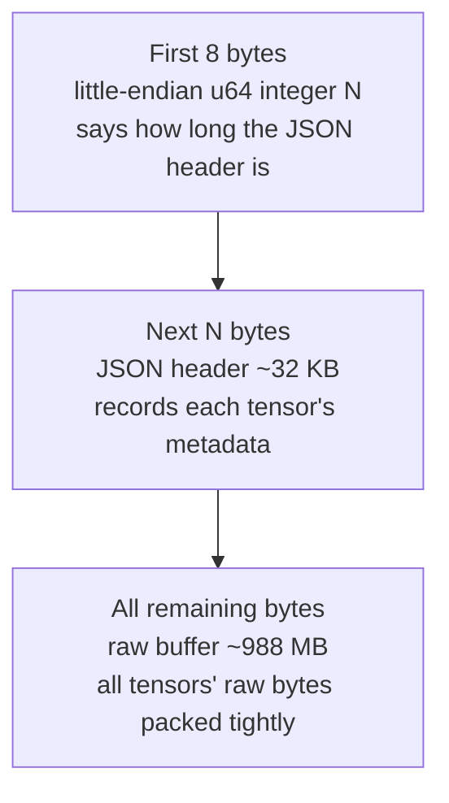
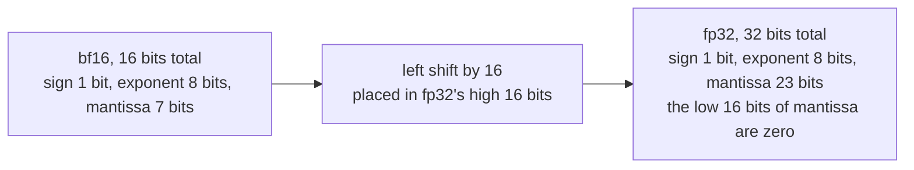
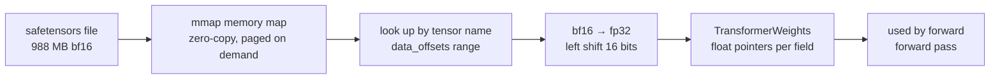

> 🌐 [中文版](../02-weights) | English

# Chapter 2 · Weight Storage & Loading

> Chapter 2 | Companion source: `safetensors.h` / `safetensors.c` (~300 lines) | [Previous: Basics](01-basics.md) | [Next: JSON Parser](03-json.md)

This chapter answers one question: **what do the model weights look like on disk, and how does the engine read them into memory**.

In Chapter 1 we computed that the model has 494 million parameters, but they don't just appear in memory out of thin air. These numbers are laid out on disk as a `model.safetensors` file (988 MB); when the engine starts up it has to read them in, convert them to float, and hand them over for the forward pass. All of this happens in `safetensors.c`.

---

## 2.1 The Safetensors File Format

HuggingFace's safetensors format is extremely minimal, designed for "safety (can't execute code) + speed (mmap-friendly)." Its binary layout looks like this:

```
 byte offset
 0        ┌───────────────────────────────────┐
          │ u64 header_len (little-endian, 8 bytes) │  tells you how long the JSON header is
 8        ├───────────────────────────────────┤
          │ header JSON (header_len bytes)     │  tensor metadata table
          │ { "tensor_name": {                 │
          │     "dtype": "BF16",               │
          │     "shape": [151936, 896],        │
          │     "data_offsets": [0, 272269312] │  position within the buffer below
          │   }, ...                           │
          │ }                                  │
 8+N      ├───────────────────────────────────┤
          │ raw tensor data (contiguous binary)│  all tensors' bytes packed tightly
 EOF      └───────────────────────────────────┘
```

The whole file is just three segments:

1. **The first 8 bytes**: a little-endian 64-bit integer telling you how many bytes the second segment (the JSON header) occupies.
2. **The JSON header**: a "metadata table" recording each tensor's name, data type, shape, and the `[start, end)` range of its raw bytes inside the third segment.
3. **The raw data**: all tensors' bytes packed tightly together, with no separators or alignment padding.

This diagram shows the three-segment binary layout of a safetensors file, and roughly how big each segment is in the real model file:



**Key insight**: the JSON header records the `[start, end)` range of each tensor within the raw buffer. When loading, you just take a pointer at the given offset — **zero copy**, no need to shuffle the data around.

> 📍 **Where**: the comment at the top of `safetensors.h` reiterates this layout. The `safetensors_open()` function (in `safetensors.c`) parses these three segments in order.

## 2.2 Core Terminology

Before diving into the code, let's clarify two low-level concepts — they explain why the code is written the way it is.

### mmap (memory-mapped file)

- **Plain English**: it "maps" a disk file into a memory address space; accessing memory is then equivalent to reading the file, with no need for `fread`.
- **Why use it**: when reading 1GB of weights, `fread` makes many syscalls and needs an extra buffer; `mmap` lets the OS page the file into memory on demand, near-instantly, with a memory footprint that grows as needed.

```c
void *map = mmap(NULL, file_size, PROT_READ, MAP_PRIVATE, fd, 0);
// afterwards, accessing map[offset] hits memory directly
```

What the parameters mean:

- `PROT_READ`: read-only permission (weights don't need to be written)
- `MAP_PRIVATE`: private mapping (copy-on-write; doesn't affect the original file)
- `MAP_FAILED`: the return value on mapping failure (used in the code for error checking)

> 📍 **Where**: the line `mmap(NULL, file_size, PROT_READ, MAP_PRIVATE, fd, 0)` inside `safetensors_open()` in `safetensors.c`. Once mapped, you get a pointer, and every subsequent read is computed as an offset from that pointer.

### little-endian

- **Plain English**: the order in which multi-byte data is laid out in memory. "Little-endian" = the low-order byte is stored at the low address.

```
The little-endian storage of the number 0x12345678 (4 bytes):
address: [0]   [1]   [2]   [3]
content: 0x78  0x56  0x34  0x12   ← low byte first
```

Almost every modern CPU (x86, ARM) is little-endian. Safetensors is also little-endian, so you can `memcpy` directly without any byte-order conversion. The code has a dedicated function for reading a little-endian u64:

```c
static unsigned long read_u64_le(const unsigned char *b) {
    unsigned long v = 0;
    for (int i = 0; i < 8; i++) {
        v |= ((unsigned long)b[i]) << (8 * i);
    }
    return v;
}
```

> 📍 **Where**: `read_u64_le()` in `safetensors.c`, used to read the 8-byte header length at the very start of the file.

## 2.3 Data Types: bf16 / fp16 / fp32

The weights are stored in **bfloat16** (saves half the space), but the engine computes in **float32** (higher precision). So at load time we do a `bf16 → fp32` conversion.

The bit layout of the three floating-point formats:

```
fp32 (32 bits): [sign 1] [exponent 8] [mantissa 23]
bf16 (16 bits): [sign 1] [exponent 8] [mantissa  7]   ← just fp32 with the low 16 mantissa bits chopped off
fp16 (16 bits): [sign 1] [exponent 5] [mantissa 10]   ← fewer exponent bits, smaller dynamic range
```

**Why bf16 instead of fp16**: bf16 keeps fp32's 8 exponent bits (same dynamic range) and only sacrifices mantissa precision. It's less prone to overflow during training, so it has become the default format on modern GPUs/TPUs.

### bf16 → fp32 Conversion

A bf16 is just the top 16 bits of an fp32 — a left shift does it:

This diagram shows how the 16 bits of bf16 line up inside the 32 bits of fp32 — bf16 sits in the high 16 bits, and the low 16 bits are filled with zeros:



```c
uint16_t b = ...;                    // read bf16
uint32_t bits = ((uint32_t)b) << 16; // place in fp32's high 16 bits
memcpy(&out[i], &bits, 4);           // bit-reinterpret as float
```

> 📍 **Where**: the `BF16` branch of the `safetensors_load_float()` function in `safetensors.c`. It expands each 2-byte element into 4 bytes element by element. The `F16` branch is also implemented (handling denormals, inf/nan), but Qwen2.5 doesn't need it — it's just supported for completeness.

### strict aliasing

- **Plain English**: the C compiler considers it "undefined behavior" for a `float*` and a `uint32_t*` to point at the same memory. So you can't do `*(float*)&bits` for a type conversion; you have to use `memcpy` (which the compiler optimizes to zero overhead).

The comment at the top of `safetensors.c` specifically emphasizes this rule — why you must use `memcpy(&f, &fp32_bits, 4)` instead of dereferencing directly. This is a classic C pitfall; violating strict aliasing under `-O2` optimization can cause bizarre bugs.

## 2.4 The Weight Tensor Naming Convention

Qwen2.5's tensor naming inside safetensors follows the transformers convention:

```
model.embed_tokens.weight                      ← token embedding table
model.layers.0.input_layernorm.weight          ← the RMSNorm before attention in layer 0
model.layers.0.self_attn.q_proj.weight         ← layer 0 Query projection weight
model.layers.0.self_attn.q_proj.bias           ← layer 0 Query projection bias (Qwen-only!)
model.layers.0.self_attn.k_proj.weight         ← Key projection
model.layers.0.self_attn.v_proj.weight         ← Value projection
model.layers.0.self_attn.o_proj.weight         ← Output projection (no bias)
model.layers.0.post_attention_layernorm.weight ← the RMSNorm before the MLP
model.layers.0.mlp.gate_proj.weight            ← SwiGLU's gate matrix
model.layers.0.mlp.up_proj.weight              ← up-projection matrix
model.layers.0.mlp.down_proj.weight            ← down-projection matrix
model.norm.weight                              ← final RMSNorm
...                                            (repeats per layer, layers.0 to layers.23)
```

Naming patterns:

- `model.embed_tokens` / `model.norm`: globally unique tensors (the embedding table, the final norm).
- `model.layers.{N}.xxx`: the weights of layer N, where N goes from 0 to 23.
- `self_attn` / `mlp`: the attention sub-module and the feed-forward sub-module.
- `input_layernorm` / `post_attention_layernorm`: the two RMSNorms, corresponding to the "two normalizations per layer" mentioned in Chapter 1.

**Key point**: when `tie_word_embeddings=true`, there is **no `lm_head.weight`** — the output head reuses `embed_tokens`. So when the engine finally computes logits, it uses the same embedding table transposed (see the final output code in `net.c`).

> 📍 **Where**: `safetensors_load_weights()` in `safetensors.c` maps these names one by one onto the fields of the `TransformerWeights` struct, and a comment lists the complete name correspondence table.

### The Per-Layer Assembly Trick

Safetensors stores each layer separately (`layers.0.xxx`, `layers.1.xxx`, ...), but the engine wants the 24 layers stacked into one contiguous array (a `[24, dim]`-style shape) so it can be indexed with `layer * stride + offset`. Hence the `load_layered()` helper:

```c
static int load_layered(SafetensorsFile *st, float *dst,
                        const char *suffix, int n_layers, size_t each_floats) {
    char name[256];
    for (int l = 0; l < n_layers; l++) {
        LAYER_NAME(name, sizeof(name), l, suffix);   // build "model.layers.{l}.{suffix}"
        float *tmp = safetensors_load_float(st, name);
        memcpy(dst + (size_t)l * each_floats, tmp, each_floats * sizeof(float));
        free(tmp);
    }
    return 0;
}
```

Each layer is loaded into a temporary buffer, then `memcpy`-ed into the right slot of the destination big array. After the 24-layer loop, you have a single contiguous `(n_layers, ...)` tensor.

> 📍 **Where**: `load_layered()` and the `LAYER_NAME` macro in `safetensors.c`, called repeatedly by `safetensors_load_weights()`.

## 2.5 Example: The Embedding Table's Exact Position in the File

Talking about the layout is still abstract. Let's look at the real data with `./run info`:

```
model.embed_tokens.weight   dtype=BF16  shape=[151936,896]
                            data[0, 272269312]   (272269312 bytes)
```

What these numbers mean:

```
The model.safetensors file (988 MB total)
┌──────────────────────────────────────────────────────────┐
│ Bytes 0-7:        u64 header length                      │
├──────────────────────────────────────────────────────────┤
│ Bytes 8-32287:    JSON header (32280 bytes)              │
├──────────────────────────────────────────────────────────┤
│                                                          │
│  ★ Bytes 32288 ~ 272301599 ★  ← the embedding table is here! │
│                                                          │
│  151936 rows × 896 cols × 2 bytes (bf16) = 272269312 bytes ≈ 260MB │
│  this is the raw data of all word vectors                │
│                                                          │
├──────────────────────────────────────────────────────────┤
│  other weights (q_proj, k_proj, mlp_gate ...)            │
└──────────────────────────────────────────────────────────┘
```

**The embedding table takes up 260/988 ≈ 26% of the entire model file** — more than a quarter. This is also why the embedding table's share is especially high in small models: the vocabulary (151936) is large relative to the feature dimension (896), and the layer count (24) is small.

### The Complete Journey from Disk to Memory

This diagram shows the full flow of the weights from the safetensors file on disk, to a float array in memory, to being used by a forward call:



Connecting the two numbers `data_offsets=[0, 272269312]`, you can see how a single token's vector travels from disk to memory:

```
Training phase (done by the Qwen team)
  Trained on a GPU cluster, learned the optimal 151936 × 896 numbers
  → saved into model.safetensors
        │
        │  you download it via ./download.sh (988 MB)
        ▼
On disk
  The start of model.safetensors's raw buffer (offset 0)
  stores 260 MB of bf16 data
        │
        │  when ./run starts, safetensors.c runs this line:
        │  w->token_embedding_table = safetensors_load_float(
        │      st, "model.embed_tokens.weight");
        ▼
In memory
  malloc a 151936 × 896 × 4 = 544 MB float array
  (bf16 is 2 bytes each → converted to fp32 at 4 bytes each, so it doubles)
        │
        │  during forward(token=4616)
        ▼
In use
  token_embedding_table + 4616 × 896  ← skip the first 4616 words, land on "cat"
  memcpy 896 floats → s->x → into the Transformer
```

Note that `data_offsets=[0, 272269312]` is an offset relative to the start of the raw buffer, not relative to the whole file. The engine records the start of the raw buffer in `safetensors_open()` (`st->data = bytes + 8 + header_len`), and every subsequent read computes an offset from that starting point.

### The In-Memory Layout

```
w->token_embedding_table (544 MB, 135.73 million floats):

         [0]     [1]     [2]    ...    [895]
       ┌────────────────────────────────────┐
  row 0│ -0.003  0.015  -0.021  ...  0.008  │ ← the 896 numbers of token 0
  row 1│  0.012 -0.004   0.033  ... -0.011  │ ← token 1
       │  ...                               │
row 4616│ -0.016  0.003  -0.002  ...  0.005  │ ← the vector of "cat" (id=4616)
       │  ...                               │
row 9707│ -0.025  0.006  -0.010  ... -0.002  │ ← "Hello" (id=9707)
       │  ...                               │
row151935│ 0.025  -0.006  0.010  ... -0.002  │
       └────────────────────────────────────┘
```

**The lookup is a single step**: `table[token_id]` fetches the 896 numbers of that row. That's the entire operation of "word embedding" — there's no computation, it's just fetching data by row number.

> **Where do these 896 numbers come from?** They were trained. During training, the model continuously adjusts these 135 million numbers so that words with similar meanings end up with similar vectors. What's stored in the loaded safetensors is the optimal values after training finished.

## 2.6 The SafetensorsFile Struct

The entire loading process revolves around a single struct, `SafetensorsFile`, defined in `safetensors.h`:

```c
typedef struct {
    char *path;            // file path (for debugging)
    char *header_json;     // header JSON text (null-terminated)
    unsigned long header_len; // byte length of the header JSON
    JsonValue *header;     // the parsed header tree (built on open, freed on close)
    unsigned char *data;   // pointer to the start of the raw buffer
    unsigned long data_size; // number of bytes in the raw buffer
    /* start of the whole file's mmap (used for the final munmap) */
    unsigned char *mapped;
    unsigned long mapped_size;
} SafetensorsFile;
```

How the pointers relate (important — don't confuse them):

```
mapped ──► very start of the file (byte 0)
             │
             │  +8                +8+header_len
             ▼                     ▼
           [u64 header_len]   [raw buffer start]
                                   ▲
data ─────────────────────────────-┘  (st->data = mapped + 8 + header_len)
```

- `mapped`: the start returned by mmap, corresponding to file byte 0. Used for `munmap` in `close`.
- `data`: the start of the raw buffer, corresponding to file byte `8 + header_len`. Every tensor's `data_offsets` is relative to this point.
- `header_json`: the JSON header text (a copy was made, with a `\0` terminator added).
- `header`: the tree produced by parsing `header_json` with the JSON parser (next chapter); all subsequent tensor metadata lookups go through this tree.

> 📍 **Where**: the struct definition in `safetensors.h`; `safetensors_open()` in `safetensors.c` fills in all the fields, and `safetensors_close()` does `munmap` + `free` + frees the JSON tree.

### The Four Public Functions

| Function | What it does | Plain English |
|------|--------|--------|
| `safetensors_open(path, st)` | open the file, mmap, parse header | open the book, look at the table of contents |
| `safetensors_close(st)` | munmap + free + free the JSON | close the book |
| `safetensors_find(st, name, ...)` | look up a tensor's offset/length/shape/dtype | look in the TOC to find a chapter's page number |
| `safetensors_load_float(st, name)` | read out the tensor and convert to a float array | turn to that page, copy the content as float |
| `safetensors_load_weights(st, cfg, w)` | load the full set of weights into `TransformerWeights` | copy the whole book into memory in one go |

`safetensors_load_weights()` is the main entry point called at engine startup. It first allocates memory for every field, then for each field calls either `load_layered()` (assemble per layer) or `safetensors_load_float()` (read a global tensor directly).

---

## Chapter Summary

1. **safetensors = 8-byte header length + JSON header + a contiguous raw buffer**. A three-segment, minimal format that can't hide code, which is why it's safe.
2. **mmap makes reading a file like accessing memory** — no `fread`, paged on demand, ideal for reading large weights.
3. **Little-endian is the default**, so on x86/ARM you can `memcpy` directly without converting byte order.
4. **bf16 is the top 16 bits of fp32**; converting is just a left shift of 16 bits; `memcpy` is there to obey strict aliasing, not to actually copy (the compiler optimizes it away).
5. **The embedding table is 26% of the file** (260MB), the leading segment of the raw buffer; after loading it doubles to 544MB (bf16→fp32).
6. **Weight naming follows the `model.layers.{N}.xxx` pattern**; when `tie_word_embeddings=true`, the output head reuses the embedding table.

In the next chapter we'll see how that JSON header gets parsed — because the safetensors header is JSON, and our engine doesn't depend on any external library, we have to write a JSON parser by hand.

> Continue reading: [Chapter 3 · JSON Parser](03-json.md)
