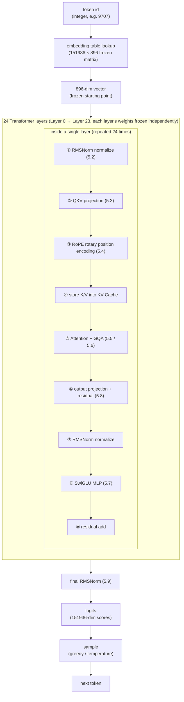
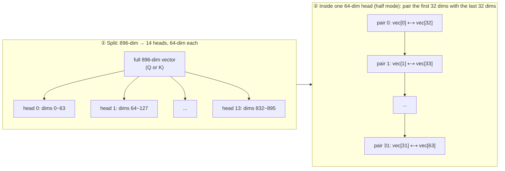
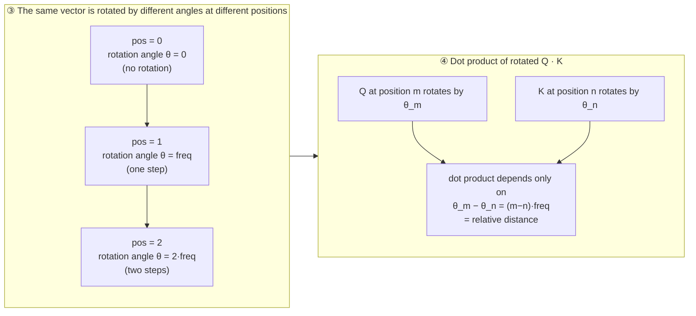
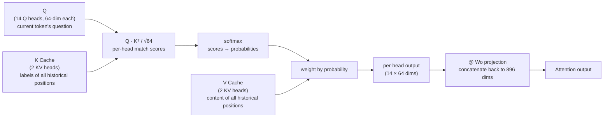
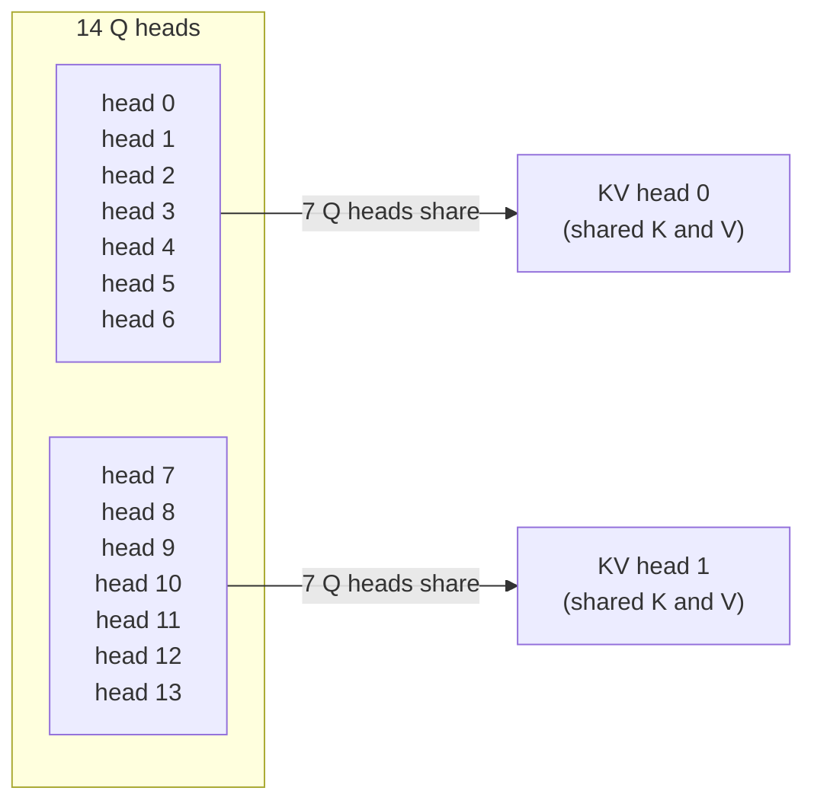
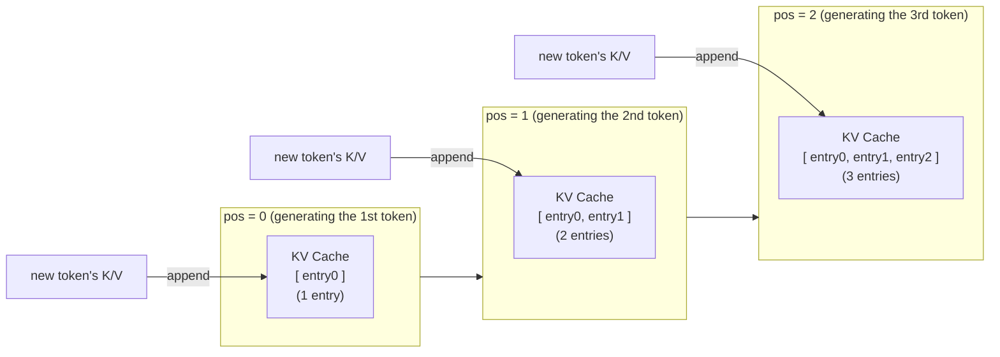

# Chapter 5 · Forward Pass (net.c)

> 🌐 [中文版](../cn/05-forward.md) | English

> Chapter 5 | Companion source: `net.c` (~400 lines) | [Previous: Model Architecture](./04-model.md) | [Next: Tokenizer](./06-tokenizer.md)

---

## What this chapter covers

`net.c` is the heart of the entire inference engine. Every operator (RMSNorm, matmul, RoPE, Attention, SwiGLU) lives here.

**This is the most important chapter — read it again and again.**

How this chapter is organized:

- **5.0** First, use real data to see exactly "what happens when a token comes in."
- **5.1** A complete flow diagram of a single Transformer layer.
- **5.2–5.9** Dissect each operator one by one, with principle + code + real numbers.

---

## A token's journey: from embedding to logits

Before looking at the individual operators, let's use real data to see exactly "what happens when a token comes in."

### Key distinction: what is frozen, what changes

```
Frozen (fixed at training time, stored in safetensors):
  ① embedding table      — "Hello" always maps to the same 896 numbers
  ② per-layer weight matrices  — Wq/Wk/Wv/Wo/MLP, never change at inference
  ③ per-layer normalization weights — rms_att_weight, rms_ffn_weight

Changes (recomputed every inference):
  ④ the intermediate vector x in each layer — 896 numbers, rewritten by every layer
  ⑤ attention scores      — depends on which tokens were fed in
  ⑥ final logits          — different input → different output
```

### Real data: how one token evolves through 24 layers

Run token "Hello" (id=9707) once and watch how its first 4 numbers change:

```
After embedding (starting point):  [-0.025,  0.006, -0.010,  0.013]   ← frozen start (table lookup)
After layer 0:                     [ 0.096,  0.091,  0.253, -0.066]   ← changed
After layer 1:                     [ 0.028,  0.213,  0.177, -0.204]   ← changed again
After layer 2:                     [-0.669, -6.341, -2.660,  4.762]   ← changed again
   ...
After layer 23:                    [ 3.011,  2.389,  0.339,  2.611]   ← final vector
```

**The starting point is frozen (the embedding lookup), but every layer rewrites the 896 numbers into new values.** The final layer-23 vector is then used to compute logits and predict the next word.

### What each layer does to the vector (a cooking analogy)

Think of the 24 layers as 24 stations on an assembly line:

```
The recipe (weights) is frozen; the ingredient (the vector) changes at every station.
```

Each station (each layer) does two things:

**First: Attention — "look at the surrounding words"**

```
When "Hello" enters layer 0:
  It takes its own Q (its question) and matches it against every K (label) of all words seen so far
  → finds which words it is more related to
  → mixes the V (content) of those related words into its own vector

Result: "Hello"'s vector is no longer isolated — it now "knows" the context.
```

**Second: Feed-forward network (MLP) — "think on its own for a moment"**

```
After "Hello" has absorbed the context:
  It passes through the MLP, expanding from 896 dims to 4864 dims (more thinking room)
  SwiGLU gating decides which information to amplify and which to suppress
  Then compresses back to 896 dims

Result: "Hello"'s vector becomes more "abstract," closer to semantics.
```

**Both operations are added onto the original vector via residual connections:**

```
x_new = x_old + Attention(x_old)   ← add "what it learned from others"
x_new = x_new + MLP(x_new)         ← add "the result of its own thinking"
```

### The cumulative effect of 24 layers

Each layer makes the vector more "high-level":

```
Layers 0-3 (shallow):    learn part-of-speech, grammatical relations
                          "Hello" → knows this is a greeting
Layers 4-15 (middle):    learn phrases, collocations
                          "Hello" → knows it's often followed by "world" / "how are you"
Layers 16-23 (deep):     learn semantics, reasoning
                          "Hello" → combines with context, decides the most sensible next word
```

### Complete flow diagram

```
  "Hello" (text)
     │
     │  tokenizer
     ▼
  token id = 9707                          [frozen vocabulary]
     │
     │  embedding table lookup (frozen)    ← frozen start
     ▼
  896-dim vector [-0.025, 0.006, ...]
     │
     │  ┌─────────────────────────────────┐
     │  │ Layer 0 (frozen weights):       │
     │  │   ① Attention: look around      │  ← vector changes
     │  │   ② MLP: independent processing  │  ← vector changes again
     │  └─────────────────────────────────┘
     ▼
  new 896-dim vector [0.096, 0.091, ...]
     │
     │  Layer 1 ... (same two things, different weights)
     ▼
  ... repeat 24 times, the vector changes every time ...
     │
     │  final RMSNorm + project back to vocabulary
     ▼
  logits (151936 scores)
     │
     │  sample (greedy / temperature)
     ▼
  next token
```

> **Core insight**: the embedding is a fixed starting point, the weights are fixed "processing rules," but the vector itself changes at every layer.
> After 24 layers, "Hello"'s vector has fused context, grammar, and semantics — it has become a "high-level representation" that can predict the next word.
> This is why the same word ends up with different final representations in different sentences (context is injected through attention at every layer).

---

## The complete flow of a single Transformer layer

The diagram below is the "map" for this chapter; sections 5.2–5.9 each correspond to a step in it:

```
        x (896-dim)
        │
   ┌────┴────────────────────────────────────────┐
   │  ① RMSNorm(x, rms_att_w) → xb              │  normalize (5.2)
   │  ② Q=xb@Wq+bq  K=xb@Wk+bk  V=xb@Wv+bv     │  QKV projection (5.3)
   │  ③ RoPE(Q, pos), RoPE(K, pos)              │  rotary position encoding (5.4)
   │  ④ store K,V into KV Cache column pos       │  cache
   │  ⑤ Attention (GQA: 14 Q heads share 2 KV heads) │  attention (5.5 + 5.6)
   │  ⑥ xb2 = out@Wo, x += xb2                  │  output projection + residual (5.3 / 5.8)
   │  ⑦ RMSNorm(x, rms_ffn_w) → xb              │  normalize (5.2)
   │  ⑧ SwiGLU: silu(xb@Wgate) * (xb@Wup) @Wdown│  feed-forward (5.7)
   │  ⑨ x += mlp_out                            │  residual (5.8)
   └─────────────────────────────────────────────┘
        │ (repeat 24 times)
        ▼
   final RMSNorm + project back to vocabulary → logits (5.9)
```

This diagram shows the full journey of a token from input to output: after an embedding lookup gives the 896-dim starting vector, it passes through 24 Transformer layers one after another (each doing Attention + MLP), is finally normalized and projected back to the 151936-dim vocabulary, then sampled to produce the next token.



Corresponding source: the `forward()` function in `net.c` (starting at line 182); the main loop `for (int l = 0; l < L; l++)` is at line 210.

---

## Operator 1: RMSNorm (normalization)

### First, see what happens without normalization

Every layer does a matrix multiplication (the QKV projection), which is essentially the **summation** of 896 numbers:

```c
for (int j = 0; j < 896; j++) {
    val += wrow[j] * x[j];   // accumulate 896 products
}
```

Summing 896 numbers — if each is slightly too large, the total gets a lot larger. **Each layer amplifies a little, and 24 layers explode exponentially.**

Let's run the same input down two paths — the only difference is "whether we normalize at the start of each layer":

```
Same 896-dim input, compare two paths:

  Layer      No normalization (just matmul)       Normalize at start of each layer (pull back to standard size then matmul)
  ────────────────────────────────────────────────────────────────
  Layer 0    |x| = 0.86                           |x| = 85.6
  Layer 1    |x| = 2.61                           |x| = 90.4
  Layer 2    |x| = 7.65                           |x| = 87.9
  Layer 3    |x| = 22.36                          |x| = 87.5
  Layer 5    |x| = 195                            |x| = 90.0
  Layer 10   |x| = 43,925                         |x| = 87.8
  Layer 15   |x| = 11,134,814                     |x| = 91.2
  Layer 20   |x| = 2,527,791,360   ← exploded     |x| = 85.3
  Layer 22   |x| = 22,842,894,336 ← exploded      |x| = 91.1
  Layer 23   |x| = 69,113,749,504 ← exploded      |x| = 90.6
```

**Left side, no normalization**: the values snowball; each layer just does a matmul that amplifies the previous layer's output, nothing stops it, and it grows exponentially to 69 billion — floats can't hold it, the model is wrecked.

**Right side, normalize each layer**: at the start of every layer, the previous layer's output is **pulled back to a standard size**, then the matmul runs. So whether the previous output was 85 or 91, it enters this layer from the same starting point — the values stay stable.

Why it explodes: each matmul slightly enlarges the vector; do that 24 times in a row and you get exponential growth:

```
If each layer scales by 2×:
  Layer 1:  ×2
  Layer 2:  ×4
  Layer 10: ×1024
  Layer 24: ×16,777,216   ← 16 million times the original

What normalization does = press the "reset button" at the door of every layer, pulling values back to a standard size.
  → the previous layer's "snowball size" is cleared
  → this layer restarts from standard size, no accumulation
```

### The goal of normalization: prevent values from exploding or vanishing across layers

**At the start of every layer, "pull" the vector back to a standard size to prevent cumulative explosion.** It's like a "volume knob" installed at the door of each layer: no matter how loud the previous layer's output is, it's tuned back to a standard volume at the door, so it can't accumulate into an explosion across layers.

### How it's actually done (three steps)

```c
// net.c: rmsnorm()  (line 98)
static void rmsnorm(float *out, const float *x, const float *weight, int size, float eps) {
    // Step 1: compute the "average size" (root-mean-square, RMS) of these 896 numbers
    double ss = 0.0;
    for (int i = 0; i < size; i++) ss += x[i] * x[i];
    ss = ss / size + eps;                 // ← eps guards against divide-by-zero
    float inv = 1.0f / sqrtf((float)ss);  // ← reciprocal of RMS

    // Steps 2+3: divide every number by RMS (uniform scaling), then multiply by weight (per-dim fine-tuning)
    for (int i = 0; i < size; i++)
        out[i] = (x[i] * inv) * weight[i];
}
```

Let's walk through a concrete example. Suppose the input vector is only 4-dim (simplified):

```
Input x:       [0.6,  1.2,  0.3,  0.9]     ← current layer's input

Step 1: compute "average size"
  squares:      [0.36, 1.44, 0.09, 0.81]
  sum:          0.36 + 1.44 + 0.09 + 0.81 = 2.7
  divide by 4:  2.7 / 4 = 0.675
  add eps:      0.675 + 0.000001 ≈ 0.675
  sqrt (RMS):   √0.675 ≈ 0.822
  reciprocal:   1 / 0.822 ≈ 1.217

Step 2: divide every number by RMS (uniform scaling, ratio preserved)
  0.6 × 1.217 = 0.730
  1.2 × 1.217 = 1.460
  0.3 × 1.217 = 0.365
  0.9 × 1.217 = 1.095
  → scaled overall, but big stays big, small stays small (ratios preserved)

Step 3: multiply by weight (per-dim fine-tuning, learned during training)
  assume weight = [1.5, 0.3, 2.0, 0.9]:
  0.730 × 1.5 = 1.095   ← this dim matters, amplify
  1.460 × 0.3 = 0.438   ← this dim doesn't, shrink
  0.365 × 2.0 = 0.730   ← amplify
  1.095 × 0.9 = 0.986   ← fine-tune

Output: [1.095, 0.438, 0.730, 0.986]
```

What each step does:

| Step | What it does | Why |
|------|--------------|-----|
| ① compute RMS | measure the "average size" of the current vector | know how much to scale |
| ② divide by RMS | uniformly scale to a standard size | **prevent cumulative explosion across layers** (core purpose) |
| ③ multiply by weight | per-dim fine-tuning | let the model learn "which dimensions matter" |

### What is eps for

```c
ss = ss / size + eps;   // ← eps = 1e-6
```

**To prevent divide-by-zero.** If the vector happens to be all zeros, RMS = 0, and `1/0` gives infinity. Adding a tiny number is a safety net.

### Each layer has two RMSNorms (it's not done just once at the start)

**Common misconception**: thinking normalization is done only once at the very start of the network.
**Reality**: every layer does it **twice** — once before attention, once before MLP.

Why twice? Because a layer contains two independent submodules (Attention + MLP), each of which changes the magnitude of the values. **You must normalize before every matmul**, and a layer has two matmuls, so two normalizations:

```
x enters a layer
  │
  ├─ normalize ① (rms_att_weight)    ← before Attention
  │   pull x back to standard size → run Attention
  │                                  Attention done, values changed again
  ├─ residual: x = x + attention output
  │
  ├─ normalize ② (rms_ffn_weight)    ← before MLP
  │   pull x back to standard size again → run MLP  ← without this, MLP's input is messy
  │
  ├─ residual: x = x + mlp output
  └─ pass to next layer (which will normalize twice again)
```

**Core principle**: every time you enter a "workshop" (Attention / MLP), you normalize at the door. Like a factory assembly line with two workshops in one stage, you check at the door of each — not just once for the whole line.

The code has two corresponding calls (`net.c:221` and `net.c:374`):

```c
rmsnorm(..., w->rms_att_weight, ...)   // 1st: before attention (net.c:221)
rmsnorm(..., w->rms_ffn_weight, ...)   // 2nd: before MLP    (net.c:374)
```

The two weight sets are trained separately (`rms_att_weight` and `rms_ffn_weight`), because attention and MLP have different requirements for value distribution. So each layer's normalization parameters are `896 + 896 = 1792` — two workshops, 896 knobs each.

### Why RMSNorm instead of LayerNorm

```
LayerNorm:  subtract mean → divide by std → multiply by weight    (three steps)
RMSNorm:                       divide by RMS → multiply by weight  (two steps, skips the mean subtraction)
```

RMSNorm skips one step (no need to compute the mean), so it's cheaper to compute and works nearly as well. Modern LLMs (Llama/Qwen) almost all use RMSNorm.

### One-sentence summary

**Normalization = the volume knob at the door of every layer.** No matter how big or small the previous layer's output is, tune it back to standard at the door, preventing 24 layers from cumulatively exploding. This is a prerequisite for deep networks to work stably — without it, you'd overflow by layer 22.

---

## Operator 2: matmul (matrix-vector multiply)

**The most time-consuming part** (95%+ of the compute).

```c
// net.c: matmul()  (line 114)
// out[d] = W[d,n] @ x[n] + bias[d]
// W is row-major: W[i*n+j] is row i, column j
static void matmul(float *out, const float *W, const float *x,
                   const float *bias, int n, int d) {
    for (int i = 0; i < d; i++) {
        float val = (bias ? bias[i] : 0.0f);
        const float *wrow = W + (size_t)i * n;
        for (int j = 0; j < n; j++) val += wrow[j] * x[j];
        out[i] = val;
    }
}
```

**Terminology**:

- **Row-major**: the matrix is stored row by row; `W[i*n+j]` is row i, column j. C arrays are row-major by default.
- **Projection**: the operation `y = Wx + b` is called a "linear projection" — multiplying a vector by a matrix to transform it into another space.

> ⚠️ **Pitfall during development**: for `matmul(out, W, x, bias, n, d)`, `n` is the input dimension and `d` is the output dimension.
> Passing them swapped causes an out-of-bounds write. During this project's development, the k_proj arguments were once swapped — ASan caught it.

### Important: don't confuse the three kinds of "matrices"

When discussing Transformer dimensions, you must distinguish three completely different kinds of "matrices":

| Category | What it is | Size determined by | Does it change |
|----------|------------|--------------------|----------------|
| **① Weight matrix** | parameters learned during training (wq/wk/wv etc.) | **fixed by model structure** | No (frozen after training) |
| **② Input data tensor** | intermediate result after embedding | **seq_len determines the row count** | Yes (different inputs differ) |
| **③ Attention score matrix** | scores from Q·Kᵀ | **seq_len × seq_len** | Yes (different inputs differ) |

Use `./run info` to see the real weight matrix shapes (category ①):

```
q_proj.weight  shape=[896, 896]   ← square weight matrix, always 896×896 regardless of input length
k_proj.weight  shape=[128, 896]   ← rectangular (GQA)
o_proj.weight  shape=[896, 896]   ← square weight matrix
mlp.gate_proj  shape=[4864, 896]  ← rectangular (MLP expansion)
embed_tokens   shape=[151936, 896] ← rectangular (vocab × features)
```

Input data tensors (category ②):

```
Input 2 tokens:    tensor shape = [2, 896]     ← 2 rows (rows = token count), 896 columns (features)
Input 128 tokens:  tensor shape = [128, 896]   ← 128 rows, 896 columns
                   row count = seq_len, unrelated to 896
```

Attention score matrices (category ③):

```
Input 2 tokens:    score shape = [2, 2]        ← 2×2, completely unrelated to 896
Input 128 tokens:  score shape = [128, 128]
                   always [seq_len, seq_len]
```

> ⚠️ **Common misconception**: "Does `hidden_size=896` mean all internal matrices are 896×896?"
> **No.** 896 is the feature dimension (each token has 896 numbers).
> - Weight matrices: some are 896×896 squares (Q/O), some are rectangular (K/V/MLP/embedding)
> - Data tensors: row count = number of tokens (seq_len), column count = 896
> - Attention matrix: seq_len × seq_len, unrelated to 896

---

## Operator 3: RoPE (Rotary Position Encoding)

**Problem**: attention is permutation-invariant by itself — shuffle the tokens and Q/K/V don't change. But word order matters in language.
**Solution**: encode position via "rotation." Vectors at different positions are rotated by different angles.

```c
// net.c: rope()  (line 139)
static void rope(float *vec, int head_dim, int pos, float base) {
    for (int i = 0; i < head_dim / 2; i++) {
        float freq = powf(base, (float)(-2*i) / head_dim);
        float angle = pos * freq;
        float c = cosf(angle), s = sinf(angle);
        // HF "half" mode: pair vec[i] with vec[i + head_dim/2]
        float a = vec[i], b = vec[i + head_dim / 2];
        vec[i]             = a * c - b * s;
        vec[i + head_dim/2] = a * s + b * c;
    }
}
```

This diagram shows the two key concepts of RoPE. Left — how an 896-dim vector is split into 14 heads (each 64-dim), and within each 64-dim head the HF "half" mode pairs the first 32 dims with the last 32 dims into 32 complex pairs. Right — the same vector at different positions pos=0/1/2 is rotated by different angles (each pair has its own frequency `freq`; the larger the position, the bigger the rotation angle). After rotation, the dot product of Q and K depends only on the relative position (m−n).



After pairing, each pair (a, b) is treated as a complex number a + bi and multiplied by e^{iθ} to rotate. **The larger the position, the bigger the rotation angle; low-frequency pairs (large dim index i) rotate slowly and encode long distances; high-frequency pairs rotate quickly and encode short distances.**



**Core intuition**: treat two adjacent dimensions as a complex number and multiply by e^{iθ} to rotate.
The attention score between position m and position n depends only on (m−n), the relative distance.

**Role of rope_theta**: the base frequency. The larger it is, the farther the positions that can be encoded.

- GPT-2: theta=10000 (context 1024)
- Qwen2.5: theta=1000000 (context 32768)

**It only applies to Q and K**, not V — position information is only needed when computing relevance (Q·K).

The call site in code (`net.c:263-268`):

```c
for (int h = 0; h < nhead; h++) {
    rope(s->q + h * d, d, pos, theta);   // rotate every Q head
}
for (int h = 0; h < nkvhead; h++) {
    rope(s->k + h * d, d, pos, theta);   // rotate every K head
}
```

---

## Operator 4: Attention

**Core formula**: `Attention(Q,K,V) = softmax(Q·Kᵀ / √d) · V`

**Intuition**: for the current token, decide which previous tokens are relevant to it, and take a weighted average of their information.

```
Q (Query): what the current token "is looking for"     — the question vector
K (Key):   what each token "is"                         — the label vector
V (Value): each token's "content"                       — the information vector

score = Q·K: how related (the larger the dot product, the more related)
att = softmax(score): normalize into probabilities
out = Σ att × V: take content weighted by relevance
```

**Why divide by √d**: when dim d is large, the dot product Q·K grows large and softmax enters the saturation region (gradients approach zero). Dividing by √d brings the variance back to 1.

**Causality**: in the code the loop only goes up to `pos` (the current position) and never sees future tokens — this is what "causal" means.

### Worked example: a full Attention pass on "cat dog"

Formulas alone are abstract. Let's walk through it with real numbers, so every step shows concrete values.

> Full script: `attention_visual.py` — change the input to inspect any word's attention.

**Input**: `"cat dog"` → tokenized into 2 tokens: `cat` (id=4616) and ` dog` (id=5562)

---

**Step 1: Embedding — token id becomes an 896-dim vector**

```
'cat' → [-0.0162, 0.0031, -0.0019, -0.0077, -0.0239, ... 896 numbers]
'dog' → [-0.0045, -0.0111, 0.0140, -0.0110, 0.0069, ... 896 numbers]
```

This is just a lookup of `token_embedding_table[id]` to fetch that row.

---

**Step 2: QKV projection — the same vector is projected into 3 viewpoints**

cat's 896-dim vector passes through **three different weight matrices** to produce three different vectors:

```
cat's input vector
  ├── @ Wq matrix → Q(cat) = [-0.047, -0.018, -0.243, ...]  "what cat wants to find"
  ├── @ Wk matrix → K(cat) = [-8.114, -3.306, -6.474, ...]  "what kind of label cat is"
  └── @ Wv matrix → V(cat) = [-0.015, 0.004, -0.017, ...]   "cat's content"
```

**Why project one input into three vectors?** Because they play different roles:

- **Q (Query)** = "what kind of words I want to find" — use it to match against others
- **K (Key)** = "what kind of word I am" — others use their Q to match against it
- **V (Value)** = "if you pick me, what information you get"

**Life analogy — matchmaking**:

| | Matchmaking analogy | Attention |
|---|---|---|
| Q | your criteria ("I want someone sporty") | the current word's sought-after context |
| K | your personal tag ("I'm into sports") | each word's "identity label" |
| V | your actual traits (height/income/personality) | the actual information each word carries |

cat takes its own Q (its criteria) and matches it against everyone's K (personal tags); for high matches, it takes more of their V (actual traits).

---

**Step 3: Q·K computes the score (match degree)**

```
dog takes its own Q and dot-products it with the K at every position:
  Q(dog) · K(cat) = +164.352   ← dog thinks cat is 164-points related to itself
  Q(dog) · K(dog) = +164.390   ← dog thinks itself is 164-points related
```

**Dot product = match degree.** The more aligned two vectors are in direction, the bigger the dot product, the more "related."

Note cat can't see dog (causality — it can only look at words already to its left), so cat only scores against itself.

---

**Step 4: softmax turns it into percentages**

```
dog's scores:   [+164.352, +164.390]
after softmax:  [0.490,    0.510]

→ dog puts 49% of its attention on cat, 51% on itself
```

---

**Step 5: weight V by the percentages (grab the final information)**

```
dog's output = 49% × V(cat) + 51% × V(dog)
            = 49% cat content + 51% dog content
```

**This is the essence of attention**: dog's output is no longer just dog's own information — it has **mixed in 49% cat information**. The more cat and dog are related (the higher the score), the larger the proportion mixed in.

---

**Full-flow recap**:

```
  cat(pos0)                          dog(pos1)
     |                                  |
  embed → 896-dim vector             embed → 896-dim vector
     |                                  |
  project out Q,K,V                  project out Q,K,V
     |                                  |
  Q(cat)·K(cat) scores               Q(dog)·K(cat), Q(dog)·K(dog) scores
  can only see itself (causal)       can see cat and itself
     |                                  |
  softmax → 100% on itself           softmax → 49% cat + 51% self
     |                                  |
  weighted V → output                weighted V → output (mixed in cat's info)
     |                                  |
  ... through 24 layers of the same ...  ... through 24 layers of the same ...
     |                                  |
  final vector → logits → predict next word
```

This diagram shows the Attention computation flow: each of the 14 Q heads takes the current token's Query and dot-products it with the Keys of all historical positions in the KV Cache to compute scores, softmax normalizes them into weights, and the weights are used to take a weighted sum of Values to produce each head's output.



This diagram shows the core of GQA (Grouped-Query Attention): Qwen2.5-0.5B has 14 Q heads but only 2 KV heads. Every 7 Q heads share the same set of K/V (head 0~6 share KV head 0, head 7~13 share KV head 1), so KV Cache memory drops from 14 copies to 2 — a 7× saving.



This diagram shows how the KV Cache accumulates over generation steps: at pos=0 the cache has only 1 entry (the first token's K/V), at pos=1 a second entry is appended, at pos=2 a third, ... Each new token's K/V is appended into the cache, and on the next forward pass all previous K/V can be read.



> **Key insight**: after a single attention layer, dog's representation already mixes in cat's information.
> After 24 layers, every token's representation has fused the entire context. This is how the model "understands" context.

### How multiple tokens cooperate: compute in order + KV Cache shares context

The previous section covered attention for a single token. But real inputs have multiple tokens (e.g. "你好" is 2 tokens).
A common question: **are the two tokens computed together or separately? If separately, doesn't the meaning change?**

Answer: **compute in order first, then use the KV Cache so later tokens can see earlier ones.**

"你好" = `[56568, 52801]`, the processing goes:

```
═══ 1st forward (pos=0): process "你" ═══

  KV Cache: empty

  Layer 0:
    "你" → embed → 896-dim
    "你" → QKV projection → Q, K, V
    store K, V into Cache position 0        ← ★ store into "memory"
    "你"'s Q × K in Cache (only position 0 = "你" itself)
    → attention only sees itself (cache has only itself right now)

  ... through 24 layers ...

  KV Cache now:  position 0 = "你"'s K/V


═══ 2nd forward (pos=1): process "好" ═══

  KV Cache:  position 0 = "你"'s K/V         ← ★ stored in the previous step!

  Layer 0:
    "好" → embed → 896-dim
    "好" → QKV projection → Q, K, V
    store K, V into Cache position 1
    "好"'s Q × K in Cache:
      × position 0 "你"'s K → score 0.7     ← ★ "好" sees "你"!
      × position 1 "好"'s K → score 0.3
    softmax → "你" gets 70%, "好" gets 30%
    "好"'s output = 70% × "你"'s V + 30% × "好"'s V
    → "好"'s vector has mixed in 70% of "你"'s information!

  ... through 24 layers, every layer mixes like this ...
  → "好"'s final vector contains the semantics of the whole "你好"
```

**Key code** — the loop range of attention `t <= pos` (`net.c:302`):

```c
for (int t = 0; t <= pos; t++) {   // only look at the current and earlier positions
    // pos=0 ("你"): t only goes to 0, "你" can only see itself
    // pos=1 ("好"): t goes to 1, "好" can see "你" (position 0) and itself (position 1)
}
```

### Why this doesn't "change the meaning"

```
Without KV Cache (the case you worry about):
  "你" computed alone → only knows "你"
  "好" computed alone → only knows "好"
  → two isolated characters, context is lost

With KV Cache (the actual situation):
  after "你" is computed → its K/V is stored in the cache (memory!)
  when "好" is computed → reads "你"'s K/V from the cache
  → "好" "sees" "你" via attention
  → context is fully preserved
```

**The KV Cache is the "communication channel" between tokens.** Although each forward pass processes only one token,
through the cache, later tokens can see the K/V of all earlier tokens and mix their V via attention.
That's why "computing separately doesn't lose meaning."

### Causality: earlier tokens can't see later ones

The `<= pos` in `for (int t = 0; t <= pos; t++)` guarantees:

```
pos=0 ("你"): can only see position 0 → "你" can't see "好"
pos=1 ("好"): can see positions 0, 1 → "好" can see "你"

→ later words can see earlier words, earlier words can't see later words
→ like reading a sentence: when you reach "好" you know "你" came before, but when you read "你" you don't know "好" follows
```

This is "causal attention," and it's also why the model can only "predict the next word" rather than "fill in the middle."

### Why 24 layers are needed

A single attention layer does only one round of "seeing." Full semantics requires many layers to accumulate:

```
Layer 0:  "好" sees "你" → knows the two characters are adjacent
Layer 5:  → understands "你好" is a greeting
Layer 10: → "你好" may be followed by "世界" or "吗"
Layer 23: → final prediction of the next word

Each layer deepens the understanding on top of the previous; 24 layers accumulate full semantics
```

---

## Operator 5: GQA (Grouped-Query Attention)

**Problem**: standard attention pairs each Q head with its own KV, making the KV Cache too large.
**Solution**: multiple Q heads share one set of KV.

```
Qwen2.5-0.5B: 14 Q heads, 2 KV heads (every 7 Q heads share 1 group of KV)

head 0-6   → share KV head 0
head 7-13  → share KV head 1
```

**Benefit**: KV Cache memory drops from 14 copies to 2 (7× saving), with little quality loss.

The GQA mapping in code (`net.c:296-297`):

```c
int group = nhead / nkvhead;        // = 14/2 = 7
for (int h = 0; h < nhead; h++) {
    int kvh = h / group;           // head 0-6 → kvh=0, head 7-13 → kvh=1
    float *qh = s->q + h * d;
    // take K/V of KV head kvh to compute this Q head's attention
}
```

Comparison of three attention schemes:

| Scheme | Q heads | KV heads | KV Cache size | Quality |
|--------|---------|----------|---------------|---------|
| MHA (standard) | 14 | 14 | 14 copies | Best |
| MQA | 14 | 1 | 1 copy | Lower |
| **GQA** ★ Qwen2.5 | 14 | 2 | 2 copies (7× saving) | Close to MHA |

---

## Operator 6: SwiGLU MLP

**Structure**: expand → gate → compress

```
x (896-dim)
 ├── @ W_gate → gate → silu() ──┐
 │                               × → (4864-dim) → @ W_down → (896-dim)
 └── @ W_up   → up   ───────────┘
```

```c
// net.c:385-401
float *wg = w->w_gate + (size_t)l * hd * dim;   // gate weights (4864,896)
float *wu = w->w_up   + (size_t)l * hd * dim;   // up weights (4864,896)
float *wd = w->w_down + (size_t)l * dim * hd;   // down weights (896,4864)

matmul(s->hb,  wg, s->xb, NULL, dim, hd);   // gate = xb @ W_gate  → 4864-dim
matmul(s->hb2, wu, s->xb, NULL, dim, hd);   // up   = xb @ W_up    → 4864-dim
// SwiGLU: element-wise silu(gate) × up; the gate decides how much of each candidate value to let through
for (int i = 0; i < hd; i++) s->hb[i] = silu(s->hb[i]) * s->hb2[i];
matmul(s->xb2, wd, s->hb, NULL, hd, dim);   // compress back to 896 dims
```

**silu(x) = x / (1+e^{-x})**: smoother than ReLU; for negatives it doesn't hard-zero but gradually approaches zero.

```c
// net.c:174
static float silu(float x) {
    return x / (1.0f + expf(-x));
}
```

**Gating intuition**: gate is a "soft gate" (0 to 1), dynamically deciding which dimensions to activate.
ReLU is a hard gate (either 0 or the original value); SwiGLU is more flexible.

| Activation | Behavior | Where used |
|------------|----------|------------|
| ReLU | negatives hard-zeroed (hard gate) | early CNNs |
| silu/Swish | negatives smoothly approach zero (differentiable everywhere) | inside SwiGLU |
| SwiGLU | silu(gate) × up (dynamic soft gating) | MLP of Qwen/Llama |

> The MLP accounts for 88% of each layer's parameters (three `4864×896` matrices). That's because "thinking" needs lots of room,
> so it first expands to 4864 dims, processes, then compresses back to 896. See Chapter 1 / Chapter 4 for the parameter distribution.

---

## Residual connections

Each layer has two residuals (after attention and after MLP):

```c
// net.c:364 (after attention)
for (int i = 0; i < dim; i++) s->x[i] += s->xb2[i];  // x = x + Wo(attn_out)

// net.c (after MLP)
for (int i = 0; i < dim; i++) s->x[i] += s->xb2[i];  // x = x + mlp_out
```

**Why they're needed**: a deep network (24 layers) without residuals suffers vanishing gradients. Residuals let information skip certain layers directly.

```
x ──→ [Attention] ──┐
│                   └──(+ )──→ x'   ← x' = x + Attention(x)
└──────────────────┘
```

Each layer "adds a small correction on top of the original input" rather than replacing it. Like marking up homework — you don't rewrite it, you annotate the original. So even if a layer learns nothing (output near 0), information flows through unchanged and isn't lost.

---

## Final output

After 24 layers, the vector `s->x` still needs two final steps to become logits:

```c
// net.c final output
// 1. final RMSNorm (using rms_final_weight)
rmsnorm(s->x, s->x, w->rms_final_weight, dim, eps);

// 2. logits = x @ embedding^T  (tie_word_embeddings reuses embedding)
for (int v = 0; v < vocab_size; v++) {
    float val = 0.0f;
    for (int i = 0; i < dim; i++) val += s->x[i] * token_embedding[v*dim+i];
    s->logits[v] = val;
}
```

**Why reuse embedding**: because `tie_word_embeddings=true`, there's no separate `lm_head` matrix.
The entrance "token → vector" and the exit "vector → token score" use the same dictionary.

```
final vector x (896-dim)
   │
   │  dot-product with every row of the embedding table (151936 times)
   ▼
logits (151936 scores)
   │
   │  sample (greedy / temperature / top-k)  ← see Chapter 7
   ▼
next token id
```

> logits are not probabilities (they can be negative and need not sum to 1). At sampling time softmax turns them into a probability distribution.
> Sampling strategies (greedy / temperature / top-k) are detailed in Chapter 7.

---

## Tying it all together: a token going through forward once

Linking 5.1–5.9, here is the complete path of a token (assume pos=5) from input to logits:

```
forward(token, pos=5)
│
├─ ① embed: x = token_embedding_table[token]            (net.c:203)
│
├─ for l in 0..23:                                       (net.c:210)
│   │
│   ├─ ② RMSNorm ①: xb = rmsnorm(x, rms_att_weight[l])  (net.c:221)
│   ├─ ③ QKV projection: q,k,v = matmul(xb, Wq/Wk/Wv + bq/bk/bv) (net.c:246-248)
│   ├─ ④ RoPE: rope(q, pos), rope(k, pos)               (net.c:263-268)
│   ├─ ⑤ store KV Cache: key_cache[l][pos]=k, value_cache[l][pos]=v (net.c:281-284)
│   ├─ ⑥ Attention (GQA): 14 Q heads × 2 KV heads        (net.c:296-350)
│   │     for h in 0..13:
│   │       kvh = h / 7
│   │       for t in 0..pos: att[t] = q[h] · k_cache[l][t][kvh] / √64
│   │       softmax(att)
│   │       out[h] = Σ att[t] · v_cache[l][t][kvh]
│   ├─ ⑦ O projection + residual: x += matmul(out, Wo)   (net.c:363-364)
│   ├─ ⑧ RMSNorm ②: xb = rmsnorm(x, rms_ffn_weight[l])   (net.c:374)
│   ├─ ⑨ SwiGLU MLP:                                    (net.c:389-401)
│   │     hb  = silu(matmul(xb, W_gate)) × matmul(xb, W_up)
│   │     mlp_out = matmul(hb, W_down)
│   └─ ⑩ residual: x += mlp_out
│
├─ ⑪ final RMSNorm: x = rmsnorm(x, rms_final_weight)
└─ ⑫ project back to vocabulary: logits = x @ embedding^T  (151936 scores)
```

Every step corresponds to a specific block of code in `net.c`. It's worth opening `net.c` side by side with this diagram, then running `./run fwd model.safetensors 198 0 -v` once and verifying your understanding line by line against the intermediate values in the log.

---

## Core insights, summarized

1. **Forward only, no backward**: an inference engine only computes the forward pass and needs no gradients — that's why 2000 lines of C is enough to implement it.

2. **Frozen vs. changing**: weights and embeddings are frozen (unchanged after training), while the vector changes at every layer.
   This is why the same word ends up with different final representations in different contexts.

3. **Normalization is the lifeblood of deep networks**: without RMSNorm you'd overflow by layer 22. Twice per layer — before attention + before MLP.

4. **The essence of Attention is "weighted mixing of V"**: Q·K computes relevance, softmax turns it into weights, and V is taken weighted by them.
   That's how context fuses into the current token.

5. **The KV Cache is the communication channel between tokens**: it lets "computing each token separately" not lose context,
   and reduces generation complexity from O(N²) to O(N).

6. **GQA replaces 14 KV heads with 2**: KV Cache memory shrinks 7×, with almost no quality drop.

7. **The MLP holds 88% of the parameters**: it expands to 4864 dims to "think," SwiGLU gating decides which channels to activate, then compresses back to 896 dims.
   If you want to compress the model, the MLP is the primary target.

8. **tie_word_embeddings**: the entrance lookup and the exit projection use the same embedding table, saving 544 MB of memory.

---

> In the next chapter we leave model computation and look at "how text becomes a token id" — the tokenizer.
> [Continue to Chapter 6 →](./06-tokenizer.md)
