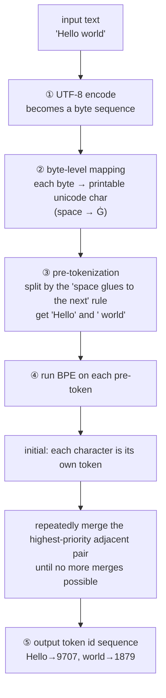

# Chapter 6 · Tokenizer (tokenizer.c)

> 🌐 [中文版](../06-tokenizer.md) | English

> Chapter 6 | Companion source: `tokenizer.c` (~510 lines) | [Previous: Forward Pass](./05-forward.md) | [Next: Sampling & Generation](./07-sampling.md)

---

## What this chapter covers

`tokenizer.c` solves one problem: **how text becomes token ids, and how to turn them back.**

The model only understands numbers (token ids), not characters. The tokenizer is the bridge between text and ids:

```
"Hello world" ──encode──► [9707, 1879] ──model──► logits ──decode──► "a"
```

Order of this chapter:

- Why tokenization is needed (motivation)
- The BPE algorithm (core: repeatedly merge the most frequent pair)
- Byte-level mapping (256 bytes → printable unicode)
- Pre-tokenization (split before BPE)
- FNV-1a hash table (how a 150k-word vocabulary is queried quickly)
- BOS / EOS / PAD (special tokens)
- The Tokenizer struct + the tokenizer.bin file format

---

## Why tokenization is needed

The model only understands numbers (token ids), not characters. The tokenizer is the bridge between text and ids:

```
"Hello world" ──encode──► [9707, 1879] ──model──► logits ──decode──► "a"
```

Why not "one character = one id"? Two reasons:

1. **Characters are too granular**: `"Hello"` = 5 characters = 5 ids, the model has to do 5 steps; merging into 1 token needs only 1 step, far more efficient.
2. **Semantics are more complete**: `"Hello"` as a whole carries more meaning than five isolated characters `H-e-l-l-o`.

Why not "one word = one id"? Because there are far too many words (English + Chinese + code + every variation), the vocabulary would explode.
**BPE is a compromise between "characters" and "whole words"** — common combinations become a single token, rare ones get split into smaller pieces.

| Scheme | # tokens | Example | Problem |
|--------|----------|---------|---------|
| Character-level | many | `Hello` → 5 tokens | too granular, weak semantics |
| Word-level | few | `Hello` → 1 token | vocabulary explodes (millions) |
| **BPE** ★ | balanced | `Hello` → 1 token; `unhappiness` → `un`+`happiness` | manageable vocab (~150k) |

---

## BPE (Byte-Pair Encoding)

### Algorithm: start from single characters, repeatedly merge the most frequent adjacent pair

**During training** (we don't do this — the Qwen team already did it):

```
Count the frequency of every adjacent byte pair across a large corpus.
Repeatedly merge the most frequent pair, until you've merged N times.

  Round 1: (l, l) appears 1 million times → merge into "ll"
  Round 2: (e, ll) appears 800k times → merge into "ell"
  ...
Every merge produces a rule; the order is the priority.
```

**During inference (what we do)**: use the trained merges rules to encode new text into tokens.

### Encoding "Hello"

```
Encoding "Hello":
  Initial: H, e, l, l, o  (each character is a token)
  Lookup merges: (l,l) is most frequent → merge into "ll"
  Now: H, e, ll, o
  Lookup again: (e,ll) → merge
  ...
  Final: "Hello" (one token, id=9707)
```

### Core code: greedily find the highest-priority merge

```c
// tokenizer.c: encode_pretoken()  (line 321)
// Repeatedly find the best merge for a pre-token
while (1) {
    int best_rank = INT_MAX;
    int best_idx = -1;
    // Scan adjacent pairs, find the one with highest priority (smallest merge_rank)
    for (int i = 0; i + 1 < n; i++) {
        int rank = merge_rank(t, tokens[i], tokens[i+1]);
        if (rank >= 0 && rank < best_rank) {
            best_rank = rank;
            best_idx = i;
        }
    }
    if (best_idx < 0) break;   // nothing left to merge, done
    // Merge tokens[best_idx] and tokens[best_idx+1] into one
    merge_at(tokens, &n, best_idx);
}
```

**Key point**: the order of merges is the priority. `merges[0]` is highest priority, `merges[1]` next, ...
`merge_rank()` looks up "which rule number is the pair (a,b)" — the smaller the number, the higher the priority.

### merge_rank: look up the priority

```c
// tokenizer.c: merge_rank()  (line 69)
static int merge_rank(Tokenizer *t, int a, int b) {
    for (int i = 0; i < t->n_merges; i++) {
        if (t->merges[2*i] == a && t->merges[2*i+1] == b)
            return i;   // the i-th rule, priority = i
    }
    return -1;   // no such rule, can't merge
}
```

In the `merges` array, every two elements form a pair: `merges[2i] = a, merges[2i+1] = b` means "token a and token b can be merged." The order of appearance is the priority — earlier means higher priority.

---

## Byte-level mapping

### Problem: spaces, newlines, and other control characters don't fit nicely in a vocabulary

Raw bytes contain spaces, newlines, control characters — these "invisible" things are awkward to store as vocabulary strings.
GPT-2's solution: map the 256 bytes to printable unicode characters.

```
raw byte 0x20 (space)   → 'Ġ' (U+0120)  ← the vocab stores this character
raw byte 0x0A (newline) → 'Ċ' (U+010A)
raw byte 0x48 ('H')     → 'H'            ← printable, unchanged
```

That's why HF tokenizer debug output is full of `Ġ` in the vocabulary entries — it's just a space.

### How the mapping is implemented

`tokenizer.h` has a 256-entry mapping table:

```c
// tokenizer.h
/* byte_map: what unicode string the i-th byte maps to (GPT-2 byte-level) */
char  byte_map_chars[256][8];   // unicode string for each byte
int   byte_map_len[256];        // length of the corresponding string
```

**Encoding**: each byte is first looked up in `byte_map_chars` to become the corresponding unicode string, then goes through BPE.

**Decoding**: the inverse mapping back to bytes.

### The full encoding pipeline (byte-level + BPE)

The flowchart below shows the complete process of a piece of text going from "string" to "token id sequence":



Walking through how the data changes at each stage:

```
"Hello world"  (raw text)
   │
   │  1. UTF-8 bytes
   ▼
[0x48, 0x65, 0x6c, 0x6c, 0x6f, 0x20, 0x77, 0x6f, 0x72, 0x6c, 0x64]
   │
   │  2. byte-level mapping (each byte → unicode char)
   ▼
['H', 'e', 'l', 'l', 'o', 'Ġ', 'w', 'o', 'r', 'l', 'd']
   │
   │  3. pre-tokenization split (space glues forward)
   ▼
["Hello", "Ġworld"]
   │
   │  4. run BPE on each pre-token (repeatedly merge the most frequent pair)
   ▼
["Hello" → id 9707, "Ġworld" → id 1879]
   │
   ▼
output token id sequence: [9707, 1879]
```

> Note that `" world"` becomes `"Ġworld"` — the space was mapped to `Ġ` by the byte mapping, then BPE merged it with the following letters into a single token. That's why `" world"` is its own entry in the vocabulary.

---

## Pre-tokenization

### BPE doesn't run on the whole text; the text is first split into pre-tokens

Running BPE on the whole text at once has two problems:

1. The text is too long; you'd scan too many pairs.
2. Boundaries between different pre-tokens shouldn't be crossed (e.g. punctuation shouldn't merge with the following word).

So it's split first, then BPE runs independently on each pre-token.

```
"Hello world" → ["Hello", " world"]   ← the space glues onto the following word
"don't"       → ["don", "'t"]
```

### Key rule: the space glues onto the following word

This way `" world"`, after encoding, has its space turned into `Ġ` and may merge into a single token:

```c
// tokenizer.c: pretokenize()  (line 213)
/* a single space followed by a letter: the space and the letter run together (GPT-2 " ?\p{L}+") */
if (c == ' ' && i + 1 < text_len) {
    unsigned char nxt = (unsigned char)text[i+1];
    int is_letter = (nxt >= 'A' && nxt <= 'Z') || (nxt >= 'a' && nxt <= 'z');
    if (is_letter) {
        int start = i;   /* include the leading space */
        i++;             /* consume the space */
        while (i < text_len) {
            ...           /* keep consuming letters */
        }
        ...
    }
}
```

### The full GPT-2-style regex approximation

`pretokenize()` implements an approximation of the GPT-2 pre-tokenizer rules:

| Pattern | Example | Notes |
|---------|---------|-------|
| `'s 't 're 've 'm 'll 'd` | `"don't"` → `don` + `'t` | English contractions |
| `space + letter run` | `" world"` → one pre-token | space glues forward |
| consecutive letters (no leading space) | `"Hello"` | a word |
| single digit | `"123"` → `1` `2` `3` three pre-tokens | GPT-2 splits digits individually |
| punctuation run | `"!!"` → one pre-token | consecutive punctuation merged |
| consecutive whitespace | `"\n\n"` → one pre-token | multiple whitespaces grouped |
| non-ASCII (UTF-8) | one group per UTF-8 character | Chinese etc. |

> Note: this project is a GPT-2-style approximation, not 100% identical to HF's Qwen tokenizer.
> For the vast majority of natural-language text the encoded result matches HF; extreme edge cases may differ by a token or two.

---

## Hash table (FNV-1a)

### Problem: the vocab has 150k entries; encoding needs frequent "string → id" lookups

Every step of BPE has to look up "what id does the merged string of this adjacent pair correspond to in the vocab?"
With 150k vocab entries, a linear scan is too slow, so a hash table accelerates it to O(1).

### FNV-1a hash: a simple, fast string-hash algorithm

```c
// tokenizer.c: hash_str()  (line 24)
static unsigned int hash_str(const char *s, int len) {
    unsigned int h = 2166136261u;       // FNV offset basis
    for (int i = 0; i < len; i++) {
        h ^= (unsigned char)s[i];
        h *= 16777619u;                 // FNV prime
    }
    return h;
}
```

**The two magic numbers**:

| Constant | Value | Name |
|----------|-------|------|
| `2166136261u` | FNV offset basis | initial value |
| `16777619u` | FNV prime | the prime multiplied each step |

**Core of the algorithm**: for each byte do "XOR + multiply by a prime." Simple enough for a few lines of code, yet evenly distributed and low-collision.

### Collision handling by chaining

Hash collisions are strung together with linked lists:

```c
// tokenizer.h
int    hash_size;     // number of buckets (a power of 2)
int   *hash_buckets;  // length hash_size, stores the first token id or -1
int   *hash_next;     // length vocab_size, on collision chains to the next token id or -1
```

- `hash_buckets[h]`: the first token id whose hash value is h
- `hash_next[id]`: chains from token id to the next token id with the same hash

```
hash_buckets[12345] → id=42 → hash_next[42]=7788 → hash_next[7788]=-1
                     (list: 42 → 7788 → end)
```

Lookup hashes the string, then walks the list comparing strings:

```c
// tokenizer.c: vocab_lookup()  (line 55)
static int vocab_lookup(Tokenizer *t, const char *s, int len) {
    unsigned int h = hash_str(s, len) & (t->hash_size - 1);   // modulo
    for (int id = t->hash_buckets[h]; id != -1; id = t->hash_next[id]) {
        if (t->vocab_len[id] == len
            && memcmp(t->vocab[id], s, len) == 0)
            return id;   // found
    }
    return -1;   // not found
}
```

### Building the table: put every vocab entry into a bucket

```c
// tokenizer.c: build_vocab_index()  (line 34)
static int build_vocab_index(Tokenizer *t) {
    // For each vocab[i], compute its hash and head-insert into the bucket's list
    for (int i = 0; i < t->vocab_size; i++) {
        unsigned int h = hash_str(t->vocab[i], t->vocab_len[i])
                         & (t->hash_size - 1);
        t->hash_next[i] = t->hash_buckets[h];
        t->hash_buckets[h] = i;
    }
    ...
}
```

---

## BOS / EOS / PAD

Three special tokens mark the structure of a sequence:

```
BOS = Beginning Of Sequence
EOS = End Of Sequence    ← generation stops when this is hit
PAD = Padding            (for batch alignment)
```

| Token | Meaning | Role |
|-------|---------|------|
| BOS | start of sequence | prepended at encode time, telling the model "this is the input's starting point" |
| EOS | end of sequence | generation stops when it's produced |
| PAD | padding | pads sequences of different lengths during batched inference |

**Qwen's setting**: both BOS and EOS are id=151643 = `<|endoftext|>`.

```c
// tokenizer.h
int   bos_id;
int   eos_id;
int   pad_id;
```

At encode time you can choose whether to prepend BOS:

```c
// tokenizer.c: tokenizer_encode()  (line 399)
int tokenizer_encode(Tokenizer *t, const char *text, int bos_id,
                     int *out_tokens, int max_tokens);
// pass bos_id = -1 to skip prepending
```

---

## The Tokenizer struct + the tokenizer.bin file format

### The Tokenizer struct

```c
// tokenizer.h
typedef struct {
    int   vocab_size;       // vocabulary size (151936)
    char **vocab;           // vocab[i] = the string of token i (after byte-level encoding)
    int  *vocab_len;        // byte length of vocab[i]
    int   n_merges;         // number of BPE merge rules
    int  *merges;           // merges[2i]=a, merges[2i+1]=b

    /* string -> id lookup table (chained hash) */
    int    hash_size;       // number of buckets (a power of 2)
    int   *hash_buckets;    // bucket heads
    int   *hash_next;       // collision lists

    /* special tokens */
    int   n_special;
    int  *special_ids;
    char **special_strs;
    int  *special_lens;

    /* byte→unicode mapping (GPT-2 byte-level) */
    char  byte_map_chars[256][8];
    int   byte_map_len[256];

    int   bos_id, eos_id, pad_id;
} Tokenizer;
```

### The tokenizer.bin file format

`tokenizer.json` (HF format, 7 MB, contains redundant info) is too large to load directly,
so `export_tokenizer.py` converts it into a compact `tokenizer.bin` (3 MB, only the essential data):

```
tokenizer.bin layout (all little-endian):
┌──────────────────────────────────────────────────────────┐
│ uint32  vocab_size           number of vocab entries N (151936) │
│ uint32  n_merges             number of BPE merge rules M  │
│ uint32  n_special            number of special tokens     │
├──────────────────────────────────────────────────────────┤
│ N vocab strings:                                         │
│   each = uint32 len + len bytes (no \0)                  │
│   vocab[0], vocab[1], ..., vocab[N-1]                    │
├──────────────────────────────────────────────────────────┤
│ M merges:                                                │
│   each = uint32 a + uint32 b                             │
│   (means token[a] + token[b] → a new token)              │
├──────────────────────────────────────────────────────────┤
│ n_special special entries:                               │
│   each = uint32 id + uint32 len + len bytes              │
├──────────────────────────────────────────────────────────┤
│ 256 bytes byte_unicode_map:                              │
│   maps raw byte (0..255) to the index of its unicode char│
└──────────────────────────────────────────────────────────┘
```

The load function `tokenizer_load()` (`tokenizer.c:85`) reads this layout section by section.

---

## The full encode + decode flow

### encode: text → token id sequence

```
tokenizer_encode("Hello world", bos=BOS)
│
├─ 1. pretokenize(): split into pre-tokens
│      "Hello world" → ["Hello", " world"]
│
├─ 2. For each pre-token:
│      a. UTF-8 bytes → byte_map → unicode string
│      b. initially each character is a token
│      c. repeatedly run BPE: find the highest-priority merge, merge
│      d. look up vocab_lookup to get the final id
│      "Hello" → [9707]
│      "Ġworld" → [1879]  (the space is now Ġ, merged into one token)
│
├─ 3. Concatenate the ids of all pre-tokens
│      [9707, 1879]
│
└─ 4. Prepend BOS (if requested)
      [BOS, 9707, 1879]
```

### decode: token id → text

```c
// tokenizer.c: tokenizer_decode()  (line 452)
int tokenizer_decode(Tokenizer *t, int id, char *buf, int buf_cap);
// Decode a single token id into UTF-8 bytes, appending to buf
```

decode is the inverse of encode: look up `vocab[id]` to get the byte-level string,
reverse the `byte_map` to turn `Ġ` back into a space, etc., and emit the original bytes.

```
id=9707 → "Hello"        → output "Hello"
id=1879 → "Ġworld"       → reverse-map Ġ→space → output " world"
```

> Note that decode works **per token** — during generation, each newly generated token is decoded one at a time
> and concatenated into the final text. See the generation loop in Chapter 7.

---

## Core insights, summarized

1. **The tokenizer is the bridge between text and numbers**: the model only understands numbers (token ids); the tokenizer splits text into tokens.

2. **BPE is the compromise between "characters" and "whole words"**: starting from characters it repeatedly merges the most frequent pair; common combinations become one token, rare ones split into pieces. The vocabulary is held around 150k.

3. **Byte-level mapping solves the control-character problem**: 256 bytes mapped to printable unicode (space → `Ġ`), so any byte can enter the vocabulary.

4. **Pre-tokenization splits before BPE**: the space glues onto the following word (`" world"`); different fragments don't merge across boundaries.

5. **FNV-1a hash + chaining**: the "string → id" lookup over a 150k vocabulary drops to O(1), making encoding fast enough.

6. **BOS/EOS/PAD are sequence-structure markers**: in Qwen, BOS=EOS=`<|endoftext|>` (id=151643); generation stops at EOS.

7. **tokenizer.bin is the compact version of tokenizer.json**: 7 MB → 3 MB, keeping only the data needed for encode/decode.

8. **The same token id stores different things in two files**: this is a common point of confusion, worth explaining clearly.

Take id=9707 of "Hello" as an example — **both files have 9707, but they store completely different things**:

```
┌─────────────────────────────────────────────────────────┐
│  tokenizer.bin (3MB)                                    │
│    vocab[9707] = "Hello"  (a string)                    │
│    purpose: text ↔ id conversion                        │
│    used by: tokenizer.c (encode / decode)               │
│    content: 151936 strings                              │
└─────────────────────────────────────────────────────────┘
                          ↓
                   token id 9707
                          ↓
┌─────────────────────────────────────────────────────────┐
│  model.safetensors (988MB)                              │
│    embed_tokens[9707] = [-0.025, 0.006, ...]  (vector)  │
│    purpose: id → 896-dim vector (for the neural net)    │
│    used by: net.c's forward()                           │
│    content: 151936 rows × 896 floats                    │
└─────────────────────────────────────────────────────────┘
```

| File | What id=9707 maps to | Size | Used for |
|-------|----------------------|------|----------|
| `tokenizer.bin` | `"Hello"` (text) | tens of bytes | text↔id translation |
| `model.safetensors` | `[-0.025, 0.006, ...]` (896 numbers) | 3.5 KB | model computation |

The full flow — text → vector must pass through two gates:

```
"Hello world" (user input)
    │
    │  tokenizer.c reads tokenizer.bin
    │  "Hello" → finds id=9707
    │  " world" → finds id=1879
    ▼
[9707, 1879] (token id sequence)
    │
    │  net.c reads safetensors' embedding table
    │  id=9707 → fetches the 896 numbers of row 9707
    │  id=1879 → fetches the 896 numbers of row 1879
    ▼
[[896 numbers], [896 numbers]] (vectors, entering the Transformer)
```

**That's why the inference engine needs to load two files** — `tokenizer.bin` handles text↔id conversion, and `model.safetensors` handles id→vector→computation. You can't do without either one.

---

> In the next chapter we look at "how to pick the next token from logits" — sampling & generation.
> [Continue to Chapter 7 →](./07-sampling.md)
