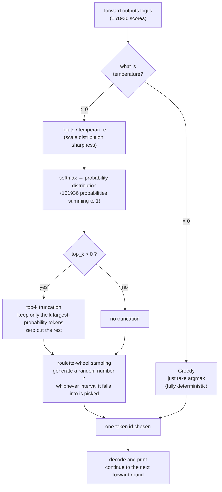

# Chapter 7 · Sampling & Generation (run.c)

> 🌐 [中文版](../cn/07-sampling.md) | English

> Chapter 7 | [Previous: Chapter 6 Tokenizer](./06-tokenizer.md) | [Next: Chapter 8 Logging & Visualization](./08-logging.md)

> Companion source: `run.c` (~500 lines)
> Prerequisites: Chapter 5 (forward pass produces logits), Chapter 6 (the tokenizer turns text into token ids)
> This chapter answers one question: **once you have logits, how do you pick a token, and how do you loop to generate a whole sentence.**

---

## Table of Contents

- [The generation loop: prefill + decode two phases](#the-generation-loop-prefill--decode-two-phases)
- [Why it must be split into two phases](#why-it-must-be-split-into-two-phases)
- [prefill and decode actually do the same thing](#prefill-and-decode-actually-do-the-same-thing)
- [Why prefill is compute-bound and decode is memory-bound](#why-prefill-is-compute-bound-and-decode-is-memory-bound)
- [The sampling strategy landscape](#the-sampling-strategy-landscape)
- [PRNG: xorshift128](#prng-xorshift128)
- [Command-line arguments](#command-line-arguments)
- [One-sentence summary](#one-sentence-summary)

---

## The generation loop: prefill + decode two phases

A full generation happens in two steps: first "read" the whole prompt in (prefill), then "write" out new tokens one at a time (decode).

```
1. prompt → BPE encode → token ids [t0, t1, ..., t(n-1)]
2. prefill: feed prompt tokens one by one (teacher forcing)
     each step uses the next token from the prompt as the answer, no sampling
     the goal is to fill the KV Cache with all of the prompt
3. decode: sample from the last step's logits → new token → decode & print → continue
4. hit EOS or reach the cap → stop
```

The skeleton of the main loop (the generation part of `main()` in `run.c`):

```c
int token = prompt_tokens[0];
for (int pos = 0; pos < total_len; pos++) {
    forward(&cfg, &w, &s, token, pos);        /* compute logits */

    int next;
    if (pos < n_prompt - 1) {
        next = prompt_tokens[pos + 1];        /* prefill: just take the next prompt slot */
    } else {
        next = sample(s.logits, ...);         /* decode: sample */
    }

    if (next == tk.eos_id && pos >= n_prompt - 1) break;   /* stop on EOS */

    if (pos >= n_prompt - 1) {
        /* only print during decode; prefill doesn't print (the prompt was already echoed) */
        fwrite(buf, 1, blen, stdout);
    }
    token = next;
}
```

### The prefill phase: teacher forcing

prefill doesn't sample — it "follows the answer key." This is called **teacher forcing**.

```
prompt = "你好世界"  →  tokens = [你, 好, 世, 界]
                                0    1    2    3

prefill goes round by round:
  pos=0: forward(你)  → logits → but no sampling, use tokens[1]=好 directly
  pos=1: forward(好)  → logits → use tokens[2]=世 directly
  pos=2: forward(世)  → logits → use tokens[3]=界 directly
  pos=3: forward(界)  → logits → ★ this step samples, starting decode
```

Why do it this way? Because the prompt is given by the user, and the model shouldn't take it upon itself to rewrite it. The only purpose of prefill is to **push every prompt token's K/V into the KV Cache**, so that during decode the newly generated tokens can see the full context.

### The decode phase: autoregressive

Starting at `pos == n_prompt - 1` we enter decode. Each step:

```
forward(current token)
  → logits (151936 scores)
  → sample() to pick one
  → decode to text, print
  → use it as the next step's input token
```

This is "autoregressive" — the output becomes the input, looping.

### Logging boundary between the two phases

The code marks the phase switch with a stage log:

```c
LOGI_L(CAT_KEY, 0, "═══ Phase 1: Prefill (processing %d prompt tokens) ═══", n_prompt);
...
if (pos == n_prompt) {
    LOGI_L(CAT_KEY, 0, "═══ Phase 2: Decode (autoregressive generation) ═══");
}
```

Run with `-v` once and you'll see these two bold red dividers.

---

## Why it must be split into two phases

A common question: **the prompt has n tokens — can we compute them all in parallel, instead of one slot at a time?**

In theory prefill could be parallel (every token in the prompt is already known and doesn't depend on prior sampling). But this project's `forward()` handles one token at a time, so prefill is also a sequential loop.

Industrial engines (vLLM / SGLang) do prefill in true parallel: they pack all prompt tokens into a `[seq_len, dim]` matrix and compute it all with one matmul. This project keeps the sequential handling for code simplicity — slower, but the logic is clearer.

> That's why prefill is usually a one-time "big" cost, while decode is a "slow trickle."
> In industry terms, prefill is called **time-to-first-token (TTFT)** and decode is called **inter-token latency**.

### The role of the KV Cache across the two phases

#### What goes into the cache — not tokens, but K and V vectors

Common misconception: "prefill puts tokens (symbols/ids) into the cache." **No.** A token, once inside the network, becomes an 896-dim vector and is then projected into K and V; **what goes into the cache are the K and V vectors**:

```
token "你" (id=56568, just a number)
  ↓
embedding lookup → 896-dim vector
  ↓
K projection (Wk matrix) → 128-dim K vector  ← ★ this goes into the cache
V projection (Wv matrix) → 128-dim V vector  ← ★ this goes into the cache
```

What's stored in the cache is **two piles of vectors**, not token ids:

```
KV Cache (after prefill fills it):

  position 0 ("你"):  K=[0.3, -0.1, ...128 numbers]  V=[0.5, 0.2, ...128 numbers]
  position 1 ("好"):  K=[-0.2, 0.4, ...]              V=[0.1, -0.3, ...]

  Vectors are stored (128 floats each), not token ids
```

Why store K and V, not anything else? Back to the attention computation (Chapter 5):

```
attention = softmax(Q · K^T / √d) · V

Q = the current token's "what I want to find"   ← recomputed every time
K = each token's "what label I am"              ← stored in cache ★
V = each token's "what content I carry"         ← stored in cache ★
```

Q must be recomputed every time (each new token has a different Q), but **once K and V are computed they never need to be recomputed** — the K and V of a token are always the same. So the cache's purpose is: **store the K and V of every historical token so they don't have to be recomputed each time.**

#### The full process of prefill filling the cache

Walk through it with "你好":

```
═══ prefill: push the prompt's K/V into the cache ═══

1st forward (pos=0, processing "你"):
  "你" → embedding → 896-dim
       → projects into K(128-dim), V(128-dim)
       → stored in cache[0]

  cache now has: [position 0: 你's K,V]            ← 1 entry

  this step also computed logits, but didn't sample, just threw them away
  (because the next prompt token "好" is known, the model doesn't need to guess)


2nd forward (pos=1, processing "好"):
  "好" → embedding → 896-dim
       → projects into K(128-dim), V(128-dim)
       → stored in cache[1]

  cache now has: [position 0: 你's K,V]            ← 2 entries
                 [position 1: 好's K,V]

  ★ This step (pos = n_prompt-1) is where sampling happens!
  "好"'s Q × all K in cache (position 0 + position 1)
  → sees "你" → mixes in "你"'s information
  → computes logits → samples → gets the first new token


═══ decode: use the cache to generate new tokens ═══

3rd forward (pos=2, processing the just-sampled new token):
  new token → embedding → 896-dim
           → projects into K, V
           → stored in cache[2]

  cache now has: [position 0: 你's K,V]
                 [position 1: 好's K,V]
                 [position 2: new word's K,V]      ← 3 entries

  the new token's Q × all K in cache (3 positions)
  → sees the full "你好 + new word" context
  → samples → next new token
```

#### One-sentence summary

```
✗ put tokens (symbols/ids) into the cache
✓ put the K and V vectors obtained by projecting the token into the cache

because every subsequent new token must do attention against these K/V
(new token's Q × K in cache → compute relevance → grab V)
once stored, no need to recompute
```

The cache is full of vectors (128-dim float arrays), not token ids. That's why the cache uses memory — each position stores K and V, 128 floats each, 24 layers × seq_len positions, totaling about 50MB. The sole purpose of prefill is to **fill this cache**, so that during decode newly generated tokens can see the whole prompt's context.

Without a KV Cache, every decode step would have to recompute the K/V of all prompt tokens — `n` steps means `O(n²)`. With the cache the complexity drops to `O(n)`. That's the fundamental reason generation is feasible at all.

---

## prefill and decode actually do the same thing

Look carefully and you'll find: every step of prefill and every step of decode do **exactly the same thing**:

```
every step of prefill:                every step of decode:
  ① embedding lookup                   ① embedding lookup
  ② project out Q, K, V                ② project out Q, K, V
  ③ store K, V into the cache          ③ store K, V into the cache
  ④ attention between Q and cache K    ④ attention between Q and cache K
  ⑤ weight V                           ⑤ weight V
  ⑥ pass through MLP                   ⑥ pass through MLP
  ⑦ compute logits                     ⑦ compute logits
```

In code, both use the **same `forward()` function**:

```c
for (int pos = 0; pos < total_len; pos++) {
    forward(&cfg, &w, &s, token, pos);   // ★ both prefill and decode call this

    int next;
    if (pos < n_prompt - 1) {
        next = prompt_tokens[pos + 1];   // prefill: use the next prompt slot
    } else {
        next = sample(s.logits, ...);    // decode: sample on our own
    }
}
```

`forward()` itself has no idea whether it's prefill or decode. **The only difference is after forward — where the next token comes from**:

```
       forward() function (net.c, same every time)
            │
            │ outputs logits
            ▼
       ┌────┴────┐
       │ logits  │
       └────┬────┘
            │
    ┌───────┴───────┐
    │               │
  prefill          decode
    │               │
  discard logits   sample from logits
  use next prompt slot  use the sampled result
```

**Why distinguish them at all**: because the prompt is given by the user and shouldn't be rewritten by the model. If prefill also sampled, the model might alter "你好" into "你吗". So prefill forces using the next prompt slot and **doesn't trust the model's output**; only at the last prompt token does it start trusting the model and sampling to generate.

> In one sentence: **prefill and decode are two ways of using the same forward** — inside forward everything is identical; the only difference is "after logits are computed, where does the next token come from."

---

## Why prefill is compute-bound and decode is memory-bound

Industrial engines (vLLM/SGLang) often say "prefill is compute-bound, decode is memory-bound." But we just said forward is the same for both — why are the bottlenecks different?

**Key premise**: industrial engines don't compute token-by-token serially; prefill and decode are handled differently:

```
prefill (can parallelize): the prompt's N tokens packed into an [N, 896] matrix, computed all at once with one matmul
decode  (must serialize):  the next token depends on the previous sample, can't parallelize, only 1 token per step
```

### Arithmetic intensity: the key metric that determines the bottleneck

"Arithmetic intensity" = compute ÷ data read (FLOP/byte). High ratio → compute-bound; low ratio → memory-bound.

Taking Qwen2.5-0.5B as an example:

```
=== prefill 1000 tokens (parallel) ===
  compute: 1000 × 0.49 GFLOP = 0.49 TFLOP
  weight read: 15 GB (no matter how many tokens, weights are read once and shared by all 1000 tokens)
  arithmetic intensity: 0.49e12 / 15e9 = 32.6 FLOP/byte
  → compute is far greater than reads → compute-bound (compute is the bottleneck)

=== decode generating 1 token (serial) ===
  compute: 1 × 0.49 GFLOP = 0.49 GFLOP
  weight read: 15 GB (★ every token must read all the weights!)
  arithmetic intensity: 0.49e9 / 15e9 = 0.033 FLOP/byte
  → reads are far greater than compute → memory-bound (bandwidth is the bottleneck)
```

The gap is striking — **prefill's arithmetic intensity is 1000× decode's.**

### Why decode must read all the weights every time

Each decode step processes only 1 token, but to compute that token's QKV projection it must read the full Wq(896×896), Wk, Wv, ... all the weights of all 24 layers:

```
decode 1 token:
  Layer 0: read Wq + Wk + Wv + Wo + the three MLP matrices (~600k numbers)
  Layer 1: same amount
  ...
  Layer 23: same amount

  → to compute 1 token, all 15GB of weights must be read
  → little compute (0.49 GFLOP), lots of reads (15GB)
  → memory bandwidth becomes the bottleneck: "can the weights even be hauled over?"
```

Whereas prefill processes 1000 tokens at once, **reads the same 15GB of weights**, but does 1000× the compute → compute becomes the bottleneck.

### Wholesale vs. retail analogy

```
prefill = wholesale:
  one truckload (15GB of weights) distributed to 1000 customers (1000 tokens)
  the goods are hauled once but split among many → heavy workload → not enough porters (compute)
  → compute-bound

decode = retail:
  one truckload (15GB of weights) sold to just 1 customer (1 token)
  a whole truck opened for 1 customer → big truck (bandwidth) cost, small transaction (compute)
  → memory-bound
```

### Different bottlenecks drive different optimization directions

| | prefill (compute-bound) | decode (memory-bound) |
|---|---|---|
| **Bottleneck** | GPU compute | memory bandwidth |
| **Optimization** | Tensor Core, Flash Attention | quantization, continuous batching |
| **Effect** | compute utilization ↑ | bandwidth utilization ↑ |

**Why vLLM pushes so hard on continuous batching**: a single decode token reads 15GB to do only 0.49G of compute — too wasteful. Batch 100 users' decodes together, read 15GB once to compute 100 tokens → reads amortized 100× → bandwidth utilization rises sharply.

> **Note**: the analysis above concerns the parallel/batching approach of industrial engines. This project computes both prefill and decode serially, one token at a time (`forward` only processes 1 token per call), so the two have little difference in bottleneck. Understanding the industrial distinction lets you see why all of vLLM's optimizations target the right symptom.

---

## The sampling strategy landscape

The `sample()` function (`run.c:84`) supports four strategies, controlled by combining the two parameters `temperature` and `top_k`.

The flowchart below shows the full sampling decision process — from logits to the final chosen token:



### Strategy 1: Greedy (temperature=0)

```c
if (temperature == 0.0f) {
    int best = 0;
    float bestv = logits[0];
    for (int i = 1; i < vocab_size; i++) {
        if (logits[i] > bestv) { bestv = logits[i]; best = i; }
    }
    return best;   /* directly pick the highest-scoring */
}
```

**Characteristics**:

- Fully deterministic — same prompt + same model always produces the same output
- No randomness needed
- Suitable for **numerical verification** (when comparing answers with PyTorch)

**Downside**: tends to produce repetitive, stiff text (always picks the safest word).

### Strategy 2: Temperature (temperature scaling)

```c
float inv_t = 1.0f / temperature;
float sum = 0.0f;
for (int i = 0; i < vocab_size; i++) {
    probs[i] = expf((logits[i] - maxl) * inv_t);   /* scaled softmax */
    sum += probs[i];
}
```

The temperature `T` scales the logits (divides by T) **before** softmax:

| T value | Effect | Distribution shape | Use case |
|---------|--------|--------------------|----------|
| `T < 1` (e.g. 0.5) | more deterministic (conservative) | sharper | factual Q&A, code generation |
| `T = 1` | original distribution | unchanged | — |
| `T > 1` (e.g. 1.5) | more random (aggressive) | flatter | creative writing, brainstorming |
| `T = 0` | fully deterministic | degenerates to argmax | numerical verification |

**Visual**:

```
original logits → softmax (T=1):
  word A: 0.60 ████████████████████
  word B: 0.30 ██████████
  word C: 0.08 ███
  word D: 0.02 ▏

T=0.5 (sharper, concentrated):
  word A: 0.85 ████████████████████████████
  word B: 0.13 ████
  word C: 0.02 ▏
  word D: 0.00

T=2.0 (flatter, dispersed):
  word A: 0.40 █████████████
  word B: 0.30 ██████████
  word C: 0.20 ██████
  word D: 0.10 ███
```

**Why subtract maxl**: `expf` easily overflows numerically. Find the max and subtract it; the largest becomes `exp(0)=1`, the rest are all less than 1, so nothing ever overflows (this is called **numerically stable softmax**).

### Strategy 3: Top-k truncation

```c
if (top_k > 0 && top_k < vocab_size) {
    char *keep = calloc(vocab_size, 1);
    for (int s = 0; s < top_k; s++) {
        /* iteratively find the current max, mark it as chosen */
        int best = -1; float bestv = -1e30f;
        for (int i = 0; i < vocab_size; i++) {
            if (!keep[i] && probs[i] > bestv) { bestv = probs[i]; best = i; }
        }
        keep[best] = 1;
    }
    /* zero out the unmarked ones, recompute sum */
    for (int i = 0; i < vocab_size; i++) {
        if (!keep[i]) probs[i] = 0.0f;
        else sum += probs[i];
    }
}
```

**Purpose**: sample only from the k tokens with the highest probability; zero out everything else — cut the long tail and avoid picking extremely low-probability garbage.

```
probability distribution over 151936 tokens after softmax:
  the vast majority have probability < 0.001 (long tail, almost never picked)
  the top 40 already account for 95%+ of the probability

no truncation: a tiny chance of picking a totally unrelated word (like a typo)
top_k=40: only pick among these 40; the tail is zeroed out
```

Industrial engines also have **top-p (nucleus sampling)**: dynamically pick the smallest set whose cumulative probability reaches p (e.g. p=0.9). This project doesn't implement it, but the idea is the same — cut off the low-probability tail.

### Strategy 4: Roulette-wheel sampling

```c
float r = rng_uniform(rng) * sum;     /* a random number in [0, sum) */
float cum = 0.0f;
int chosen = vocab_size - 1;          /* fallback */
for (int i = 0; i < vocab_size; i++) {
    cum += probs[i];
    if (r < cum) { chosen = i; break; }   /* which interval it falls into */
}
```

Think of the probability distribution as a roulette wheel, where each token occupies a wedge (area = probability), spun once at random:

```
probs = [0.5, 0.3, 0.15, 0.05]
roulette:
  ┌──────────────────────────┐
  │       word A (50%)       │
  │──────────────────────────│
  │     word B (30%)         │
  │──────────────────────────│
  │  word C (15%) │ word D (5%) │
  └──────────────────────────┘
   ↑ r=0.62 falls in word B's interval → pick word B
```

**Why `r * sum` instead of `r`**: after top-k truncation, sum is no longer 1.0 (the zeroed parts don't count). Multiplying by sum scales the random number to `[0, sum)`, then we compare cumulatively to make sure it lands in the right interval.

### Relationship among the four strategies

```
                    temperature=0?
                         │
                    ┌────┴────┐
                   yes        no
                    │         │
                argmax    softmax(logits/T)
                              │
                         top_k > 0?
                              │
                         ┌────┴────┐
                        yes        no
                         │         │
                  truncate tail   use as is
                         │         │
                         └────┬────┘
                              │
                  roulette-wheel sampling → pick one token
```

---

## Random number generator: xorshift128

Sampling needs random numbers. This project doesn't rely on the system's `/dev/random`; it uses a **deterministic** pseudo-random number generator (PRNG) — so that **the same seed always produces the same sequence**, which makes reproducing bugs easy.

### The xorshift128 algorithm

```c
typedef struct { unsigned int x,y,z,w; } RNG;

static void rng_seed(RNG *r, unsigned int s) {
    r->x = s ? s : 1;                          /* seed=0 gets replaced with 1 */
    r->y = r->x * 1812433253u + 1;
    r->z = r->y * 1812433253u + 1;
    r->w = r->z * 1812433253u + 1;
}

static unsigned int rng_next(RNG *r) {
    unsigned int t = r->x ^ (r->x << 11);
    r->x = r->y; r->y = r->z; r->z = r->w;
    r->w = r->w ^ (r->w >> 19) ^ (t ^ (t >> 8));
    return r->w;
}

static float rng_uniform(RNG *r) {
    return (rng_next(r) >> 8) * (1.0f / 16777216.0f);   /* [0, 1) */
}
```

**Core of the algorithm**: use 4 32-bit state words (128 bits total) and at each step do **XOR + shift** to produce the next number. Hence the name xorshift.

```
state: [x, y, z, w]  (128 bits)
        │
        │  ① t = x ^ (x << 11)        ← a left-shift XOR on x
        │  ② shift the whole state left: x←y, y←z, z←w
        │  ③ w = w ^ (w>>19) ^ (t ^ (t>>8))  ← mix t and w
        ▼
       the new w = the output 32-bit random number
```

**Key terms**:

| Term | Full name | Meaning |
|------|-----------|---------|
| **PRNG** | Pseudo Random Number Generator | generates "seemingly random" numbers via a deterministic algorithm. Given a seed, the sequence is fully reproducible |
| **xorshift** | XOR + shift | a class of PRNGs using XOR and shift operations; extremely simple and fast |
| **seed** | seed | the initial state. The same seed always produces the same sequence — that's why `-s 42` can reproduce a run |

### How `rng_uniform` turns a 32-bit integer into a [0,1) float

```c
return (rng_next(r) >> 8) * (1.0f / 16777216.0f);
```

- `rng_next(r)` is a 32-bit unsigned int (0 to ~4.3 billion)
- `>> 8` drops the low 8 bits, keeping the high 24 (0 to 16777215, i.e. `2^24 - 1`)
- multiply by `1 / 16777216` (`2^-24`); the result is in `[0, 1)`

Why drop the low 8 bits? Because a float's mantissa is only 23 bits; keeping the high 24 bits is just enough precision. Using all 32 bits directly would lose low-bit precision.

### Why not use `rand()`

The C standard library's `rand()` has several issues:

- Different implementations on different platforms (Windows and Linux give different results)
- Short period, poor statistical properties
- Not thread-safe (global state)

Hand-written xorshift128 fixes all of these: cross-platform consistent, period `2^128 - 1`, state encapsulated in a struct.

---

## Command-line arguments

`run.c`'s `main()` parses these arguments:

```bash
./run model.safetensors tokenizer.bin "prompt" \
      -t 0.8    \   # temperature (0=greedy, default 0)
      -k 40     \   # top_k (default 40)
      -s 42     \   # seed (default 12345)
      -v        \   # debug-level logging (per-layer summary)
      -vv       \   # trace-level logging (all intermediate tensors)
      --report      # generate trace_report.html
```

| Argument | Default | Meaning |
|----------|---------|---------|
| `-t` | `0.0` | temperature. 0 means greedy (no sampling); >0 enables sampling |
| `-k` | `40` | top_k. `<=0` means no truncation, sample over the full vocabulary |
| `-s` | `12345` | PRNG seed. The same seed always generates the same output |
| `-v` | off | enable debug logging |
| `-vv` | off | enable trace logging (most detailed) |
| `--report` | off | generate an HTML report after running |

The argument parsing code:

```c
float temperature = 0.0f;
int   top_k       = 40;
int   seed        = 12345;

for (int i = 4; i < argc; i++) {
    if (strcmp(argv[i], "-t") == 0 && i+1 < argc) {
        temperature = (float)atof(argv[++i]);
    } else if (strcmp(argv[i], "-k") == 0 && i+1 < argc) {
        top_k = atoi(argv[++i]);
    } else if (strcmp(argv[i], "-s") == 0 && i+1 < argc) {
        seed = atoi(argv[++i]);
    }
}
```

### Tuning cheat sheet

**For stable output to compare against**:

```bash
./run model.safetensors tokenizer.bin "你好" -t 0
```

`-t 0` always picks the highest score; the output is fully deterministic.

**For varied, creative text**:

```bash
./run model.safetensors tokenizer.bin "从前有座山" -t 0.8 -k 40 -s 42
```

`-t 0.8` is slightly conservative, `-k 40` cuts the tail, `-s 42` fixes the seed (reproducible if something goes wrong).

**For different results every time**: just use different `-s` values.

### Other subcommands

Besides generation mode, `run.c` has three debugging subcommands:

```bash
./run info  model.safetensors          # print the full tensor list + key checks
./run encode tokenizer.bin "Hello"     # BPE encode, print the token id list
./run fwd  model.safetensors 198 0     # single-token forward, print top-5 logits
```

The `fwd` subcommand is the cornerstone of the debugging methodology in Chapter 9 — comparing a single token's output against PyTorch.

---

## One-sentence summary

**Generation = prefill (pour the prompt into the KV Cache) + decode (autoregressively sample one token at a time)**.
Sampling = `softmax(logits/T)` → top-k cuts the long tail → roulette-wheel picks one.
Random numbers use xorshift128 so that **the same seed is reproducible** — a necessary foundation for engineering debugging and verification.
